# Agent Handover Notifications and Mermaid Documentation System

## Summary

Two interconnected improvements to the cortex-agents plugin:

**1. Agent Handover Notifications** — When agents hand off to each other (Plan → Build, Build → Debug, etc.), a toast notification appears in the OpenCode TUI instead of silently switching. Uses the plugin `event` hook to automatically detect `message.part.updated` events where `part.type === "agent"` and fires `client.tui.showToast()` with the new agent name and role context.

**2. Mermaid Documentation System** — After completing any task, primary agents (build, debug) always prompt: "Would you like to update project documentation?" The user can choose to generate **decisions**, **features**, or **flows** docs — each stored as a mermaid-enriched markdown file in `docs/{type}/`. A `docs_init` tool creates the folder structure, `docs_save` writes the doc with strict templates, and `docs_index` auto-regenerates `docs/INDEX.md` with links to all docs.

Together, these make agent transitions visible and ensure every piece of work produces searchable, AI-parseable documentation with visual diagrams.

## Architecture Diagram


## Tasks

- [ ] Task 1: Add `event` hook to `src/index.ts` — detect agent switches and fire toast notifications
- [ ] Task 2: Create `src/tools/docs.ts` — `docs_init`, `docs_save`, `docs_list`, `docs_index` tools
- [ ] Task 3: Define strict markdown templates for each doc type (decision, feature, flow)
- [ ] Task 4: Register new tools in `src/index.ts` plugin export
- [ ] Task 5: Update `build.md` agent — add post-task documentation workflow (Step 7.5)
- [ ] Task 6: Update `debug.md` agent — add post-fix documentation workflow
- [ ] Task 7: Grant new tools to all primary agents in `.md` frontmatter
- [ ] Task 8: Update `plan.md` agent — mention docs tools for architectural documentation
- [ ] Task 9: Update CLI `install` to copy new tools; update `help` and `status`
- [ ] Task 10: Update README with documentation system section
- [ ] Task 11: Bump version to 2.1.0
- [ ] Task 12: Build and test end-to-end

## Technical Approach

### Phase 1: Agent Handover Toast Notifications

**File: `src/index.ts`** — Add `event` hook to the plugin.

The plugin currently only returns `tool` from the `Hooks` object. We add an `event` hook that listens for all OpenCode events and filters for agent switches:

```typescript
export const CortexPlugin: Plugin = async (ctx) => {
  return {
    // Existing tools...
    tool: { ... },

    // NEW: Agent handover notifications
    async event({ event }) {
      if (
        event.type === "message.part.updated" &&
        event.properties.part.type === "agent"
      ) {
        const agentName = event.properties.part.name;
        const descriptions: Record<string, string> = {
          build: "Development mode — ready to implement",
          plan: "Planning mode — read-only analysis",
          debug: "Debug mode — troubleshooting and fixes",
          fullstack: "Fullstack subagent — end-to-end implementation",
          testing: "Testing subagent — writing tests",
          security: "Security subagent — vulnerability audit",
          devops: "DevOps subagent — CI/CD and deployment",
        };

        const description = descriptions[agentName] || `Switched to ${agentName}`;

        await ctx.client.tui.showToast({
          body: {
            title: `🔄 Agent: ${agentName}`,
            message: description,
            variant: "info",
            duration: 4000,
          },
        });
      }
    },
  };
};
```

**Key details:**
- Fires automatically — no agent prompt changes needed for notifications
- Uses `ctx.client` (captured in closure from plugin initialization)
- Only fires for `message.part.updated` with `part.type === "agent"`
- 4-second duration — visible but not intrusive
- Includes role-specific description so user knows what mode they're in

### Phase 2: Documentation Tools (`src/tools/docs.ts`)

Create four new tools:

#### 2a. `docs_init` — Setup documentation folder

```typescript
docs_init: tool({
  description: "Initialize docs/ directory with folders for decisions, features, and flows",
  args: {
    path: tool.schema.string().optional()
      .describe("Custom docs directory path (default: 'docs')"),
    confirm: tool.schema.boolean().optional()
      .describe("If docs/ already exists, confirm using it (default: false)"),
  },
  async execute(args, context) {
    // 1. Check if docs/ exists
    // 2. If exists and !confirm → return message asking to confirm
    // 3. Create: docs/decisions/, docs/features/, docs/flows/
    // 4. Create docs/INDEX.md with header
    // 5. Create docs/.gitkeep in each subfolder
    // 6. Return success message with structure
  },
});
```

**Folder structure created:**
```
docs/
├── INDEX.md            # Auto-generated index of all docs
├── decisions/          # Architecture/tech decisions (ADRs)
│   └── .gitkeep
├── features/           # Feature documentation with diagrams
│   └── .gitkeep
└── flows/              # Process/data flow documentation
    └── .gitkeep
```

#### 2b. `docs_save` — Save a documentation file

```typescript
docs_save: tool({
  description: "Save a documentation file with mermaid diagrams to docs/",
  args: {
    title: tool.schema.string().describe("Document title"),
    type: tool.schema.enum(["decision", "feature", "flow"]).describe("Document type"),
    content: tool.schema.string().describe("Full markdown content with mermaid diagrams"),
    tags: tool.schema.array(tool.schema.string()).optional()
      .describe("Optional tags for categorization"),
    relatedFiles: tool.schema.array(tool.schema.string()).optional()
      .describe("Optional list of related source files"),
  },
  async execute(args, context) {
    // 1. Ensure docs/{type}s/ folder exists (auto-init if missing)
    // 2. Generate filename: YYYY-MM-DD-{slug}.md
    // 3. Build content from strict template (see Phase 3)
    // 4. Write file
    // 5. Auto-rebuild INDEX.md via docs_index logic
    // 6. Return success with file path
  },
});
```

#### 2c. `docs_list` — List documentation files

```typescript
docs_list: tool({
  description: "List all documentation files in docs/",
  args: {
    type: tool.schema.enum(["decision", "feature", "flow", "all"]).optional()
      .describe("Filter by doc type (default: all)"),
  },
  async execute(args, context) {
    // 1. Scan docs/decisions/, docs/features/, docs/flows/
    // 2. Parse frontmatter for title, date, tags
    // 3. Return formatted list grouped by type
  },
});
```

#### 2d. `docs_index` — Rebuild the documentation index

```typescript
docs_index: tool({
  description: "Rebuild docs/INDEX.md with links to all documentation files",
  args: {},
  async execute(args, context) {
    // 1. Scan all three folders
    // 2. Parse frontmatter from each file
    // 3. Generate INDEX.md with:
    //    - Table of contents
    //    - Grouped sections (Decisions, Features, Flows)
    //    - Links to each doc with title, date, tags
    // 4. Write docs/INDEX.md
  },
});
```

### Phase 3: Strict Document Templates

Each doc type has a mandatory template structure. The agent generates the content, but the `docs_save` tool wraps it in the template.

#### Decision Template (`docs/decisions/YYYY-MM-DD-slug.md`)

```markdown
---
title: "{title}"
type: decision
date: {ISO date}
status: accepted
tags: [{tags}]
related_files: [{files}]
---

# Decision: {title}

## Context
[What is the issue? Why was a decision needed?]

## Decision
[What was decided?]

## Rationale

```mermaid
graph TD
    A[Option A] -->|Pros| B[Selected ✓]
    C[Option B] -->|Cons| D[Rejected]
```



[Why this option was chosen over alternatives]

## Consequences
[What are the implications of this decision?]

## Related Files
- `file1.ts`
- `file2.ts`
```

#### Feature Template (`docs/features/YYYY-MM-DD-slug.md`)

```markdown
---
title: "{title}"
type: feature
date: {ISO date}
status: implemented
tags: [{tags}]
related_files: [{files}]
---

# Feature: {title}

## Overview
[What does this feature do?]

## Architecture


## Key Components
[List of files/modules involved]

## Usage
[How to use this feature]

## Related Files
- `file1.ts`
- `file2.ts`
```

#### Flow Template (`docs/flows/YYYY-MM-DD-slug.md`)

```markdown
---
title: "{title}"
type: flow
date: {ISO date}
tags: [{tags}]
related_files: [{files}]
---

# Flow: {title}

## Overview
[What process/data flow does this document?]

## Flow Diagram


## Steps
1. Step 1 description
2. Step 2 description

## Related Files
- `file1.ts`
- `file2.ts`
```

### Phase 4: Agent Prompt Updates

#### `build.md` — Add Step 7.5: Documentation Prompt

After existing Step 7 (Save Session Summary), add:

```markdown
### Step 7.5: Documentation Prompt (MANDATORY)

After completing work and BEFORE committing, use the question tool to ask:

"Would you like to update project documentation?"

Options:
1. **Create decision doc** - Record an architecture/technology decision (ADR)
2. **Create feature doc** - Document a new feature with architecture diagram
3. **Create flow doc** - Document a process/data flow with sequence diagram
4. **Skip documentation** - Proceed to commit without docs
5. **Multiple docs** - Create more than one document type

If the user selects a doc type:
1. Check if `docs/` exists. If not, run `docs_init`.
2. Generate the appropriate document with a mermaid diagram.
3. Use `docs_save` to persist it.
4. The index will auto-update.

If the user selects "Multiple docs", repeat the generation for each selected type.
```

#### `debug.md` — Add Step 6.5: Documentation Prompt

After existing Step 6 (Save Session Summary), add the same documentation prompt workflow, but with debug-specific context:

```markdown
### Step 6.5: Documentation Prompt (MANDATORY)

After fixing a bug and BEFORE committing, use the question tool to ask:

"Would you like to document this fix?"

Options:
1. **Create decision doc** - Record why this fix approach was chosen
2. **Create flow doc** - Document the corrected flow with diagram
3. **Skip documentation** - Proceed to commit without docs
```

#### `plan.md` — Add documentation awareness

Add to the plan agent's tool list and body text:

```markdown
- Use `docs_list` to check existing documentation when analyzing the codebase
- Plans can reference existing feature/flow docs for context
```

### Phase 5: Tool Registration and Agent Frontmatter

#### `src/index.ts` — Register new tools

```typescript
import * as docs from "./tools/docs";

// In the tool map:
tool: {
  // ... existing tools ...

  // Documentation tools
  docs_init: docs.init,
  docs_save: docs.save,
  docs_list: docs.list,
  docs_index: docs.index,
},
```

#### Agent frontmatter updates

**`build.md`** — Add to tools section:
```yaml
tools:
  # ... existing tools ...
  docs_init: true
  docs_save: true
  docs_list: true
  docs_index: true
```

**`debug.md`** — Add same docs tools.

**`plan.md`** — Add read-only docs tools:
```yaml
tools:
  # ... existing tools ...
  docs_list: true
```

### Phase 6: INDEX.md Auto-Generation

The `docs_index` tool generates/regenerates `docs/INDEX.md`:

```markdown
# Project Documentation

> Auto-generated by cortex-agents. Last updated: {date}

## 📋 Decisions ({count})

| Date | Title | Status | Tags |
|------|-------|--------|------|
| 2026-02-22 | [Use OAuth2 for auth](decisions/2026-02-22-use-oauth2-for-auth.md) | accepted | auth, security |
| 2026-02-20 | [PostgreSQL over MongoDB](decisions/2026-02-20-postgresql-over-mongodb.md) | accepted | database |

## 🚀 Features ({count})

| Date | Title | Status | Tags |
|------|-------|--------|------|
| 2026-02-22 | [User Authentication](features/2026-02-22-user-authentication.md) | implemented | auth, users |

## 🔄 Flows ({count})

| Date | Title | Tags |
|------|-------|------|
| 2026-02-22 | [Login Flow](flows/2026-02-22-login-flow.md) | auth, users |
```

This is called automatically by `docs_save` after every new document is written.

## Data Flow

```mermaid
sequenceDiagram
    participant OC as OpenCode
    participant EH as Plugin event hook
    participant TUI as TUI showToast

    OC->>OC: User switches to build agent
    OC->>EH: event { type: "message.part.updated", part: { type: "agent", name: "build" } }
    EH->>TUI: showToast({ title: "🔄 Agent: build", message: "Development mode — ready to implement", variant: "info" })
    TUI->>OC: Toast displayed in TUI
```




## Risks & Mitigations

| Risk | Impact | Likelihood | Mitigation |
|------|--------|------------|------------|
| `showToast` not supported in older OpenCode versions | Low | Low | Wrap in try/catch — notification failure is non-fatal |
| Event hook fires too often / noise | Medium | Low | Strict filter: only `message.part.updated` + `part.type === "agent"` |
| Users find doc prompt annoying on small tasks | Medium | Medium | "Skip documentation" is always the 4th option. Users learn the habit quickly. Could add "Always skip" in future. |
| `docs/` folder already has different structure | Low | Medium | `docs_init` checks for existing folders and asks to confirm before proceeding. Doesn't overwrite existing files. |
| Agent generates poor mermaid diagrams | Medium | Medium | Strict templates constrain the output. The required sections guide the AI to produce useful diagrams. |
| INDEX.md gets stale | Low | Low | Auto-regenerated on every `docs_save` call. `docs_index` can also be called manually. |

## Estimated Effort

- **Complexity**: Medium-High
- **Time Estimate**: 4-6 hours
- **Dependencies**:
  - OpenCode plugin API `showToast` (confirmed available in SDK v1.2.10)
  - `event` hook (confirmed available)
  - No new npm dependencies needed

## Key Decisions

1. **Decision**: Plugin `event` hook for automatic handover notifications
   **Rationale**: Fully automatic — no agent prompt changes needed. Detects all agent switches including subagent invocations. The event hook fires for every OpenCode event; we filter to only `message.part.updated` where `part.type === "agent"`.

2. **Decision**: Project root `docs/` folder, not `.cortex/docs/`
   **Rationale**: Standard convention. Visible to all tools and developers. Git-tracked by default. The `.cortex/` directory is for internal cortex state (plans, sessions); `docs/` is user-facing project documentation.

3. **Decision**: Strict templates per doc type with mandatory sections
   **Rationale**: Consistency across all documentation. Parseable by AI tools reading the codebase. Required mermaid block ensures visual diagrams are always present. Templates match industry patterns (ADR format for decisions, component diagrams for features, sequence diagrams for flows).

4. **Decision**: Always prompt for documentation before commit
   **Rationale**: Creates a habit of documenting work. "Skip" option respects user autonomy. Over time, the docs/ folder becomes a rich knowledge base that makes AI-assisted development much more effective.

5. **Decision**: Auto-generate INDEX.md on every save
   **Rationale**: Always up-to-date. No manual maintenance. Serves as a table of contents for the entire documentation set. Parseable by both humans and AI.

6. **Decision**: `docs_init` as agent tool, not CLI command
   **Rationale**: Fits naturally in the agent workflow. Agent detects missing `docs/` and runs `docs_init` before saving. No separate setup step needed. Users never have to remember to run a CLI command.

## Suggested Branch Name

`feature/handover-notifications-and-docs-system`

## File Change Summary

| File | Action | Description |
|------|--------|-------------|
| `src/tools/docs.ts` | **CREATE** | New module: `docs_init`, `docs_save`, `docs_list`, `docs_index` tools (~250 lines) |
| `src/index.ts` | **MODIFY** | Add `event` hook for toast notifications + register docs tools |
| `.opencode/agents/build.md` | **MODIFY** | Add Step 7.5 documentation workflow + add docs tools to frontmatter |
| `.opencode/agents/debug.md` | **MODIFY** | Add Step 6.5 documentation workflow + add docs tools to frontmatter |
| `.opencode/agents/plan.md` | **MODIFY** | Add `docs_list` tool to frontmatter + reference docs in analysis |
| `README.md` | **MODIFY** | Document notification feature + documentation system |
| `package.json` | **MODIFY** | Bump version to 2.1.0 |
| **Total** | **7 files** | 1 new, 6 modified |
## Tasks

- [ ] Add `event` hook to `src/index.ts` for automatic agent handover toast notifications
- [ ] Create `src/tools/docs.ts` with `docs_init`, `docs_save`, `docs_list`, `docs_index` tools
- [ ] Define strict markdown templates for decision, feature, and flow doc types
- [ ] Register new docs tools in `src/index.ts` plugin export
- [ ] Update `build.md` agent with Step 7.5: mandatory documentation prompt before commit
- [ ] Update `debug.md` agent with Step 6.5: documentation prompt after fix
- [ ] Update `plan.md` agent with `docs_list` tool access and reference to existing docs
- [ ] Grant docs tools to primary agents in .md frontmatter
- [ ] Update README.md with docs system and notification documentation
- [ ] Bump version to 2.1.0, build and test
