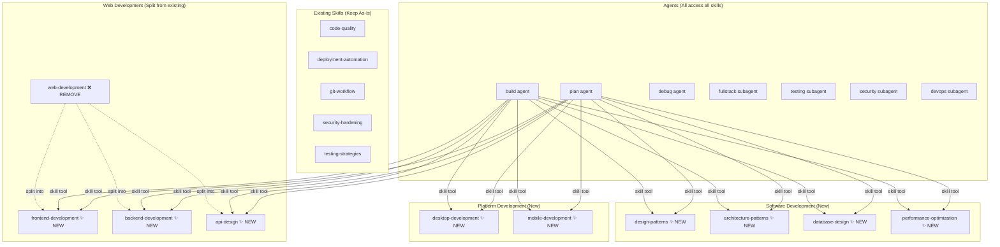
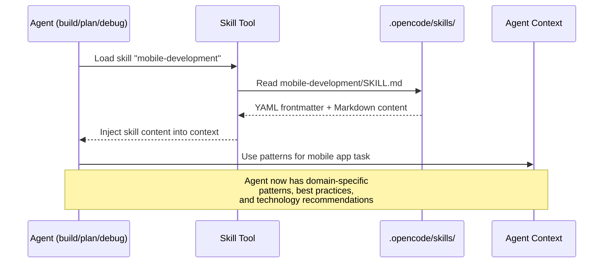

# Agent Skills Expansion - Web, Software, Desktop, and Mobile Development

# Plan: Agent Skills Expansion — Web, Software, Desktop & Mobile Development

## Summary

This plan adds 9 new skills and restructures 1 existing skill, bringing the total skill count from 6 to 14. The existing `web-development` skill is split into 3 focused sub-skills (`frontend-development`, `backend-development`, `api-design`), and 6 entirely new skills are added to cover Software Development patterns (`design-patterns`, `architecture-patterns`, `database-design`, `performance-optimization`), Desktop Applications (`desktop-development`), and Mobile Development (`mobile-development`). All skills follow the established convention: a directory under `.opencode/skills/` containing a `SKILL.md` file with YAML frontmatter (150-300 lines each).

## Architecture Diagram



## Complete Skills Inventory (14 Total)

### Category: Foundation (5 existing — no changes)
| # | Skill | Status | Lines |
|---|-------|--------|-------|
| 1 | `code-quality` | ✅ Keep | ~251 |
| 2 | `deployment-automation` | ✅ Keep | ~258 |
| 3 | `git-workflow` | ✅ Keep | ~281 |
| 4 | `security-hardening` | ✅ Keep | ~209 |
| 5 | `testing-strategies` | ✅ Keep | ~159 |

### Category: Web Development (split from existing)
| # | Skill | Status | Est. Lines | Description |
|---|-------|--------|------------|-------------|
| 6 | `frontend-development` | ✨ New | ~250 | Component architecture, state management, routing, SSR/SSG, styling, accessibility |
| 7 | `backend-development` | ✨ New | ~250 | Server architecture, middleware, ORMs, caching, auth, error handling |
| 8 | `api-design` | ✨ New | ~200 | REST, GraphQL, gRPC, WebSocket, OpenAPI, versioning, pagination |
| — | `web-development` | ❌ Remove | — | Replaced by the 3 skills above |

### Category: Software Development (new)
| # | Skill | Status | Est. Lines | Description |
|---|-------|--------|------------|-------------|
| 9 | `design-patterns` | ✨ New | ~280 | GoF patterns, enterprise patterns, functional patterns, DDD basics |
| 10 | `architecture-patterns` | ✨ New | ~250 | Microservices, monolith, event-driven, CQRS, hexagonal, clean architecture, 12-factor |
| 11 | `database-design` | ✨ New | ~220 | Schema design, normalization, indexing, SQL/NoSQL patterns, migrations, ORMs |
| 12 | `performance-optimization` | ✨ New | ~200 | Profiling, caching, algorithm optimization, memory management, bundle optimization |

### Category: Platform Development (new)
| # | Skill | Status | Est. Lines | Description |
|---|-------|--------|------------|-------------|
| 13 | `desktop-development` | ✨ New | ~280 | Cross-platform (Electron, Tauri) + Native (SwiftUI, WPF/WinUI, GTK), packaging, auto-update |
| 14 | `mobile-development` | ✨ New | ~280 | Cross-platform (React Native, Flutter) + Native (Swift, Kotlin/Compose), offline-first, push notifications |

## Tasks

- [ ] Task 1: Create `frontend-development` skill — Extract frontend content from existing `web-development`, expand with React/Vue/Angular/Svelte patterns, SSR/SSG, accessibility
- [ ] Task 2: Create `backend-development` skill — Extract backend content, expand with Node.js/Python/Go/Rust server patterns, middleware, ORMs, caching
- [ ] Task 3: Create `api-design` skill — Extract API content, expand with REST/GraphQL/gRPC/WebSocket patterns, OpenAPI, versioning strategies
- [ ] Task 4: Create `design-patterns` skill — GoF creational/structural/behavioral patterns, enterprise patterns, DDD, with code examples
- [ ] Task 5: Create `architecture-patterns` skill — Microservices, monolith, event-driven, CQRS, hexagonal, clean architecture, 12-factor methodology
- [ ] Task 6: Create `database-design` skill — Schema design, normalization, indexing, SQL/NoSQL patterns, ORM patterns, migration strategies
- [ ] Task 7: Create `performance-optimization` skill — Profiling, caching, algorithm complexity, memory management, web performance metrics
- [ ] Task 8: Create `desktop-development` skill — Electron/Tauri cross-platform + SwiftUI/WPF/GTK native, packaging, auto-update, system integration
- [ ] Task 9: Create `mobile-development` skill — React Native/Flutter cross-platform + Swift/Kotlin native, offline-first, push notifications, deep linking
- [ ] Task 10: Remove old `web-development` skill directory (after Tasks 1-3 are verified)
- [ ] Task 11: Verify all 14 skills are discoverable by the skill tool (test loading each skill)

## Technical Approach

### Phase 1: Web Development Split (Tasks 1-3)

**frontend-development/SKILL.md** — Content outline:
- `## When to Use` — Starting frontend projects, component design, styling decisions
- `## Component Architecture` — Single responsibility, composition, container/presentational, slots/render props
- `## Framework Patterns` — React (hooks, context, suspense), Vue 3 (composition API, composables), Angular (modules, services, signals), Svelte (stores, reactivity)
- `## State Management` — Local vs global vs server state, popular libraries per framework
- `## Routing & Navigation` — SPA routing, nested routes, route guards, code splitting by route
- `## Rendering Strategies` — CSR, SSR, SSG, ISR, streaming — when to use each
- `## Styling Approaches` — CSS-in-JS, utility-first (Tailwind), CSS Modules, SCSS, design tokens
- `## Accessibility` — Semantic HTML, ARIA, keyboard navigation, color contrast, screen readers
- `## Performance` — Memoization, lazy loading, virtualization, image optimization, Core Web Vitals
- `## Build Tooling` — Vite, Webpack, Turbopack, tree shaking, bundle analysis
- `## Technology Recommendations` — Stack recommendations per project type

**backend-development/SKILL.md** — Content outline:
- `## When to Use` — Building APIs, server logic, data processing, background jobs
- `## Server Architecture` — Layered architecture, clean/hexagonal, middleware pipeline
- `## Framework Patterns` — Node.js (Express/Fastify/NestJS), Python (FastAPI/Django), Go (Gin/Echo), Rust (Actix/Axum)
- `## Middleware & Plugins` — Request pipeline, auth middleware, logging, CORS, rate limiting
- `## Data Access` — Repository pattern, ORM patterns (Prisma, Drizzle, SQLAlchemy, GORM), query builders
- `## Caching Strategies` — In-memory, Redis, CDN, cache invalidation patterns
- `## Authentication & Authorization` — JWT, sessions, OAuth 2.0, RBAC, API keys
- `## Error Handling` — Consistent error responses, HTTP status codes, error logging, retry strategies
- `## Background Processing` — Job queues (BullMQ, Celery), scheduled tasks, event-driven processing
- `## Technology Recommendations` — Stack recommendations per use case

**api-design/SKILL.md** — Content outline:
- `## When to Use` — Designing new APIs, API refactoring, choosing API paradigm
- `## REST API Design` — Resource naming, HTTP methods, status codes, HATEOAS, content negotiation
- `## GraphQL` — Schema design, resolvers, queries/mutations/subscriptions, N+1 prevention, federation
- `## gRPC` — Protocol Buffers, service definitions, streaming patterns, when to use vs REST
- `## WebSocket` — Connection lifecycle, message patterns, pub/sub, heartbeats, reconnection
- `## API Versioning` — URL vs header vs query param versioning, deprecation strategies
- `## Documentation` — OpenAPI/Swagger, API-first design, auto-generated docs
- `## Pagination & Filtering` — Cursor vs offset pagination, filtering, sorting, sparse fieldsets
- `## Error Responses` — RFC 7807 problem details, error codes, localization
- `## Rate Limiting & Throttling` — Token bucket, sliding window, per-client limits
- `## Industry Guidelines` — Summary of Microsoft, Google, Zalando API guidelines

### Phase 2: Software Development Skills (Tasks 4-7)

**design-patterns/SKILL.md** — Content outline:
- `## When to Use` — Solving recurring design problems, code review, refactoring
- `## Creational Patterns` — Singleton, Factory Method, Abstract Factory, Builder, Prototype
- `## Structural Patterns` — Adapter, Bridge, Composite, Decorator, Facade, Proxy
- `## Behavioral Patterns` — Observer, Strategy, Command, State, Template Method, Iterator, Chain of Responsibility
- `## Enterprise Patterns` — Repository, Unit of Work, Service Layer, Domain Model, Data Mapper
- `## Functional Patterns` — Monads, functors, pipes, currying, immutability
- `## Domain-Driven Design` — Bounded contexts, aggregates, entities, value objects, domain events
- `## Anti-Patterns` — God object, spaghetti code, golden hammer, premature optimization
- `## Language-Specific Idioms` — TS/JS, Python, Go, Rust pattern implementations

**architecture-patterns/SKILL.md** — Content outline:
- `## When to Use` — System design, scaling decisions, greenfield vs brownfield
- `## Monolithic Architecture` — When to use, modular monolith, strangler fig migration
- `## Microservices` — Service boundaries, communication (sync/async), service discovery, saga pattern
- `## Event-Driven Architecture` — Event sourcing, CQRS, event bus, eventual consistency
- `## Clean / Hexagonal Architecture` — Ports & adapters, dependency inversion, onion layers
- `## Serverless Architecture` — FaaS patterns, cold starts, event triggers, limitations
- `## The Twelve-Factor App` — Summary of all 12 factors with modern context
- `## Data Architecture` — Data mesh, data lake, ETL/ELT patterns
- `## Decision Framework` — When to choose which architecture (decision matrix)

**database-design/SKILL.md** — Content outline:
- `## When to Use` — Schema design, query optimization, choosing databases
- `## Relational Design` — Normalization (1NF-3NF), denormalization trade-offs, foreign keys, constraints
- `## Indexing` — B-tree, hash, GIN, GiST, composite indexes, partial indexes, covering indexes
- `## Query Optimization` — EXPLAIN plans, N+1 queries, joins vs subqueries, query caching
- `## NoSQL Patterns` — Document modeling (MongoDB), key-value (Redis), wide-column (Cassandra), graph (Neo4j)
- `## ORM Patterns` — Active Record vs Data Mapper, lazy vs eager loading, migrations
- `## Migration Strategies` — Forward-only migrations, zero-downtime migrations, data backfills
- `## Caching Layer` — Read-through, write-through, cache-aside, TTL strategies
- `## Database Selection Guide` — PostgreSQL vs MySQL vs MongoDB vs Redis — decision matrix
- `## Tools` — Prisma, Drizzle, SQLAlchemy, GORM, Knex.js, TypeORM

**performance-optimization/SKILL.md** — Content outline:
- `## When to Use` — Slow applications, scaling bottlenecks, resource optimization
- `## Profiling` — CPU profiling, memory profiling, flame graphs, heap snapshots
- `## Web Performance` — Core Web Vitals (LCP, FID, CLS), Lighthouse, bundle analysis
- `## Caching Strategies` — Browser cache, CDN, server-side cache, memoization, HTTP caching headers
- `## Algorithm Optimization` — Big-O complexity, common optimizations, data structure selection
- `## Memory Management` — Garbage collection, memory leaks, object pooling, weak references
- `## Concurrency & Parallelism` — Async/await, web workers, thread pools, concurrent data structures
- `## Database Performance` — Connection pooling, query optimization, read replicas, sharding
- `## Network Optimization` — Compression, HTTP/2, connection reuse, prefetching, CDN
- `## Build Optimization` — Tree shaking, code splitting, minification, lazy loading
- `## Language-Specific Tools` — Chrome DevTools, Node.js profiler, Go pprof, Rust criterion

### Phase 3: Platform Development Skills (Tasks 8-9)

**desktop-development/SKILL.md** — Content outline:
- `## When to Use` — Building desktop applications, choosing cross-platform vs native
- `## Cross-Platform Frameworks`
  - **Electron** — Architecture (main/renderer), IPC, security model, packaging
  - **Tauri** — Rust backend + web frontend, smaller binaries, security advantages, plugin system
  - **.NET MAUI** — XAML UI, platform services, Blazor hybrid
  - **Qt/QML** — C++ with QML UI, signals/slots, cross-platform widgets
- `## Native Development`
  - **macOS (SwiftUI/AppKit)** — Views, data flow, Combine, menu bar apps
  - **Windows (WPF/WinUI 3)** — XAML, MVVM, Windows App SDK
  - **Linux (GTK 4)** — Widgets, signals, GLib, Flatpak packaging
- `## Desktop-Specific Patterns` — System tray, native menus, file system access, drag & drop, clipboard, keyboard shortcuts
- `## Auto-Update` — Electron auto-updater, Tauri updater, Sparkle (macOS), WinGet/MSIX
- `## Packaging & Distribution` — DMG/pkg (macOS), MSI/MSIX (Windows), AppImage/Flatpak/Snap (Linux), code signing, notarization
- `## Platform Design Guidelines` — Apple HIG, Windows Design, GNOME HIG summary
- `## Decision Framework` — Electron vs Tauri vs Native — trade-offs matrix
- `## Technology Recommendations` — Recommended stacks by use case

**mobile-development/SKILL.md** — Content outline:
- `## When to Use` — Building mobile applications, choosing cross-platform vs native
- `## Cross-Platform Frameworks`
  - **React Native** — JSI architecture, Fabric renderer, Hermes engine, Expo toolchain
  - **Flutter** — Widget tree, Dart, Skia/Impeller rendering, state management (Riverpod, BLoC, Provider)
  - **Capacitor/Ionic** — Web-based, native plugins, progressive enhancement
- `## Native Development`
  - **iOS (Swift/SwiftUI)** — Views, modifiers, data flow, Combine, async/await, UIKit interop
  - **Android (Kotlin/Jetpack Compose)** — Composables, state hoisting, ViewModel, Navigation, Material 3
- `## Mobile-Specific Patterns` — App lifecycle, deep linking / universal links, push notifications, biometric auth, permissions
- `## Offline-First` — Local storage (SQLite, Realm, Core Data), sync strategies, conflict resolution
- `## Navigation` — Stack navigation, tab navigation, drawer, deep link routing
- `## Performance` — Render optimization, list virtualization, image caching, startup time, memory
- `## Platform Design Guidelines` — Apple HIG (iOS), Material Design 3 summary
- `## App Distribution` — App Store (iOS), Google Play (Android), TestFlight, internal distribution, CI/CD
- `## Decision Framework` — React Native vs Flutter vs Native — trade-offs matrix
- `## Technology Recommendations` — Recommended stacks by use case

### Phase 4: Cleanup & Verification (Tasks 10-11)

1. Remove the old `web-development/` directory after confirming Tasks 1-3 produce equivalent + expanded content
2. Test each skill by loading it via the `skill` tool from an agent
3. Verify frontmatter format consistency across all 14 skills

## Sources by Skill

### frontend-development
| Category | Source | URL |
|----------|--------|-----|
| Official | React Docs | https://react.dev/learn |
| Official | Vue 3 Guide | https://vuejs.org/guide/introduction.html |
| Official | Angular Docs | https://angular.dev/overview |
| Official | Svelte 5 Docs | https://svelte.dev/docs/svelte/overview |
| Official | Next.js Docs | https://nextjs.org/docs |
| Official | MDN Web Docs | https://developer.mozilla.org/en-US/docs/Web |
| Best Practice | Vue Style Guide | https://vuejs.org/style-guide/ |
| Best Practice | Angular Style Guide | https://angular.dev/style-guide |
| Best Practice | Google TS Style Guide | https://google.github.io/styleguide/tsguide.html |
| Best Practice | W3C WCAG Quick Ref | https://www.w3.org/WAI/WCAG22/quickref/ |
| Community | Patterns.dev | https://www.patterns.dev/ |
| Community | Bulletproof React | https://github.com/alan2207/bulletproof-react |
| Community | web.dev | https://web.dev/learn |

### backend-development
| Category | Source | URL |
|----------|--------|-----|
| Official | Node.js API Docs | https://nodejs.org/docs/latest/api/ |
| Official | Express Guide | https://expressjs.com/en/guide/routing.html |
| Official | Fastify Docs | https://fastify.dev/docs/latest/ |
| Official | NestJS Docs | https://docs.nestjs.com/ |
| Official | FastAPI Docs | https://fastapi.tiangolo.com/ |
| Official | Django Docs | https://docs.djangoproject.com/en/stable/ |
| Official | Effective Go | https://go.dev/doc/effective_go |
| Official | Rust API Guidelines | https://rust-lang.github.io/api-guidelines/ |
| Best Practice | Node.js Best Practices | https://github.com/goldbergyoni/nodebestpractices |
| Best Practice | Express Security | https://expressjs.com/en/advanced/best-practice-security.html |
| Community | Prisma Docs | https://www.prisma.io/docs |
| Community | Drizzle ORM | https://orm.drizzle.team/docs/overview |

### api-design
| Category | Source | URL |
|----------|--------|-----|
| Official | OpenAPI Spec | https://swagger.io/specification/ |
| Official | GraphQL Learn | https://graphql.org/learn/ |
| Official | gRPC Docs | https://grpc.io/docs/ |
| Official | JSON:API Spec | https://jsonapi.org/format/ |
| Best Practice | Microsoft REST Guidelines | https://github.com/microsoft/api-guidelines |
| Best Practice | Google API Design Guide | https://cloud.google.com/apis/design |
| Best Practice | Zalando REST Guidelines | https://opensource.zalando.com/restful-api-guidelines/ |
| Best Practice | GraphQL Best Practices | https://graphql.org/learn/best-practices/ |
| Community | Apollo GraphQL | https://www.apollographql.com/docs/ |

### design-patterns
| Category | Source | URL |
|----------|--------|-----|
| Primary | Refactoring.Guru Patterns | https://refactoring.guru/design-patterns/catalog |
| Primary | Martin Fowler's Catalog | https://martinfowler.com/eaaCatalog/ |
| Primary | SourceMaking | https://sourcemaking.com/design_patterns |
| Best Practice | Rust Design Patterns | https://rust-unofficial.github.io/patterns/ |
| Best Practice | Python Patterns Guide | https://python-patterns.guide/ |
| Community | DDD Reference | https://www.domainlanguage.com/ddd/reference/ |
| Community | Awesome DDD | https://github.com/heynickc/awesome-ddd |

### architecture-patterns
| Category | Source | URL |
|----------|--------|-----|
| Primary | The Twelve-Factor App | https://12factor.net/ |
| Primary | Microservices.io Patterns | https://microservices.io/patterns/index.html |
| Primary | Azure Architecture Center | https://learn.microsoft.com/en-us/azure/architecture/ |
| Primary | Azure Cloud Design Patterns | https://learn.microsoft.com/en-us/azure/architecture/patterns/ |
| Primary | AWS Well-Architected | https://docs.aws.amazon.com/wellarchitected/latest/framework/welcome.html |
| Best Practice | Martin Fowler — Microservices | https://martinfowler.com/articles/microservices.html |
| Best Practice | Clean Architecture | https://blog.cleancoder.com/uncle-bob/2012/08/13/the-clean-architecture.html |
| Best Practice | Hexagonal Architecture | https://alistair.cockburn.us/hexagonal-architecture/ |
| Community | System Design Primer | https://github.com/donnemartin/system-design-primer |

### database-design
| Category | Source | URL |
|----------|--------|-----|
| Official | PostgreSQL Docs | https://www.postgresql.org/docs/current/ |
| Official | MongoDB Data Modeling | https://www.mongodb.com/docs/manual/data-modeling/ |
| Official | Redis Docs | https://redis.io/docs/ |
| Best Practice | Use The Index, Luke | https://use-the-index-luke.com/ |
| Best Practice | SQL Style Guide | https://www.sqlstyle.guide/ |
| Best Practice | MongoDB Schema Patterns | https://www.mongodb.com/blog/post/building-with-patterns-a-summary |
| Community | Prisma Data Guide | https://www.prisma.io/dataguide |

### performance-optimization
| Category | Source | URL |
|----------|--------|-----|
| Official | Chrome DevTools Perf | https://developer.chrome.com/docs/devtools/performance/ |
| Official | web.dev Performance | https://web.dev/explore/performance |
| Official | Core Web Vitals | https://web.dev/articles/vitals |
| Official | Rust Performance Book | https://nnethercote.github.io/perf-book/ |
| Best Practice | FE Performance Checklist | https://github.com/thedaviddias/Front-End-Performance-Checklist |
| Best Practice | Next.js Optimization | https://nextjs.org/docs/app/building-your-application/optimizing |
| Community | Big-O Cheat Sheet | https://www.bigocheatsheet.com/ |

### desktop-development
| Category | Source | URL |
|----------|--------|-----|
| Official | Electron Docs | https://www.electronjs.org/docs/latest/ |
| Official | Tauri Docs | https://tauri.app/start/ |
| Official | SwiftUI Docs | https://developer.apple.com/documentation/swiftui |
| Official | WPF Docs | https://learn.microsoft.com/en-us/dotnet/desktop/wpf/ |
| Official | WinUI 3 Docs | https://learn.microsoft.com/en-us/windows/apps/winui/winui3/ |
| Official | GTK 4 Docs | https://docs.gtk.org/gtk4/ |
| Official | Qt 6 Docs | https://doc.qt.io/qt-6/ |
| Official | .NET MAUI Docs | https://learn.microsoft.com/en-us/dotnet/maui/ |
| Best Practice | Apple HIG (macOS) | https://developer.apple.com/design/human-interface-guidelines/designing-for-macos |
| Best Practice | Windows Design | https://learn.microsoft.com/en-us/windows/apps/design/ |
| Best Practice | GNOME HIG | https://developer.gnome.org/hig/ |
| Best Practice | Electron Security | https://www.electronjs.org/docs/latest/tutorial/security |
| Community | Awesome Electron | https://github.com/sindresorhus/awesome-electron |
| Community | Awesome Tauri | https://github.com/tauri-apps/awesome-tauri |

### mobile-development
| Category | Source | URL |
|----------|--------|-----|
| Official | React Native Docs | https://reactnative.dev/docs/getting-started |
| Official | Flutter Docs | https://flutter.dev/docs |
| Official | Flutter Cookbook | https://docs.flutter.dev/cookbook |
| Official | Expo Docs | https://docs.expo.dev/ |
| Official | SwiftUI Docs | https://developer.apple.com/documentation/swiftui |
| Official | Jetpack Compose | https://developer.android.com/develop/ui/compose |
| Official | Android Architecture | https://developer.android.com/topic/architecture |
| Official | Capacitor Docs | https://capacitorjs.com/docs |
| Best Practice | Apple HIG (iOS) | https://developer.apple.com/design/human-interface-guidelines/designing-for-ios |
| Best Practice | Material Design 3 | https://m3.material.io/ |
| Best Practice | RN Performance | https://reactnative.dev/docs/performance |
| Best Practice | Flutter Performance | https://docs.flutter.dev/perf |
| Community | Awesome React Native | https://github.com/jondot/awesome-react-native |
| Community | Awesome Flutter | https://github.com/Solido/awesome-flutter |
| Community | Awesome Offline-First | https://github.com/nicedoc/awesome-offline-first |

## Data Flow



## Skill File Template (Follow for All New Skills)

```markdown
---
name: {skill-slug}
description: {One-line description}
license: Apache-2.0
compatibility: opencode
---

# {Skill Name} Skill

This skill provides {what it provides}.

## When to Use

Use this skill when:
- {trigger 1}
- {trigger 2}
- {trigger 3}

## {Section 1}

### {Subsection}
- Pattern / principle
- Code example (fenced with language tag)

## {Section N}

## Technology Recommendations

### {Category}
- {Tech 1} + {Tech 2} + {Tech 3}
```

## Risks & Mitigations

| Risk | Impact | Likelihood | Mitigation |
|------|--------|------------|------------|
| Skills become too long (>300 lines) | Medium | Medium | Strict content curation; link to sources rather than duplicating |
| Removing web-development breaks existing workflows | High | Low | Create replacement skills first, verify coverage, then remove |
| Skills overlap with each other | Medium | Medium | Clear "When to Use" sections; each skill has distinct scope |
| Content becomes outdated quickly | Medium | High | Use principles over tool-specific details; note framework versions |
| Too many skills slow down skill selection | Low | Low | Clear naming and descriptions help the skill tool match correctly |

## Estimated Effort

- **Complexity**: Medium
- **Time Estimate**: 4-6 hours (roughly 30-45 minutes per skill × 9 new skills + cleanup)
- **Dependencies**: None — all skills are independent and can be created in any order
- **Parallelization**: Tasks 1-9 can be done in parallel; Tasks 10-11 must follow

## Key Decisions

1. **Decision**: Split `web-development` into `frontend-development`, `backend-development`, and `api-design`
   **Rationale**: The existing 122-line skill was too broad to be useful. Three focused skills allow agents to load only relevant context and provide deeper guidance per domain.

2. **Decision**: Cover both cross-platform AND native in desktop/mobile skills (rather than separate skills)
   **Rationale**: 150-300 lines is sufficient to cover both approaches with trade-off guidance. Developers often need to understand both to make informed decisions. A single skill with a decision framework is more useful than two narrow skills.

3. **Decision**: Keep existing 5 foundation skills unchanged
   **Rationale**: They are well-structured, appropriately scoped, and not impacted by this expansion. No need to touch working code.

4. **Decision**: Use curated patterns over exhaustive documentation
   **Rationale**: Skills are context injections for AI agents, not textbooks. Concise, actionable patterns with "when to use" guidance are more effective than comprehensive references.

5. **Decision**: Include sources as part of plan, not embedded in skills
   **Rationale**: Skill files should contain the distilled knowledge itself, not links to external resources. Sources inform skill creation but the skills should be self-contained.

## Suggested Branch Name

`feature/agent-skills-expansion`

## Tasks

- [ ] Create frontend-development skill (split from web-development)
- [ ] Create backend-development skill (split from web-development)
- [ ] Create api-design skill (split from web-development)
- [ ] Create design-patterns skill
- [ ] Create architecture-patterns skill
- [ ] Create database-design skill
- [ ] Create performance-optimization skill
- [ ] Create desktop-development skill
- [ ] Create mobile-development skill
- [ ] Remove old web-development skill directory
- [ ] Verify all 14 skills are discoverable by the skill tool
