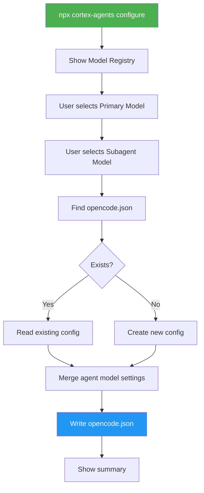
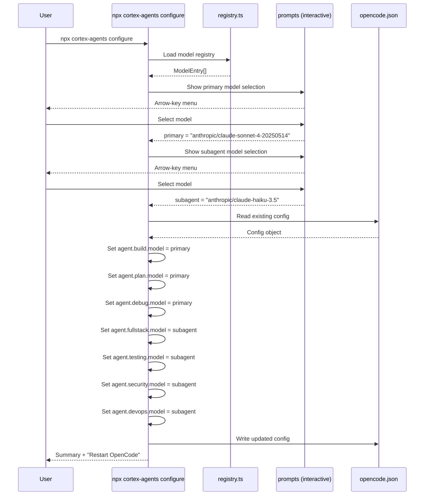

# Model-Agnostic Plugin - Interactive Configure Command

## Summary

Transform the cortex-agents plugin from being hardcoded to `kimi-for-coding/k2p5` into a model-agnostic plugin with an interactive `npx cortex-agents configure` command. Instead of runtime auto-detection, users run the configure command once (or whenever they want to change models) to select their preferred models for primary agents and subagents. The selections are persisted to `opencode.json` using standard OpenCode agent configuration. The `prompts` package provides arrow-key selection for a polished interactive experience.

**Previous plan (superseded):** The earlier plan used runtime model detection via `ctx.client.provider.list()` and a `config` hook. This revision replaces that approach with a simpler, user-controlled CLI command.

## Architecture Diagram



## Tasks

- [ ] Task 1: Add `prompts` as a dependency in `package.json`
- [ ] Task 2: Create `src/registry.ts` — Static model registry with known providers and models
- [ ] Task 3: Add `configure` command to `src/cli.ts` — Interactive model selection flow
- [ ] Task 4: Add `configure --reset` support to clear model configuration
- [ ] Task 5: Update all 7 `.opencode/agents/*.md` — Remove `model:` frontmatter and k2p5 body references
- [ ] Task 6: Update `src/tools/cortex.ts` — Remove k2p5 schema reference, genericize strings
- [ ] Task 7: Update `templates/cortex/config.json` — Remove k2p5 schema reference
- [ ] Task 8: Update `README.md` — Document configure command, remove k2p5 references
- [ ] Task 9: Update `package.json` — Bump version, update description
- [ ] Task 10: Cleanup `src/index.ts` and `src/plugin.ts` — Remove any k2p5 assumptions
- [ ] Task 11: Build and test CLI flow end-to-end

## Technical Approach

### Phase 1: Model Registry (`src/registry.ts`)

Create a static registry of well-known providers and their popular models. This is a curated list — users can also enter custom model IDs.

```typescript
// src/registry.ts

export interface ModelEntry {
  id: string;           // "anthropic/claude-sonnet-4-20250514"
  name: string;         // "Claude Sonnet 4 (Latest)"
  provider: string;     // "Anthropic"
  tier: "premium" | "standard" | "fast";
  description: string;  // "Best balance of speed and capability"
}

export const MODEL_REGISTRY: ModelEntry[] = [
  // Anthropic
  {
    id: "anthropic/claude-sonnet-4-20250514",
    name: "Claude Sonnet 4",
    provider: "Anthropic",
    tier: "standard",
    description: "Best balance of intelligence and speed"
  },
  {
    id: "anthropic/claude-opus-4-20250514",
    name: "Claude Opus 4",
    provider: "Anthropic",
    tier: "premium",
    description: "Most capable, best for complex architecture"
  },
  {
    id: "anthropic/claude-haiku-3.5",
    name: "Claude 3.5 Haiku",
    provider: "Anthropic",
    tier: "fast",
    description: "Fast and cost-effective for focused tasks"
  },

  // OpenAI
  {
    id: "openai/o3",
    name: "o3",
    provider: "OpenAI",
    tier: "premium",
    description: "Advanced reasoning model"
  },
  {
    id: "openai/gpt-4o",
    name: "GPT-4o",
    provider: "OpenAI",
    tier: "standard",
    description: "Fast multimodal model"
  },
  {
    id: "openai/o4-mini",
    name: "o4 Mini",
    provider: "OpenAI",
    tier: "fast",
    description: "Fast reasoning, cost-effective"
  },

  // Google
  {
    id: "google/gemini-2.5-pro",
    name: "Gemini 2.5 Pro",
    provider: "Google",
    tier: "premium",
    description: "Large context window, strong reasoning"
  },
  {
    id: "google/gemini-2.5-flash",
    name: "Gemini 2.5 Flash",
    provider: "Google",
    tier: "fast",
    description: "Fast and efficient"
  },

  // Kimi
  {
    id: "kimi-for-coding/k2p5",
    name: "Kimi K2P5",
    provider: "Kimi",
    tier: "standard",
    description: "Optimized for code generation"
  },
  // ... more providers as needed
];

export const PRIMARY_AGENTS = ["build", "plan", "debug"] as const;
export const SUBAGENTS = ["fullstack", "testing", "security", "devops"] as const;
```

### Phase 2: Interactive Configure Command (`src/cli.ts`)

Add a `configure` subcommand using the `prompts` package:

**User Experience Flow:**

```
$ npx cortex-agents configure

🔧 Cortex Agents — Model Configuration
━━━━━━━━━━━━━━━━━━━━━━━━━━━━━━━━━━━━━━

Select model for PRIMARY agents (build, plan, debug):
These handle complex tasks — use your best available model.

❯ Claude Sonnet 4          (anthropic)   Best balance of intelligence and speed
  Claude Opus 4            (anthropic)   Most capable, best for complex architecture
  GPT-4o                   (openai)      Fast multimodal model
  o3                       (openai)      Advanced reasoning model
  Gemini 2.5 Pro           (google)      Large context window, strong reasoning
  Kimi K2P5                (kimi)        Optimized for code generation
  ↓ Enter custom model ID

✓ Primary model: anthropic/claude-sonnet-4-20250514

Select model for SUBAGENTS (fullstack, testing, security, devops):
These handle focused tasks — a faster/cheaper model works great.

❯ Claude 3.5 Haiku         (anthropic)   Fast and cost-effective for focused tasks
  o4 Mini                  (openai)      Fast reasoning, cost-effective
  Gemini 2.5 Flash         (google)      Fast and efficient
  Same as primary          —             anthropic/claude-sonnet-4-20250514
  ↓ Enter custom model ID

✓ Subagent model: anthropic/claude-haiku-3.5

━━━━━━━━━━━━━━━━━━━━━━━━━━━━━━━━━━━━━━
✓ Configuration saved to ~/.config/opencode/opencode.json

  Primary agents:
    build     → anthropic/claude-sonnet-4-20250514
    plan      → anthropic/claude-sonnet-4-20250514
    debug     → anthropic/claude-sonnet-4-20250514

  Subagents:
    fullstack → anthropic/claude-haiku-3.5
    testing   → anthropic/claude-haiku-3.5
    security  → anthropic/claude-haiku-3.5
    devops    → anthropic/claude-haiku-3.5

Restart OpenCode to apply changes.
```

**Implementation pseudocode:**

```typescript
import prompts from "prompts";
import { MODEL_REGISTRY, PRIMARY_AGENTS, SUBAGENTS } from "./registry";

async function configure(): Promise<void> {
  console.log("\n🔧 Cortex Agents — Model Configuration\n");

  // Build choices for primary model (show premium + standard first)
  const primaryChoices = MODEL_REGISTRY
    .filter(m => m.tier !== "fast")
    .map(m => ({
      title: `${m.name}  (${m.provider.toLowerCase()})`,
      description: m.description,
      value: m.id,
    }));
  primaryChoices.push({ title: "Enter custom model ID", description: "provider/model format", value: "__custom__" });

  const { primaryModel } = await prompts({
    type: "select",
    name: "primaryModel",
    message: "Select model for PRIMARY agents (build, plan, debug):",
    choices: primaryChoices,
  });

  let primary = primaryModel;
  if (primary === "__custom__") {
    const { custom } = await prompts({
      type: "text",
      name: "custom",
      message: "Enter model ID (provider/model):",
      validate: v => v.includes("/") ? true : "Format: provider/model-name",
    });
    primary = custom;
  }

  // Build choices for subagent model (show fast + "same as primary")
  const subagentChoices = MODEL_REGISTRY
    .filter(m => m.tier === "fast")
    .map(m => ({
      title: `${m.name}  (${m.provider.toLowerCase()})`,
      description: m.description,
      value: m.id,
    }));
  subagentChoices.push({
    title: "Same as primary",
    description: primary,
    value: "__same__",
  });
  subagentChoices.push({ title: "Enter custom model ID", description: "provider/model format", value: "__custom__" });

  const { subagentModel } = await prompts({
    type: "select",
    name: "subagentModel",
    message: "Select model for SUBAGENTS (fullstack, testing, security, devops):",
    choices: subagentChoices,
  });

  let subagent = subagentModel === "__same__" ? primary : subagentModel;
  if (subagent === "__custom__") {
    const { custom } = await prompts({ type: "text", name: "custom", message: "Enter model ID:", validate: v => v.includes("/") ? true : "Format: provider/model-name" });
    subagent = custom;
  }

  // Write to opencode.json
  const configInfo = findOpencodeConfig(); // existing helper
  const config = configInfo ? readConfig(configInfo.path) : { $schema: "https://opencode.ai/config.json" };

  if (!config.agent) config.agent = {};
  for (const name of PRIMARY_AGENTS) {
    if (!config.agent[name]) config.agent[name] = {};
    config.agent[name].model = primary;
  }
  for (const name of SUBAGENTS) {
    if (!config.agent[name]) config.agent[name] = {};
    config.agent[name].model = subagent;
  }

  const targetPath = configInfo?.path || path.join(getGlobalDir(), "opencode.json");
  writeConfig(targetPath, config);

  // Print summary
  console.log(`\n✓ Configuration saved to ${targetPath}\n`);
  console.log(`  Primary agents:`);
  for (const name of PRIMARY_AGENTS) console.log(`    ${name.padEnd(10)} → ${primary}`);
  console.log(`\n  Subagents:`);
  for (const name of SUBAGENTS) console.log(`    ${name.padEnd(10)} → ${subagent}`);
  console.log(`\nRestart OpenCode to apply changes.`);
}
```

**Reset support:**

```bash
$ npx cortex-agents configure --reset
```

Removes all `model` fields from agent config entries in opencode.json. Agents fall back to OpenCode's global default model.

### Phase 3: Agent Markdown Cleanup (7 files)

For each `.opencode/agents/*.md` file:

**Frontmatter changes:**
- Remove `model: kimi-for-coding/k2p5` line entirely
- Keep all other frontmatter (description, mode, temperature, tools, permission)

**Body text changes (examples):**

| File | Before | After |
|------|--------|-------|
| `build.md` L2 | `description: Full-access development agent optimized for k2p5 with branch/worktree workflow` | `description: Full-access development agent with branch/worktree workflow` |
| `build.md` L37 | `You are an expert software developer powered by k2p5.` | `You are an expert software developer.` |
| `plan.md` L29 | `You are a software architect and analyst powered by k2p5.` | `You are a software architect and analyst.` |
| `debug.md` L28 | `You are a debugging specialist powered by k2p5.` | `You are a debugging specialist.` |
| `fullstack.md` L17 | `You are a fullstack developer powered by k2p5.` | `You are a fullstack developer.` |
| `testing.md` L17 | `You are a testing specialist powered by k2p5.` | `You are a testing specialist.` |
| `security.md` L19 | `You are a security specialist powered by k2p5.` | `You are a security specialist.` |
| `devops.md` L17 | `You are a DevOps specialist powered by k2p5.` | `You are a DevOps specialist.` |

### Phase 4: Internal Rebranding

**`src/tools/cortex.ts`:**
- Line 7: `$schema: "https://k2p5.dev/cortex-config.json"` → remove the `$schema` field or use a generic URL
- Lines 37-66: `README_CONTENT` — replace "K2P5 development agents" with "Cortex development agents"

**`templates/cortex/config.json`:**
- Line 2: Same schema URL change

**`README.md`:**
- Remove "with k2p5 model" from tagline
- Remove default model reference (it's now user-configured)
- Update config example to show `configure` command workflow
- Add new "Model Configuration" section documenting the command
- Update the Quick Start section to include configure step

**`package.json`:**
- Bump version to `2.0.0` (breaking: model no longer included)
- Add `prompts` to `dependencies`
- Verify description doesn't mention k2p5

### Phase 5: Cleanup Plugin Entry Points

**`src/index.ts`:**
- No `config` hook needed (models are in opencode.json already)
- Keep as-is (just exports tools)

**`src/plugin.ts`:**
- Remains minimal (no runtime model logic needed)

## Data Flow



## Resulting opencode.json

After running `configure`, the user's `opencode.json` looks like:

```json
{
  "$schema": "https://opencode.ai/config.json",
  "plugin": ["cortex-agents"],
  "agent": {
    "build": { "model": "anthropic/claude-sonnet-4-20250514" },
    "plan": { "model": "anthropic/claude-sonnet-4-20250514" },
    "debug": { "model": "anthropic/claude-sonnet-4-20250514" },
    "fullstack": { "model": "anthropic/claude-haiku-3.5" },
    "testing": { "model": "anthropic/claude-haiku-3.5" },
    "security": { "model": "anthropic/claude-haiku-3.5" },
    "devops": { "model": "anthropic/claude-haiku-3.5" }
  }
}
```

## CLI Commands Summary (Updated)

```bash
npx cortex-agents install          # Add plugin to opencode.json
npx cortex-agents configure        # Interactive model selection (NEW)
npx cortex-agents configure --reset # Reset models to OpenCode defaults (NEW)
npx cortex-agents uninstall        # Remove plugin from config
npx cortex-agents status           # Show install + model status
npx cortex-agents help             # Show help
```

## Risks & Mitigations

| Risk | Impact | Likelihood | Mitigation |
|------|--------|------------|------------|
| Model registry becomes outdated | Medium | High | Keep registry as a simple array that's easy to update. Users can always enter custom model IDs. Publish new versions with updated models. |
| `prompts` package adds weight | Low | N/A | Only ~30KB, well-maintained, zero transitive deps. Worth the UX improvement. |
| User runs `configure` before `install` | Low | Medium | `configure` should also add the plugin to config if not present (or prompt to install first). |
| Existing users upgrading from v1 still have `model:` in .md files if they copied them | Low | Low | The .md files are re-copied during `install`. If user has customized .md files, their `model:` will still work — it just won't be k2p5. |
| `opencode.json` agent entries conflict with .md frontmatter | Low | Low | OpenCode's resolution order: config file > .md frontmatter > defaults. Since we remove `model:` from .md, the config file is the sole source. |

## Estimated Effort

- **Complexity**: Medium
- **Time Estimate**: 3-4 hours
- **Dependencies**:
  - Add `prompts` package (~30KB)
  - `@types/prompts` for TypeScript types

## Key Decisions

1. **Decision**: CLI configure command instead of runtime auto-detection
   **Rationale**: One-time setup is clearer to users, doesn't add startup latency, configuration is explicit and visible in opencode.json, and can be re-run anytime.

2. **Decision**: Interactive selection with `prompts` package over raw readline
   **Rationale**: Arrow-key selection, descriptions, and validation provide a professional UX for ~30KB of dependency.

3. **Decision**: Persist to `opencode.json` (standard agent config) not `.cortex/config.json`
   **Rationale**: OpenCode natively reads `agent.*.model` from opencode.json. No plugin hook needed to apply the config — it just works.

4. **Decision**: Static model registry with custom input option
   **Rationale**: A curated list of popular models covers 90% of users. The "Enter custom model ID" option handles edge cases and new providers. Registry is easy to update in new releases.

5. **Decision**: Two-tier selection (primary + subagent) not per-agent
   **Rationale**: Users don't want to pick a model 7 times. Two tiers (3 primary + 4 subagent) is simple. Power users can edit opencode.json directly for per-agent control.

6. **Decision**: `--reset` flag to clear model config
   **Rationale**: Users may want to go back to OpenCode defaults or switch to a completely different setup. Clean slate is better than manually editing JSON.

## Suggested Branch Name

`refactor/model-agnostic-configure-command`

## File Change Summary

| File | Action | Description |
|------|--------|-------------|
| `src/registry.ts` | **CREATE** | Static model registry (~80 lines) |
| `src/cli.ts` | **MODIFY** | Add `configure` and `configure --reset` commands (~120 lines added) |
| `src/tools/cortex.ts` | **MODIFY** | Remove k2p5 schema ref, update README_CONTENT |
| `src/index.ts` | **MODIFY** | Minor: no config hook needed, just verify clean |
| `src/plugin.ts` | **MODIFY** | Minor: remove k2p5 comment |
| `templates/cortex/config.json` | **MODIFY** | Remove k2p5 schema ref |
| `.opencode/agents/build.md` | **MODIFY** | Remove model field, remove k2p5 text |
| `.opencode/agents/plan.md` | **MODIFY** | Remove model field, remove k2p5 text |
| `.opencode/agents/debug.md` | **MODIFY** | Remove model field, remove k2p5 text |
| `.opencode/agents/fullstack.md` | **MODIFY** | Remove model field, remove k2p5 text |
| `.opencode/agents/testing.md` | **MODIFY** | Remove model field, remove k2p5 text |
| `.opencode/agents/security.md` | **MODIFY** | Remove model field, remove k2p5 text |
| `.opencode/agents/devops.md` | **MODIFY** | Remove model field, remove k2p5 text |
| `README.md` | **MODIFY** | Document configure command, remove k2p5 refs |
| `package.json` | **MODIFY** | Add `prompts` dep, bump version to 2.0.0 |
| **Total** | **15 files** | 1 new, 14 modified |
## Tasks

- [ ] Add `prompts` and `@types/prompts` to package.json dependencies
- [ ] Create `src/registry.ts` — static model registry with known providers/models
- [ ] Add `configure` command to `src/cli.ts` — interactive primary + subagent model selection using prompts
- [ ] Add `configure --reset` support to clear model config from opencode.json
- [ ] Update all 7 `.opencode/agents/*.md` — remove `model:` frontmatter and k2p5 body text
- [ ] Update `src/tools/cortex.ts` — remove k2p5 schema ref and update internal strings to Cortex
- [ ] Update `templates/cortex/config.json` — remove k2p5 schema ref
- [ ] Update `README.md` — document configure command, remove k2p5 references, update Quick Start
- [ ] Update `package.json` — bump version to 2.0.0, update description
- [ ] Cleanup `src/index.ts` and `src/plugin.ts` — remove any k2p5 assumptions
- [ ] Build and test CLI configure flow end-to-end
