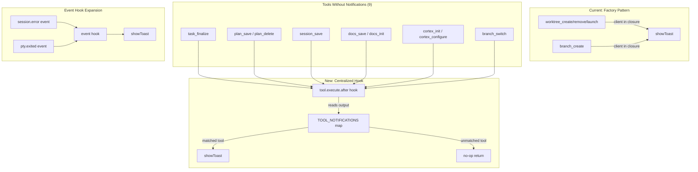
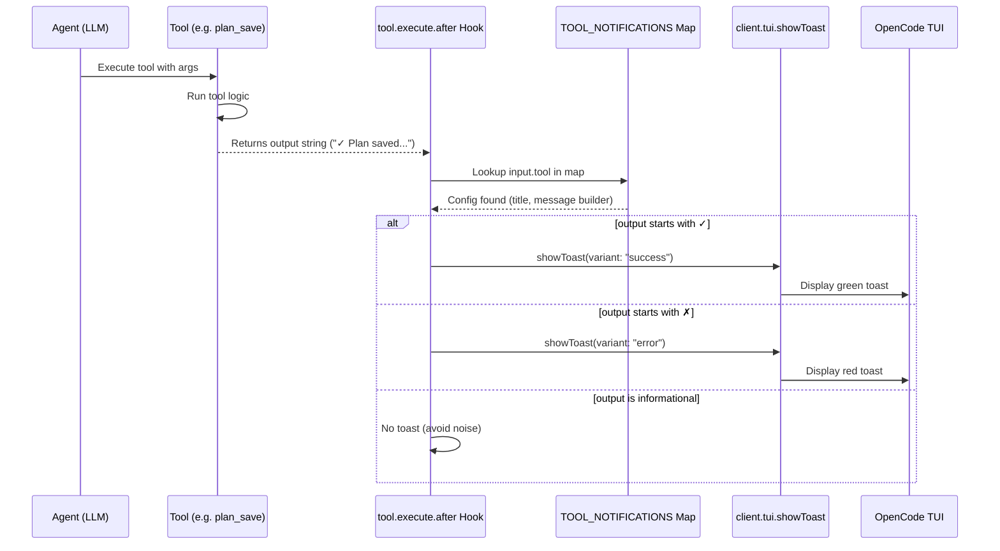
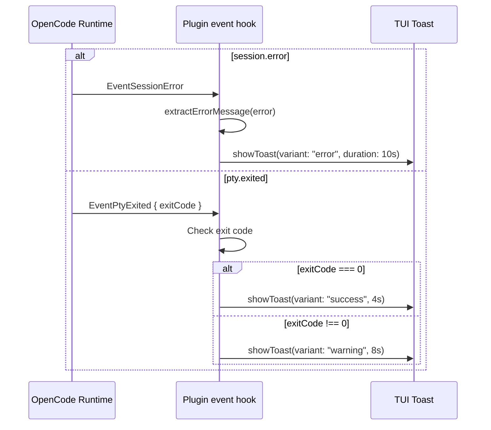

# Complete Toast Notification Coverage via tool.execute.after Hook

## Summary

Nine write-operation tools in cortex-agents send no toast notifications because they lack access to the OpenCode `client`. Instead of converting every tool to a factory function (which would touch 7 files), we use the `tool.execute.after` hook — a centralized, post-execution callback in `src/index.ts` that receives the tool name, args, and output for every tool call. A declarative notification map routes tool results to the appropriate toast.

Additionally, the `event` hook is expanded to surface `session.error` and `pty.exited` events as toasts.

**Net result**: Only `src/index.ts` changes. Zero modifications to individual tool files.

## Architecture Diagram



## Tasks
- [ ] Task 1: Add TOOL_NOTIFICATIONS map — declarative config for all 9 tools
- [ ] Task 2: Add `tool.execute.after` hook to plugin Hooks return
- [ ] Task 3: Add `extractErrorMessage` helper for session.error event types
- [ ] Task 4: Expand event hook — add session.error and pty.exited handlers
- [ ] Task 5: Build and verify TypeScript compiles cleanly
- [ ] Task 6: Manual smoke test — trigger each tool and verify toasts appear

## Technical Approach

### Phase 1: Declarative Notification Map

Add a `TOOL_NOTIFICATIONS` config object at the top of `src/index.ts`:

```typescript
interface ToolNotificationConfig {
  successTitle: string;
  successMsg: (args: any, output: string) => string;
  errorTitle: string;
  errorMsg: (args: any, output: string) => string;
  successDuration?: number;  // default: 4000
  errorDuration?: number;    // default: 8000
}

const TOOL_NOTIFICATIONS: Record<string, ToolNotificationConfig> = {
  task_finalize: {
    successTitle: "Task Finalized",
    successMsg: (args) => 
      `Committed & pushed: ${args.commitMessage?.substring(0, 50) || ""}`,
    errorTitle: "Finalization Failed",
    errorMsg: (_, out) => out.replace(/^✗\s*/, "").split("\n")[0].substring(0, 100),
    successDuration: 5000,
    errorDuration: 10000,
  },
  plan_save: {
    successTitle: "Plan Saved",
    successMsg: (args) => args.title || "Plan saved",
    errorTitle: "Plan Save Failed",
    errorMsg: (_, out) => out.substring(0, 100),
  },
  plan_delete: {
    successTitle: "Plan Deleted",
    successMsg: (args) => args.filename || "Plan deleted",
    errorTitle: "Plan Delete Failed",
    errorMsg: (_, out) => out.substring(0, 100),
  },
  session_save: {
    successTitle: "Session Saved",
    successMsg: () => "Session summary recorded",
    errorTitle: "Session Save Failed",
    errorMsg: (_, out) => out.substring(0, 100),
  },
  docs_save: {
    successTitle: "Documentation Saved",
    successMsg: (args) => `${args.type}: ${args.title}`,
    errorTitle: "Doc Save Failed",
    errorMsg: (_, out) => out.substring(0, 100),
  },
  docs_init: {
    successTitle: "Docs Initialized",
    successMsg: () => "Documentation directory created",
    errorTitle: "Docs Init Failed",
    errorMsg: (_, out) => out.substring(0, 100),
  },
  cortex_init: {
    successTitle: "Project Initialized",
    successMsg: () => ".cortex directory created",
    errorTitle: "Init Failed",
    errorMsg: (_, out) => out.substring(0, 100),
  },
  cortex_configure: {
    successTitle: "Models Configured",
    successMsg: (args) => 
      `Primary: ${args.primaryModel?.split("/").pop() || "set"}`,
    errorTitle: "Configure Failed",
    errorMsg: (_, out) => out.substring(0, 100),
  },
  branch_switch: {
    successTitle: "Branch Switched",
    successMsg: (args) => `Now on ${args.branch}`,
    errorTitle: "Branch Switch Failed",
    errorMsg: (_, out) => out.replace(/^✗\s*/, "").split("\n")[0].substring(0, 100),
  },
};
```

**Why declarative?** Easy to add/remove/modify notifications without touching logic. Each entry maps tool name → toast content.

### Phase 2: Add `tool.execute.after` Hook

In the Hooks return object of `CortexPlugin`, add:

```typescript
"tool.execute.after": async (input, output) => {
  const config = TOOL_NOTIFICATIONS[input.tool];
  if (!config) return; // No notification for this tool

  try {
    const isSuccess = output.output.startsWith("✓");
    const isError = output.output.startsWith("✗");

    if (isSuccess) {
      await ctx.client.tui.showToast({
        body: {
          title: config.successTitle,
          message: config.successMsg(input.args, output.output),
          variant: "success",
          duration: config.successDuration ?? 4000,
        },
      });
    } else if (isError) {
      await ctx.client.tui.showToast({
        body: {
          title: config.errorTitle,
          message: config.errorMsg(input.args, output.output),
          variant: "error",
          duration: config.errorDuration ?? 8000,
        },
      });
    }
    // Informational or warning outputs (⚠) — no toast to avoid noise
  } catch {
    // Toast failure is non-fatal
  }
},
```

**Key design decisions:**
- Only fires for tools in the notification map (O(1) lookup)
- Uses the `✓`/`✗` prefix convention already used by ALL tools in the codebase
- Does NOT fire for read-only tools (`plan_list`, `session_list`, etc.)
- Does NOT fire for tools with existing factory toasts (`worktree_create`, `branch_create`, etc.)
- Wrapped in try/catch — toast failures never affect tool execution

### Phase 3: Expand Event Hook

Add two new event handlers alongside the existing agent handover handler:

```typescript
async event({ event }) {
  try {
    // ── Existing: Agent handover ──────────────────────
    if (
      event.type === "message.part.updated" &&
      "part" in event.properties &&
      event.properties.part.type === "agent"
    ) {
      const agentName = event.properties.part.name;
      const description =
        AGENT_DESCRIPTIONS[agentName] || `Switched to ${agentName}`;
      await ctx.client.tui.showToast({
        body: {
          title: `Agent: ${agentName}`,
          message: description,
          variant: "info",
          duration: 4000,
        },
      });
    }

    // ── New: Session errors ──────────────────────────
    if (event.type === "session.error") {
      const error = event.properties.error;
      const message = extractErrorMessage(error);
      await ctx.client.tui.showToast({
        body: {
          title: "Session Error",
          message,
          variant: "error",
          duration: 10000,
        },
      });
    }

    // ── New: PTY exited ──────────────────────────────
    if (event.type === "pty.exited") {
      const exitCode = event.properties.exitCode;
      await ctx.client.tui.showToast({
        body: {
          title: "Terminal Exited",
          message:
            exitCode === 0
              ? "Terminal session completed successfully"
              : `Terminal exited with code ${exitCode}`,
          variant: exitCode === 0 ? "success" : "warning",
          duration: exitCode === 0 ? 4000 : 8000,
        },
      });
    }
  } catch {
    // Toast failure is non-fatal
  }
},
```

### Phase 4: Error Message Extraction Helper

Add a helper function to extract human-readable messages from the session error union type:

```typescript
function extractErrorMessage(
  error?: { name: string; data: Record<string, unknown> }
): string {
  if (!error) return "An unknown error occurred";

  switch (error.name) {
    case "ProviderAuthError":
      return `Auth error: ${error.data.message || "Provider authentication failed"}`;
    case "UnknownError":
      return `${error.data.message || "An unknown error occurred"}`;
    case "MessageOutputLengthError":
      return "Output length exceeded — try compacting the session";
    case "MessageAbortedError":
      return `Aborted: ${error.data.message || "Message was aborted"}`;
    case "APIError":
      return `API error: ${error.data.message || "Request failed"}`;
    default:
      return `Error: ${error.name}`;
  }
}
```

## Data Flow





## Notification Coverage Matrix (After Implementation)

```
Tool                  | Before | After  | Source
─────────────────────┼────────┼────────┼──────────────────────
worktree_create       | ✅     | ✅     | Factory (unchanged)
worktree_remove       | ✅     | ✅     | Factory (unchanged)
worktree_launch       | ✅     | ✅     | Factory (unchanged)
branch_create         | ✅     | ✅     | Factory (unchanged)
branch_switch         | ❌     | ✅     | tool.execute.after
task_finalize         | ❌     | ✅     | tool.execute.after
plan_save             | ❌     | ✅     | tool.execute.after
plan_delete           | ❌     | ✅     | tool.execute.after
session_save          | ❌     | ✅     | tool.execute.after
docs_save             | ❌     | ✅     | tool.execute.after
docs_init             | ❌     | ✅     | tool.execute.after
cortex_init           | ❌     | ✅     | tool.execute.after
cortex_configure      | ❌     | ✅     | tool.execute.after
─────────────────────┼────────┼────────┼──────────────────────
Event: agent handover | ✅     | ✅     | event hook (unchanged)
Event: session.error  | ❌     | ✅     | event hook (new)
Event: pty.exited     | ❌     | ✅     | event hook (new)
```

## Risks & Mitigations

| Risk | Impact | Likelihood | Mitigation |
|------|--------|------------|------------|
| Tool name in hook differs from registered name (e.g., prefixed by OpenCode) | High | Low | Verify during smoke test. The SDK docs show tool names passed as-is. If prefixed, adjust the map keys. |
| Double-toast for factory tools if accidentally added to map | Medium | Low | Explicitly exclude `worktree_*` and `branch_create` from the notification map. Add comment documenting this. |
| `output.output` format changes (tools stop using `✓`/`✗` prefixes) | Medium | Low | All 22 tools in the codebase consistently use this convention. It's a project standard. |
| `session.error` fires too frequently during retries | Low | Medium | Toast shows for 10s. If errors spam, user sees the latest. The `catch` block ensures no crash. |
| `tool.execute.after` hook not supported in older OpenCode versions | Medium | Low | The hook is defined in the current `@opencode-ai/plugin` SDK (v1.2.10+). Wrap in `try/catch` at registration. |

## Estimated Effort

- **Complexity**: Low — one file, declarative config + two hooks
- **Time Estimate**: 30–45 minutes
- **Dependencies**: None (uses existing SDK hooks)

## Key Decisions

1. **Decision**: Use `tool.execute.after` hook instead of converting tools to factory functions
   **Rationale**: Modifies only `src/index.ts` vs. 7 files. Centralized, declarative configuration. Separation of concerns — tools handle business logic, the hook handles notifications. No changes to the existing factory pattern for worktree/branch tools.

2. **Decision**: Declarative notification map (`TOOL_NOTIFICATIONS`) rather than inline switch/case
   **Rationale**: Easy to read, extend, and maintain. Adding a new tool's notifications is a single map entry. Decoupled from the hook execution logic.

3. **Decision**: Only toast on `✓` (success) and `✗` (error) — skip informational/warning outputs
   **Rationale**: Reduces noise. Tools like `docs_init` return `⚠` when asking for confirmation — we don't toast on that. Only definitive outcomes get toasts.

4. **Decision**: Keep existing factory toasts for worktree/branch_create untouched
   **Rationale**: These tools have multi-step operations where mid-execution toasts are valuable (e.g., toasting immediately on worktree creation error before retry). The `tool.execute.after` hook only fires once at the end.

5. **Decision**: Add `session.error` and `pty.exited` to event hook, skip `session.idle`/`session.compacted`
   **Rationale**: Errors and exits are actionable events users need to see. Idle/compacted are routine lifecycle events that would add noise.

## File Change Summary

| File | Action | Description |
|------|--------|-------------|
| `src/index.ts` | **MODIFY** | Add `TOOL_NOTIFICATIONS` map (~60 lines), `tool.execute.after` hook (~25 lines), expand `event` hook (+20 lines), add `extractErrorMessage` helper (~15 lines) |
| **Total** | **1 file** | ~120 lines added |

## Suggested Branch Name
`bugfix/notification-coverage-all-tools`
## Tasks

- [ ] Add TOOL_NOTIFICATIONS declarative config map for 9 tools to src/index.ts
- [ ] Add tool.execute.after hook to CortexPlugin Hooks return object
- [ ] Add extractErrorMessage helper for session error types
- [ ] Expand event hook with session.error and pty.exited handlers
- [ ] Build and verify TypeScript compilation
- [ ] Smoke test all 9 tools to verify toasts fire correctly
