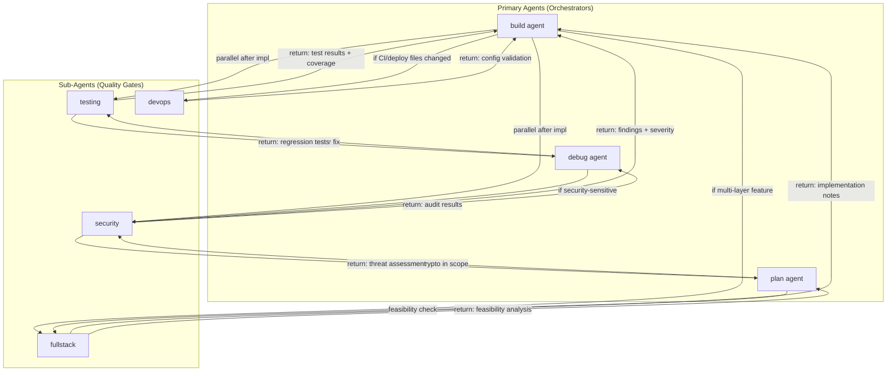
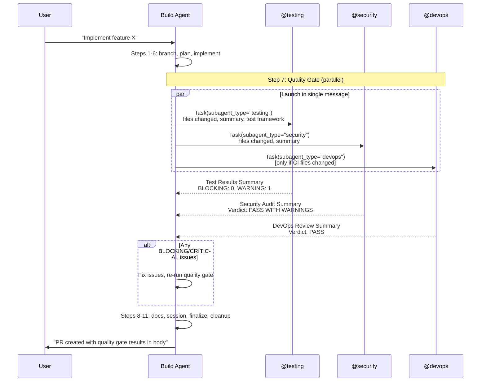
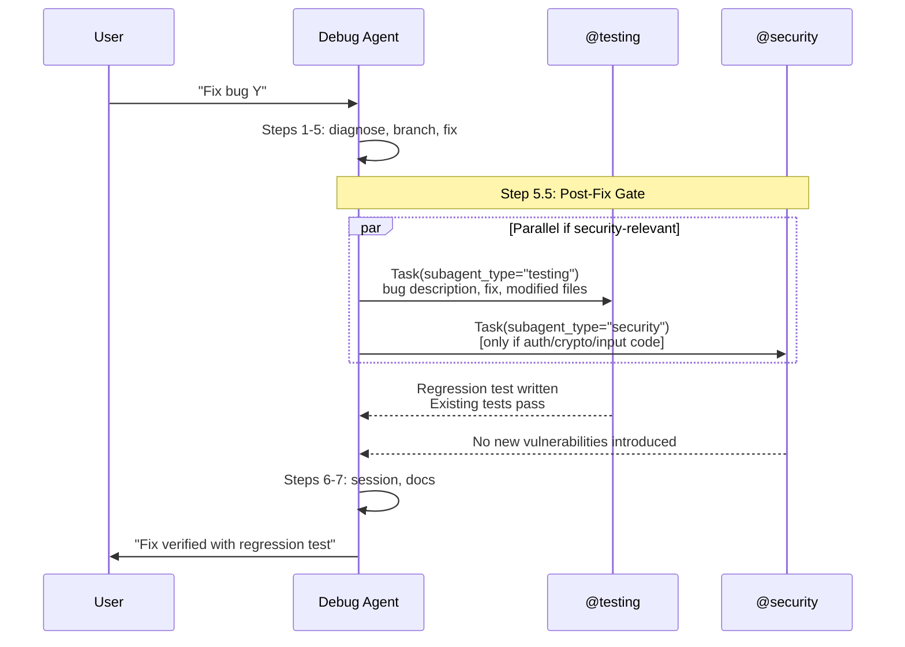

# Sub-Agent Parallel Orchestration - Automatic Quality Gates

# Plan: Sub-Agent Parallel Orchestration — Automatic Quality Gates

## Summary

The cortex-agents project has full infrastructure for parallel sub-agents (`mode: subagent`, model tiers, Task tool enabled, toast notifications) but **zero orchestration logic** — no agent ever actually invokes a sub-agent. The sub-agent references in `build.md`, `debug.md`, and `plan.md` are decorative bullet points at the bottom of the file, disconnected from the workflow steps. The `devops` sub-agent is completely orphaned.

This plan integrates sub-agents as **automatic quality gates** in every primary agent's workflow. After implementation, the `build` agent always launches `@testing` + `@security` in parallel before finalizing. The `debug` agent launches `@testing` for regression tests and `@security` when the fix touches sensitive code. The `plan` agent uses `@fullstack` for implementation feasibility analysis. `@devops` is connected wherever CI/CD or deployment config is modified. Sub-agent definitions are upgraded with clear input/output contracts so they return structured, actionable results.

## Architecture Diagram



## Tasks

- [ ] Task 1: Upgrade `build.md` — add mandatory parallel sub-agent quality gate step (Step 7: Launch @testing + @security in parallel)
- [ ] Task 2: Upgrade `build.md` — add conditional @fullstack trigger for multi-layer features
- [ ] Task 3: Upgrade `build.md` — add conditional @devops trigger when CI/deploy files change
- [ ] Task 4: Upgrade `debug.md` — add mandatory @testing for regression tests after fix
- [ ] Task 5: Upgrade `debug.md` — add conditional @security audit when fix touches sensitive code
- [ ] Task 6: Upgrade `plan.md` — add @fullstack for feasibility analysis on complex features
- [ ] Task 7: Upgrade `plan.md` — add @security for threat modeling when plan involves auth/data
- [ ] Task 8: Rewrite `testing.md` — add input expectations, structured return contract, parallel awareness
- [ ] Task 9: Rewrite `security.md` — add input expectations, structured return contract, severity format
- [ ] Task 10: Rewrite `fullstack.md` — add input expectations, structured return contract for both build and plan contexts
- [ ] Task 11: Rewrite `devops.md` — add input expectations, structured return contract, connect to build agent
- [ ] Task 12: Update README.md — document sub-agent orchestration patterns
- [ ] Task 13: Build and run tests to verify no regressions

## Technical Approach

### Phase 1: Upgrade Primary Agent Orchestration (build.md, debug.md, plan.md)

The core change: each primary agent's workflow gets new **mandatory steps** that launch sub-agents via the Task tool. The key insight is that the Task tool allows multiple concurrent calls in a single message — the agent just needs to be told to do it.

#### 1a. `build.md` — New Step 7: Parallel Quality Gate

Insert between current Step 6 (implementation) and Step 7 (documentation prompt). This becomes the new mandatory quality gate:

```markdown
### Step 7: Quality Gate — Parallel Sub-Agent Review (MANDATORY)

After completing implementation and BEFORE documentation or finalization,
launch BOTH sub-agents in parallel using the Task tool in a SINGLE message:

**Always launch (both in the same message for parallel execution):**

1. **@testing sub-agent** — Provide:
   - List of files you created or modified
   - Summary of what was implemented
   - The test framework used in the project (check package.json or existing tests)
   - Ask it to: write unit tests for new code, verify existing tests still pass,
     report coverage gaps

2. **@security sub-agent** — Provide:
   - List of files you created or modified  
   - Summary of what was implemented
   - Ask it to: audit for OWASP Top 10 vulnerabilities, check for secrets/credentials
     in code, review input validation, report findings with severity levels

**Conditionally launch (in the same parallel batch if applicable):**

3. **@devops sub-agent** — ONLY if you modified any of these file patterns:
   - `Dockerfile*`, `docker-compose*`, `.dockerignore`
   - `.github/workflows/*`, `.gitlab-ci*`, `Jenkinsfile`
   - `*.yml`/`*.yaml` in root that look like CI config
   - `deploy/`, `infra/`, `k8s/`, `terraform/`
   - Ask it to: validate config syntax, check for best practices,
     review security of CI/CD pipeline

**After all sub-agents return:**

- Review @testing results: if tests fail or coverage is critically low,
  fix the issues before proceeding
- Review @security results: if HIGH or CRITICAL findings exist,
  address them before proceeding. MEDIUM findings should be noted
  in the PR body. LOW findings can be deferred.
- Review @devops results: address any config errors or security issues
- Proceed to Step 8 (Documentation) only when quality gate passes
```

#### 1b. `build.md` — Conditional @fullstack trigger

Add to Step 6 (implementation):

```markdown
### Step 6: Implement Changes

[...existing content...]

**Multi-layer feature detection:** If the task involves changes across 3+ layers
(e.g., database + API + frontend, or CLI + library + tests), consider launching
the @fullstack sub-agent to implement the end-to-end feature. Provide:
- The plan or requirements
- Current codebase structure for relevant layers
- Any API contracts or interfaces that need to be consistent
```

#### 1c. `debug.md` — Post-fix quality gate

Add after current Step 5 (Implement Fix):

```markdown
### Step 5.5: Post-Fix Quality Gate (MANDATORY)

After implementing the fix, launch sub-agents for validation:

**Always launch:**
1. **@testing sub-agent** — Provide:
   - The file(s) you modified to fix the bug
   - Description of the bug and the fix
   - Ask it to: write a regression test that would have caught this bug,
     verify the fix doesn't break existing tests

**Conditionally launch (in parallel with @testing if applicable):**
2. **@security sub-agent** — Launch if the bug or fix involves ANY of:
   - Authentication, authorization, or session management
   - Input validation or output encoding
   - Cryptography, hashing, or secrets
   - SQL queries, command execution, or file system access
   - CORS, CSP, or security headers
   - Provide: the bug description, the fix, and ask for a security
     audit of the fix to ensure it doesn't introduce new vulnerabilities

**After sub-agents return:**
- Incorporate the regression test from @testing
- Address any security findings before proceeding
```

#### 1d. `plan.md` — Analysis sub-agents

Add to Step 3 (Analyze and Create Plan):

```markdown
### Step 3: Analyze and Create Plan

[...existing content...]

**Sub-agent assistance for complex plans:**

- **@fullstack sub-agent**: When the feature spans multiple layers (frontend,
  backend, database, infrastructure), launch @fullstack to analyze implementation
  feasibility. Provide the requirements and current codebase structure. Use its
  analysis to inform the plan's technical approach, effort estimates, and risk
  assessment.

- **@security sub-agent**: When the feature involves authentication, authorization,
  data handling, cryptography, or external API integrations, launch @security
  to perform a threat model. Provide the feature requirements and current
  security posture. Use its findings to add security-specific tasks and risks
  to the plan.

Both can be launched in parallel when both conditions apply.
```

### Phase 2: Upgrade Sub-Agent Definitions (testing.md, security.md, fullstack.md, devops.md)

Each sub-agent needs three things it currently lacks:
1. **Input expectations** — what context to expect from the orchestrator
2. **Return contract** — structured format for results so the orchestrator can act on them
3. **Parallel awareness** — understanding that it runs alongside other sub-agents

#### 2a. `testing.md` — Structured return contract

Add to the top of the file (after frontmatter):

```markdown
## When You Are Invoked

You are launched as a sub-agent by a primary agent (build or debug). You will
receive:
- A list of files that were created or modified
- A summary of what was implemented or fixed
- The test framework in use

## What You Must Return

Return a structured report in this exact format:

### Test Results Summary
- **Tests written**: [count] new tests across [count] files
- **Tests passing**: [count]/[count]
- **Coverage**: [percentage or "unable to determine"]
- **Critical gaps**: [list of untested critical paths, or "none"]

### Files Created/Modified
- `path/to/test/file1.test.ts` — [what it tests]
- `path/to/test/file2.test.ts` — [what it tests]

### Issues Found
- [BLOCKING] Description of any test that reveals a bug in the implementation
- [WARNING] Description of any coverage gap or test quality concern
- [INFO] Suggestions for additional test coverage

The orchestrating agent will use BLOCKING issues to decide whether to
proceed with finalization.
```

#### 2b. `security.md` — Structured return contract

```markdown
## When You Are Invoked

You are launched as a sub-agent by a primary agent (build, debug, or plan).
You will receive:
- A list of files to audit
- A summary of what was implemented/fixed/planned
- Specific areas of concern (if any)

## What You Must Return

Return a structured report in this exact format:

### Security Audit Summary
- **Files audited**: [count]
- **Findings**: [count] (CRITICAL: [n], HIGH: [n], MEDIUM: [n], LOW: [n])
- **Verdict**: PASS / PASS WITH WARNINGS / FAIL

### Findings

#### [CRITICAL/HIGH/MEDIUM/LOW] Finding Title
- **Location**: `file:line`
- **Category**: [OWASP category or CWE]
- **Description**: What the vulnerability is
- **Recommendation**: How to fix it
- **Evidence**: Code snippet showing the issue

(Repeat for each finding)

### Secrets Scan
- **Hardcoded secrets found**: [yes/no] — [details if yes]

### Recommendations
- Priority fixes (must do before merge)
- Suggested improvements (can defer)

The orchestrating agent uses CRITICAL and HIGH findings to block finalization.
MEDIUM findings go into the PR body. LOW findings are noted for future work.
```

#### 2c. `fullstack.md` — Dual-context return contract

```markdown
## When You Are Invoked

You are launched as a sub-agent in one of two contexts:

**Context A — Implementation (from build agent):**
You receive requirements and implement end-to-end features across layers.
Return the implementation with a summary of files created/modified per layer.

**Context B — Feasibility Analysis (from plan agent):**
You receive requirements and analyze implementation feasibility.
Return:

### Feasibility Analysis
- **Complexity**: Low / Medium / High / Very High
- **Estimated effort**: [time range]
- **Layers affected**: [frontend, backend, database, infrastructure]
- **Key challenges**: [list]
- **Recommended approach**: [brief description]
- **Dependencies**: [external libraries, services, migrations needed]
- **Risks**: [technical risks specific to this implementation]
```

#### 2d. `devops.md` — Structured return contract + connections

```markdown
## When You Are Invoked

You are launched as a sub-agent by a primary agent (build or debug) when
CI/CD, Docker, or infrastructure configuration files are modified.
You will receive:
- The config files that were changed
- A summary of what was implemented

## What You Must Return

### DevOps Review Summary
- **Files reviewed**: [count]
- **Issues**: [count] (ERROR: [n], WARNING: [n], INFO: [n])
- **Verdict**: PASS / PASS WITH WARNINGS / FAIL

### Findings

#### [ERROR/WARNING/INFO] Finding Title
- **File**: `path/to/file`
- **Description**: What the issue is
- **Recommendation**: How to fix it

### Best Practices Check
- [ ] Multi-stage Docker build (if Dockerfile present)
- [ ] Non-root user in container
- [ ] No secrets in CI config
- [ ] Proper caching strategy
- [ ] Health checks configured
- [ ] Resource limits set

The orchestrating agent uses ERROR findings to block finalization.
```

### Phase 3: Renumber Workflow Steps

Since we're inserting new steps, the workflow numbering in `build.md` and `debug.md` shifts:

#### `build.md` new step order:
1. Check Git Status
2. Initialize Cortex
3. Check for Existing Plan
4. Ask User About Branch Strategy
4b. Worktree Launch Mode
5. Execute Based on Response
6. Implement Changes (+ @fullstack conditional)
7. **NEW: Quality Gate — Parallel Sub-Agent Review**
8. Documentation Prompt (was Step 7)
9. Save Session Summary (was Step 8)
10. Finalize Task (was Step 9)
11. Worktree Cleanup (was Step 10)

#### `debug.md` new step order:
1. Check Git Status
2. Assess Bug Severity
3. Ask User About Branch Strategy
4. Execute Based on Response
5. Implement Fix
5.5. **NEW: Post-Fix Quality Gate**
6. Save Session Summary
6.5. Documentation Prompt
7. (existing end)

### Phase 4: Tool Usage Section Rewrite

Replace the current one-liner sub-agent references at the bottom of each agent with a proper **Sub-Agent Orchestration** section:

#### In `build.md`:
```markdown
## Sub-Agent Orchestration

The following sub-agents are available via the Task tool. Launch them by
using the Task tool with the appropriate subagent_type. **Launch multiple
sub-agents in a single message for parallel execution.**

| Sub-Agent | Trigger | What It Does | When to Use |
|-----------|---------|------------|-------------|
| @testing  | **Always** after implementation | Writes tests, checks coverage | Step 7 — mandatory |
| @security | **Always** after implementation | OWASP audit, secrets scan | Step 7 — mandatory |
| @fullstack | Multi-layer features (3+ layers) | End-to-end implementation | Step 6 — conditional |
| @devops   | CI/CD/Docker/infra files changed | Config validation, best practices | Step 7 — conditional |
```

#### In `debug.md`:
```markdown
## Sub-Agent Orchestration

| Sub-Agent | Trigger | What It Does | When to Use |
|-----------|---------|------------|-------------|
| @testing  | **Always** after fix | Regression test, existing test validation | Step 5.5 — mandatory |
| @security | Fix touches auth/crypto/input validation | Security audit of the fix | Step 5.5 — conditional |
```

#### In `plan.md`:
```markdown
## Sub-Agent Orchestration

| Sub-Agent | Trigger | What It Does | When to Use |
|-----------|---------|------------|-------------|
| @fullstack | Feature spans 3+ layers | Feasibility analysis, effort estimation | Step 3 — conditional |
| @security  | Feature involves auth/data/crypto | Threat modeling, security requirements | Step 3 — conditional |
```

## Data Flow





## Risks & Mitigations

| Risk | Impact | Likelihood | Mitigation |
|------|--------|------------|------------|
| Token cost increase from always running 2+ sub-agents | Medium | High | Sub-agents use fast/cheap models (configured in registry.ts). Cost per invocation is low. Document expected token usage in README. |
| Sub-agent hallucination (fake test results, false security findings) | High | Medium | Structured return contracts make output verifiable. Build agent is instructed to review results critically. Tests must actually run. |
| Workflow becomes too slow (waiting for multiple sub-agents) | Medium | Medium | Parallel execution mitigates this — both run simultaneously. Fast models (Haiku, GPT-4o-mini) return quickly. |
| Sub-agents can't access worktree files if run as separate process | High | Low | Sub-agents run within the same OpenCode session via Task tool — they share the same filesystem context. Not a concern. |
| Users find the automatic gate too aggressive on trivial changes | Medium | Medium | The "Automatic & Aggressive" style is a deliberate design choice. Could add a `.cortex/config.json` override in future, but start aggressive and dial back based on feedback. |
| Renumbering workflow steps breaks existing user muscle memory | Low | Medium | Steps shift by 1 at most. The new step is intuitive. Users who have internalized the workflow will adapt quickly. |
| Sub-agent returns don't match expected format | Medium | Medium | Clear templates in the sub-agent instructions constrain output. The orchestrator agent can request re-runs if format is wrong. |

## Estimated Effort

- **Complexity**: Medium
- **Time Estimate**: 2-3 hours
- **Dependencies**: None — all changes are to `.opencode/agents/*.md` markdown files. No TypeScript code changes needed.
- **Testing**: Manual verification by running each primary agent and confirming sub-agents are invoked. Automated tests not applicable (these are LLM prompt files).

## Key Decisions

1. **Decision**: Automatic & Aggressive orchestration — always launch @testing + @security after implementation
   **Rationale**: User explicitly chose this style. Maximizes code quality. The cost is manageable since sub-agents use fast/cheap models. Better to catch issues before PR than after review.

2. **Decision**: Structured return contracts for all sub-agents
   **Rationale**: Without a defined output format, the orchestrating agent can't reliably parse results or make decisions (e.g., "are there CRITICAL findings?"). The contracts use markdown headings and severity levels that are easy for the LLM to generate and parse.

3. **Decision**: Parallel execution via single-message Task calls
   **Rationale**: OpenCode's Task tool supports multiple concurrent invocations in one message. This is the most efficient approach — no sequential waiting. The agent instructions explicitly tell the agent to batch the calls.

4. **Decision**: Connect `devops` conditionally (only when CI/deploy files change)
   **Rationale**: Running @devops on every task would be wasteful — it's only relevant when infrastructure files are modified. A file-pattern trigger is the right heuristic.

5. **Decision**: Keep sub-agents as `mode: subagent` (not promote to primary)
   **Rationale**: Sub-agents are focused, single-purpose workers. They don't need the full workflow (branch management, session saving, docs). Keeping them as sub-agents maintains the orchestrator/worker separation and keeps their token context small.

6. **Decision**: Quality gate results included in PR body
   **Rationale**: When the build agent finalizes via `task_finalize`, it should include a summary of sub-agent results (test count, security verdict) in the PR body. This creates an audit trail and helps reviewers.

## Suggested Branch Name

`feature/subagent-parallel-orchestration`

## File Change Summary

| File | Action | Key Changes |
|------|--------|-------------|
| `.opencode/agents/build.md` | **MODIFY** | Add Step 7 (Quality Gate), @fullstack in Step 6, @devops conditional, new Sub-Agent Orchestration section, renumber steps 8-11 |
| `.opencode/agents/debug.md` | **MODIFY** | Add Step 5.5 (Post-Fix Gate), new Sub-Agent Orchestration section |
| `.opencode/agents/plan.md` | **MODIFY** | Add sub-agent usage in Step 3, new Sub-Agent Orchestration section |
| `.opencode/agents/testing.md` | **REWRITE** | Add input expectations, structured return contract, parallel awareness |
| `.opencode/agents/security.md` | **REWRITE** | Add input expectations, structured return contract, severity format |
| `.opencode/agents/fullstack.md` | **REWRITE** | Add dual-context (build vs plan), structured return contracts |
| `.opencode/agents/devops.md` | **REWRITE** | Add input expectations, structured return contract, connect to build agent |
| `README.md` | **MODIFY** | Document sub-agent orchestration patterns and quality gates |
| **Total** | **8 files** | 0 new, 8 modified (all markdown — no TypeScript changes) |
## Tasks

- [ ] Upgrade build.md — add mandatory parallel sub-agent quality gate (Step 7: @testing + @security in parallel)
- [ ] Upgrade build.md — add conditional @fullstack trigger for multi-layer features in Step 6
- [ ] Upgrade build.md — add conditional @devops trigger when CI/deploy files change
- [ ] Upgrade build.md — rewrite Sub-Agent Orchestration section (replace one-liner references)
- [ ] Upgrade build.md — renumber steps 8-11 to accommodate new Step 7
- [ ] Upgrade debug.md — add mandatory Step 5.5 post-fix quality gate (@testing + conditional @security)
- [ ] Upgrade debug.md — add Sub-Agent Orchestration table section
- [ ] Upgrade plan.md — add sub-agent usage in Step 3 (@fullstack + @security conditional)
- [ ] Upgrade plan.md — add Sub-Agent Orchestration table section
- [ ] Rewrite testing.md — add input expectations, structured return contract, parallel awareness
- [ ] Rewrite security.md — add input expectations, structured return contract, severity format
- [ ] Rewrite fullstack.md — add dual-context support (build vs plan), structured return contracts
- [ ] Rewrite devops.md — add input expectations, return contract, connect to build/debug agents
- [ ] Update README.md — document sub-agent orchestration patterns and quality gates
- [ ] Build and verify no regressions (npm run build && npm test)
