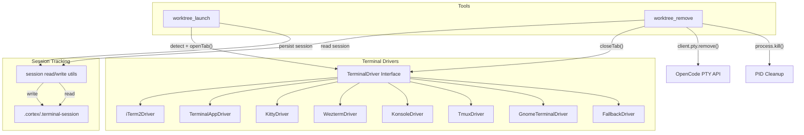
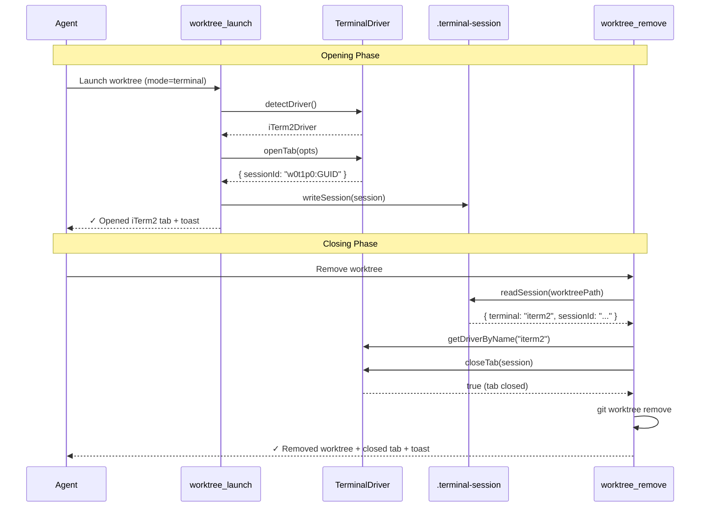

# Terminal Driver System - Tab Open/Close Lifecycle

# Plan: Terminal Driver System — Tab Open/Close Lifecycle

## Summary

Refactor terminal tab management in `worktree_launch` and `worktree_remove` into a **strategy-pattern driver system**. Each supported terminal emulator gets its own driver implementing a common interface for detecting, opening tabs, and closing tabs. Session metadata is persisted in the worktree's `.cortex/.terminal-session` so tabs can be closed when the worktree is removed. PTY sessions are also tracked and cleaned up.

**Current problems:**
- Linux terminals open NEW WINDOWS instead of tabs (kitty, wezterm, etc.)
- No session identifiers are captured when opening tabs — nothing to close later
- `worktree_remove` has zero cleanup logic — doesn't close tabs, kill processes, or remove PTY sessions
- PTY ID from `client.pty.create()` is discarded (never persisted)

## Architecture Diagram



## Tasks

- [ ] Task 1: Create `src/utils/terminal.ts` with TerminalDriver interface, TerminalSession type, and detection registry
- [ ] Task 2: Implement macOS drivers — iTerm2Driver and TerminalAppDriver with open/close via AppleScript
- [ ] Task 3: Implement Linux drivers — KittyDriver (IPC), WeztermDriver (CLI), KonsoleDriver (D-Bus)
- [ ] Task 4: Implement multiplexer driver — TmuxDriver with open/close via tmux commands
- [ ] Task 5: Implement GnomeTerminalDriver and FallbackDriver (PID-based)
- [ ] Task 6: Implement session I/O — read/write `.cortex/.terminal-session` files
- [ ] Task 7: Refactor `worktree_launch` terminal mode to use driver system + persist sessions
- [ ] Task 8: Refactor `worktree_launch` PTY mode to capture and persist PTY ID
- [ ] Task 9: Refactor `worktree_remove` to read session data, close tabs, kill processes, remove PTYs BEFORE git removal
- [ ] Task 10: Add `kill(pid)` utility to `shell.ts`
- [ ] Task 11: Update tests and verify build

## Technical Approach

### Phase 1: Terminal Driver Interface and Types

**New file: `src/utils/terminal.ts`**

```typescript
// ─── Types ───────────────────────────────────────────────────
export interface TerminalSession {
  // Driver info
  terminal: string;         // Driver name (e.g., "iterm2", "kitty", "tmux")
  platform: NodeJS.Platform;

  // Terminal-specific identifiers for tab closing
  sessionId?: string;       // iTerm2 session ID
  windowId?: string;        // Terminal.app window ID
  tabId?: string;           // kitty tab ID
  paneId?: string;          // wezterm pane ID, tmux pane ID
  dbusPath?: string;        // konsole D-Bus session path
  pid?: number;             // Shell PID (universal fallback)
  ptyId?: string;           // OpenCode PTY session ID

  // Metadata
  mode: "terminal" | "pty" | "background";
  branch: string;
  agent: string;
  worktreePath: string;
  startedAt: string;        // ISO timestamp
}

export interface TabOpenOptions {
  worktreePath: string;
  opencodeBin: string;
  agent: string;
  prompt: string;
  branchName: string;
}

export interface TerminalDriver {
  readonly name: string;
  detect(): boolean;
  openTab(opts: TabOpenOptions): Promise<Partial<TerminalSession>>;
  closeTab(session: TerminalSession): Promise<boolean>;
}
```

**Detection priority order** (multiplexers first, then terminal emulators):

```typescript
const DETECTION_ORDER: TerminalDriver[] = [
  new TmuxDriver(),        // $TMUX
  new ITerm2Driver(),      // $ITERM_SESSION_ID or $TERM_PROGRAM=iTerm.app
  new TerminalAppDriver(), // $TERM_PROGRAM=Apple_Terminal
  new KittyDriver(),       // $KITTY_WINDOW_ID
  new WeztermDriver(),     // $WEZTERM_PANE
  new KonsoleDriver(),     // $KONSOLE_VERSION
  new GnomeTerminalDriver(), // $GNOME_TERMINAL_SERVICE
  new FallbackDriver(),    // Always matches (PID-based)
];

export function detectDriver(): TerminalDriver {
  return DETECTION_ORDER.find(d => d.detect()) ?? new FallbackDriver();
}
```

### Phase 2: macOS Drivers

**iTerm2Driver** — Open tab via AppleScript, capture session ID:

```applescript
tell application "iTerm2"
  tell current window
    create tab with default profile
    tell current session of current tab
      write text "cd \"<path>\" && \"<opencode>\" --agent <agent>"
      set sessionID to id
    end tell
  end tell
end tell
return sessionID
```

Close tab:
```applescript
tell application "iTerm2"
  repeat with w in windows
    repeat with t in tabs of w
      repeat with s in sessions of t
        if id of s is "<sessionId>" then
          close s
          return "closed"
        end if
      end repeat
    end repeat
  end repeat
end tell
return "not_found"
```

**TerminalAppDriver** — Open tab via AppleScript, capture window ID:

```applescript
tell application "Terminal"
  activate
  set newTab to do script "cd \"<path>\" && \"<opencode>\" --agent <agent>"
  return id of window of newTab
end tell
```

Close tab:
```applescript
tell application "Terminal"
  close window id <windowId>
end tell
```

### Phase 3: Linux Drivers (IPC-based)

**KittyDriver** — Uses `kitty @` remote control:

```bash
# Open tab (returns window ID on stdout)
kitty @ launch --type=tab --cwd=/path --title="Worktree: branch" bash -c "..."

# Close tab
kitty @ close-tab --match id:<tabId>
# Fallback: kitty @ close-window --match pid:<pid>
```

Requires `allow_remote_control` in kitty.conf and `KITTY_LISTEN_ON` env var. Falls back to `kitty --directory` (new window) if remote control unavailable.

**WeztermDriver** — Uses `wezterm cli`:

```bash
# Open tab in current window (returns pane ID on stdout)
wezterm cli spawn --cwd /path -- bash -c "..."

# Close tab
wezterm cli kill-pane --pane-id <paneId>
```

**KonsoleDriver** — Uses `qdbus` / `gdbus`:

```bash
# Open tab (returns session number)
qdbus org.kde.konsole-$KONSOLE_DBUS_SERVICE /Windows/1 newSession

# Close tab
qdbus org.kde.konsole-$KONSOLE_DBUS_SERVICE /Sessions/<N> close
```

### Phase 4: Multiplexer Driver

**TmuxDriver** — Detected when `$TMUX` is set:

```bash
# Open tab (returns pane ID, e.g., %5)
tmux new-window -P -F "#{pane_id}" -c "/path" "cd /path && opencode --agent build"

# Close tab
tmux kill-pane -t <paneId>
```

This takes priority over terminal detection since tmux manages its own tabs.

### Phase 5: Fallback Drivers

**GnomeTerminalDriver** — `gnome-terminal --tab` + PID tracking:

```bash
# Open tab (captures shell PID)
gnome-terminal --tab --working-directory=/path -- bash -c "..."
```

Close via `process.kill(pid, 'SIGTERM')`.

**FallbackDriver** — For unknown terminals:
- Opens a new process via `spawn()`, captures PID
- Close by sending SIGTERM to PID
- Always matches — serves as the catch-all

### Phase 6: Session I/O

```typescript
const SESSION_FILE = ".terminal-session";

export function writeSession(
  worktreePath: string,
  session: TerminalSession,
): void {
  const cortexDir = path.join(worktreePath, ".cortex");
  if (!fs.existsSync(cortexDir)) {
    fs.mkdirSync(cortexDir, { recursive: true });
  }
  fs.writeFileSync(
    path.join(cortexDir, SESSION_FILE),
    JSON.stringify(session, null, 2),
  );
}

export function readSession(
  worktreePath: string,
): TerminalSession | null {
  const sessionPath = path.join(worktreePath, ".cortex", SESSION_FILE);
  if (!fs.existsSync(sessionPath)) return null;
  try {
    return JSON.parse(fs.readFileSync(sessionPath, "utf-8"));
  } catch {
    return null;
  }
}
```

### Phase 7: Refactor `worktree_launch` Terminal Mode

Replace `launchTerminalTab()` + `detectMacTerminal()` + `detectLinuxTerminal()` with:

```typescript
import { detectDriver, writeSession, type TerminalSession } from "../utils/terminal.js";

// Inside createLaunch factory, terminal mode:
case "terminal": {
  const driver = detectDriver();
  const result = await driver.openTab({
    worktreePath: absoluteWorktreePath,
    opencodeBin,
    agent,
    prompt: launchPrompt,
    branchName,
  });

  // Persist session for later cleanup
  const session: TerminalSession = {
    terminal: driver.name,
    platform: process.platform,
    mode: "terminal",
    branch: branchName,
    agent,
    worktreePath: absoluteWorktreePath,
    startedAt: new Date().toISOString(),
    ...result,
  };
  writeSession(absoluteWorktreePath, session);

  // Toast notification
  await notify(`Opened ${driver.name} tab with agent '${agent}'`);
  launchResult = `✓ Opened ${driver.name} tab in worktree\nBranch: ${branchName}`;
  break;
}
```

### Phase 8: Refactor `worktree_launch` PTY Mode

Capture the PTY ID from the create response:

```typescript
case "pty": {
  const response = await client.pty.create({
    body: {
      command: opencodeBin,
      args: ["--agent", agent, "--prompt", launchPrompt],
      cwd: absoluteWorktreePath,
      title: `Worktree: ${branchName}`,
    },
  });

  // Capture PTY ID from response
  const ptyId = response.data?.id;

  // Persist session with PTY ID
  writeSession(absoluteWorktreePath, {
    terminal: "pty",
    platform: process.platform,
    mode: "pty",
    ptyId,
    pid: response.data?.pid,
    branch: branchName,
    agent,
    worktreePath: absoluteWorktreePath,
    startedAt: new Date().toISOString(),
  });
  break;
}
```

### Phase 9: Refactor `worktree_remove` Cleanup

**BEFORE** calling `git worktree remove`, read the session file and close everything:

```typescript
// Inside createRemove(), after getting branchName, BEFORE git worktree remove:

// ── Close terminal session ────────────────────────────────
const session = readSession(absoluteWorktreePath);
if (session) {
  let closedTab = false;

  if (session.mode === "pty" && session.ptyId) {
    // Close PTY session via OpenCode SDK
    try {
      await client.pty.remove({ ptyID: session.ptyId });
      closedTab = true;
    } catch { /* PTY may already be closed */ }
  } else if (session.mode === "terminal") {
    // Close terminal tab via driver
    const driver = getDriverByName(session.terminal);
    if (driver) {
      closedTab = await driver.closeTab(session);
    }
  } else if (session.mode === "background" && session.pid) {
    // Kill background process
    try {
      process.kill(session.pid, "SIGTERM");
      closedTab = true;
    } catch { /* Process may already be dead */ }
  }

  // Fallback: kill PID if driver close failed
  if (!closedTab && session.pid) {
    try { process.kill(session.pid, "SIGTERM"); } catch {}
  }
}

// Also check legacy .background-pid file
const bgPidFile = path.join(absoluteWorktreePath, ".cortex", ".background-pid");
if (fs.existsSync(bgPidFile)) {
  try {
    const bgData = JSON.parse(fs.readFileSync(bgPidFile, "utf-8"));
    if (bgData.pid) process.kill(bgData.pid, "SIGTERM");
  } catch {}
}

// NOW safe to remove the worktree
await git(context.worktree, "worktree", "remove", absoluteWorktreePath);
```

## Data Flow



## Risks & Mitigations

| Risk | Impact | Likelihood | Mitigation |
|------|--------|------------|------------|
| kitty remote control not enabled | Medium | Medium | Detect via `kitty @ ls` probe; fall back to new window + PID tracking |
| User manually closes tab before `worktree_remove` | Low | High | `closeTab()` returns false gracefully; never throws |
| konsole D-Bus unavailable (no qdbus binary) | Medium | Low | Check for `qdbus`/`gdbus` availability; fall back to FallbackDriver |
| Session file read races with git worktree remove | High | Low | Read session file FIRST, store in memory, then git remove |
| PTY already exited when remove is called | Low | Medium | `client.pty.remove()` in try/catch; 404 is expected |
| tmux inside iTerm2 — which driver wins? | Low | Medium | tmux is first in detection order; opens tmux window (correct UX) |
| AppleScript rejected by sandboxing | Medium | Low | Catch osascript errors; fall back to FallbackDriver |

## Estimated Effort

- **Complexity**: Medium-High
- **Time Estimate**: 4-6 hours
- **Dependencies**: None (all terminal APIs are native CLI/IPC — no npm dependencies needed)

## Key Decisions

1. **Decision**: Strategy pattern with per-terminal drivers
   **Rationale**: Each terminal has vastly different APIs (AppleScript, CLI IPC, D-Bus, tmux commands). A driver interface isolates the complexity and makes adding new terminals trivial.

2. **Decision**: Store session file in worktree's `.cortex/` directory
   **Rationale**: Self-contained per worktree, no cross-reference needed, naturally cleaned up if worktree directory is manually deleted. Must be read before `git worktree remove`.

3. **Decision**: Multiplexer detection takes priority over terminal emulator detection
   **Rationale**: When a user is in tmux inside iTerm2, they see tmux tabs — so opening a tmux window is the correct action, not an iTerm2 tab.

4. **Decision**: FallbackDriver always matches as catch-all
   **Rationale**: Unknown/unsupported terminals still get a working (if imperfect) experience via PID-based open/close.

5. **Decision**: `closeTab()` is idempotent — never throws
   **Rationale**: Users may manually close tabs; stale sessions are expected. The driver should gracefully return `false` if the tab is already gone.

6. **Decision**: Capture PTY ID from `client.pty.create()` response
   **Rationale**: The OpenCode SDK already provides `client.pty.remove({ ptyID })` — we just need to persist the ID. The response type is `Pty { id, title, command, args, cwd, status, pid }`.

## File Changes Summary

| File | Action | Description |
|------|--------|-------------|
| `src/utils/terminal.ts` | **NEW** | TerminalDriver interface, 8 driver implementations, detection registry, session I/O |
| `src/utils/shell.ts` | **EDIT** | Add `kill(pid)` utility |
| `src/tools/worktree.ts` | **EDIT** | Remove `detectMacTerminal()`, `detectLinuxTerminal()`, refactor `launchTerminalTab()` to use drivers, refactor `launchPty()` to capture PTY ID, refactor `createRemove()` for cleanup |
| `src/index.ts` | **NONE** | No changes needed (factories already receive client) |

## Suggested Branch Name

`feature/terminal-driver-system`

## Tasks

- [ ] Create src/utils/terminal.ts with TerminalDriver interface, TerminalSession type, and detection registry
- [ ] Implement macOS drivers — iTerm2Driver and TerminalAppDriver with open/close via AppleScript
- [ ] Implement Linux drivers — KittyDriver (IPC), WeztermDriver (CLI), KonsoleDriver (D-Bus)
- [ ] Implement multiplexer driver — TmuxDriver with open/close via tmux commands
- [ ] Implement GnomeTerminalDriver and FallbackDriver (PID-based)
- [ ] Implement session I/O — read/write .cortex/.terminal-session files
- [ ] Refactor worktree_launch terminal mode to use driver system + persist sessions
- [ ] Refactor worktree_launch PTY mode to capture and persist PTY ID
- [ ] Refactor worktree_remove to read session data, close tabs, kill processes, remove PTYs BEFORE git removal
- [ ] Add kill(pid) utility to shell.ts
- [ ] Update tests and verify build
