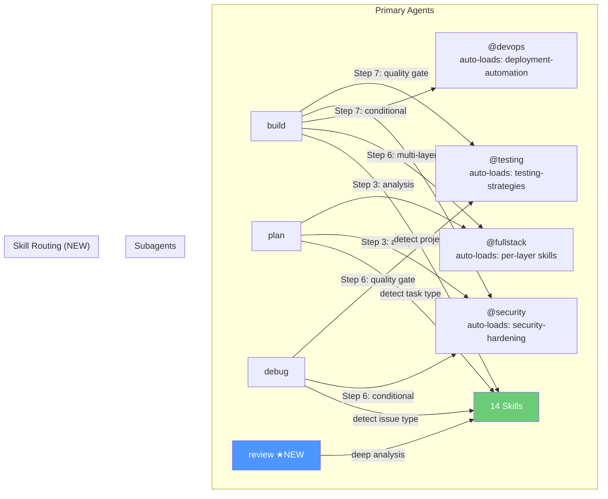
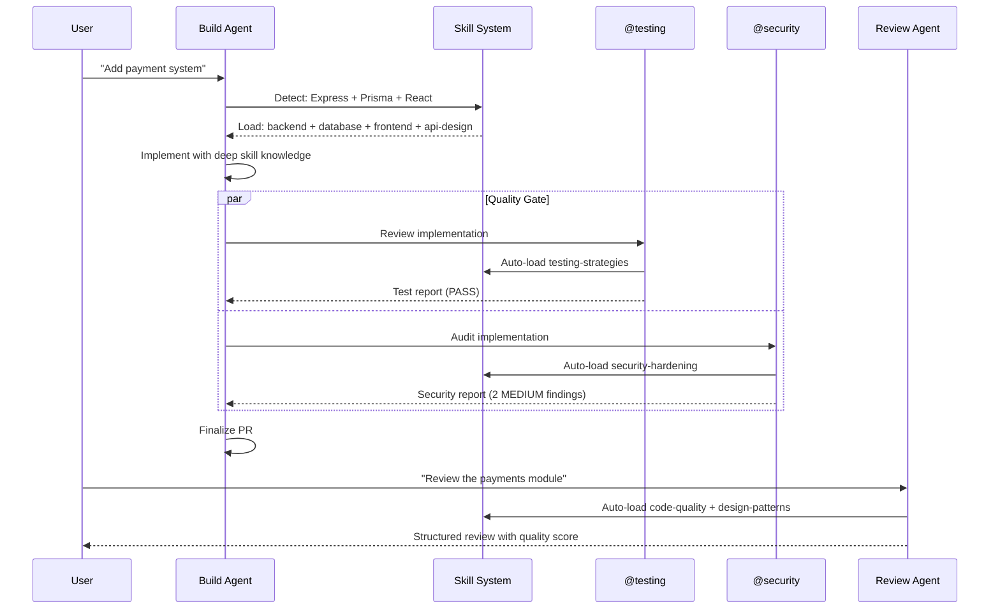

# Agent Overhaul — Skill Routing, Domain Depth, and Code Review Agent

# Plan: Agent Overhaul — Skill Routing, Domain Depth, and Code Review Agent

## Summary

A comprehensive overhaul of all 7 agents plus the addition of a new Code Review primary agent. The three main goals are:

1. **Skill Routing** — Every agent gets explicit instructions on WHEN to load which of the 14 skills, turning dormant skills into active intelligence
2. **Domain Depth** — Subagents get significantly deeper domain knowledge and always auto-load their core skill
3. **New Agent** — A Code Review primary agent that leverages the orphaned `code-quality` and `design-patterns` skills

Secondary improvements: collapse duplicated model config blocks (90 lines → 6), remove surface-level language standards from build agent, add error recovery patterns, and add performance debugging to debug agent.

## Architecture Diagram



## Tasks

- [ ] Task 1: Add skill routing tables to build, plan, and debug agents
- [ ] Task 2: Collapse model configuration blocks in build, plan, and debug (30 lines → 2 each)
- [ ] Task 3: Remove generic language standards from build agent, replace with skill routing
- [ ] Task 4: Rewrite testing subagent with deeper domain knowledge + auto-load testing-strategies
- [ ] Task 5: Rewrite security subagent with actionable fix patterns + auto-load security-hardening
- [ ] Task 6: Rewrite fullstack subagent with cross-layer patterns + layer-specific skill loading
- [ ] Task 7: Rewrite devops subagent with IaC/rollback guidance + auto-load deployment-automation
- [ ] Task 8: Create new review primary agent with code-quality + design-patterns skills
- [ ] Task 9: Register review agent in registry.ts (add to PRIMARY_AGENTS)
- [ ] Task 10: Add error recovery patterns to primary agents
- [ ] Task 11: Add performance debugging to debug agent
- [ ] Task 12: Update README to reflect 8 agents (4 primary + 4 subagents) and 23 tools
- [ ] Task 13: Run tests to verify nothing breaks

## Technical Approach

### Phase 1: Primary Agent Improvements (build, plan, debug)

#### 1a. Shared Fix — Collapse Model Config Block

**In all 3 primary agents**, replace the ~30-line model configuration block with:

```markdown
### Step 2: Initialize Cortex (if needed)
Run `cortex_status` to check if .cortex exists. If not, run `cortex_init`.
If `./opencode.json` does not have agent model configuration, offer to configure models via `cortex_configure`.
```

The `cortex_configure` tool's description already lists all available models — the agent will read them from the tool definition. No need to duplicate the full list in instructions.

**Impact**: -90 lines across 3 files.

#### 1b. Build Agent — Refocus on Implementation Quality

**Remove** (Lines 252-293): All 4 generic language standards sections (TypeScript, Python, Rust, Go). They add ~40 lines of basic linting rules.

**Replace with Skill Routing Table**:

```markdown
## Skill Loading (MANDATORY — before implementation)

Detect the project's technology stack and load relevant skills BEFORE writing code:

| Signal | Skill to Load |
|--------|--------------|
| `package.json` has react/next/vue/nuxt/svelte/angular | `frontend-development` |
| `package.json` has express/fastify/hono/nest or Python with flask/django/fastapi | `backend-development` |
| Database files: migrations/, schema.prisma, models.py, *.sql | `database-design` |
| API routes, OpenAPI spec, GraphQL schema | `api-design` |
| React Native, Flutter, iOS/Android project files | `mobile-development` |
| Electron, Tauri, or native desktop project files | `desktop-development` |
| Performance-related task (optimization, profiling, caching) | `performance-optimization` |
| Refactoring or cleanup task | `code-quality` |
| Git workflow question or complex branching | `git-workflow` |

Load **multiple skills** if the task spans domains (e.g., fullstack feature → `frontend-development` + `backend-development` + `api-design`).
```

**Add Error Recovery section**:

```markdown
## Error Recovery

- **Subagent fails to return**: Re-launch once. If it fails again, proceed with manual review and note in PR body.
- **Quality gate loops** (fix → test → fail → fix): After 3 iterations, present findings to user and ask whether to proceed or stop.
- **Git conflict on finalize**: Show the conflict, ask user how to resolve (merge, rebase, or manual).
- **Worktree creation fails**: Fall back to branch creation. Inform user.
```

#### 1c. Plan Agent — Strengthen Analysis Framework

**Add Skill Routing Table**:

```markdown
## Skill Loading (load based on plan topic)

| Plan Topic | Skill to Load |
|------------|--------------|
| System architecture, microservices, monolith decisions | `architecture-patterns` |
| Design pattern selection (factory, strategy, observer, etc.) | `design-patterns` |
| API design, versioning, contracts | `api-design` |
| Database schema, migrations, indexing | `database-design` |
| Performance requirements, SLAs | `performance-optimization` |
| Security requirements, threat models | `security-hardening` |
| CI/CD pipeline design, deployment strategy | `deployment-automation` |
| Frontend architecture, component design | `frontend-development` |
| Backend service design | `backend-development` |
```

**Add NFR Analysis section**:

```markdown
## Non-Functional Requirements Analysis

Every plan SHOULD address applicable NFRs:

- **Performance**: Expected load, response time targets, throughput
- **Scalability**: Horizontal/vertical scaling needs, data growth projections
- **Security**: Authentication, authorization, data protection requirements
- **Reliability**: Uptime targets, failure modes, recovery procedures
- **Observability**: Logging, metrics, tracing requirements
- **Cost**: Infrastructure cost implications, optimization opportunities
```

#### 1d. Debug Agent — Add Performance Debugging + Skill Routing

**Add Skill Routing Table**:

```markdown
## Skill Loading (load based on issue type)

| Issue Type | Skill to Load |
|-----------|--------------|
| Performance issue (slow queries, high latency, memory) | `performance-optimization` |
| Security vulnerability | `security-hardening` |
| Test failures, flaky tests | `testing-strategies` |
| Git issues (merge conflicts, lost commits) | `git-workflow` |
| API errors (400s, 500s, timeouts) | `api-design` + `backend-development` |
| Database issues (deadlocks, slow queries) | `database-design` |
| Frontend rendering issues | `frontend-development` |
| Deployment/CI failures | `deployment-automation` |
```

**Add Performance Debugging section**:

```markdown
## Performance Debugging Methodology

### Memory Issues
- Use heap snapshots to identify leaks
- Check for growing arrays, unclosed listeners, circular references
- Monitor RSS and heap used over time
- Look for closures retaining large objects

### Latency Issues  
- Profile with flamegraphs or built-in profilers
- Check N+1 query patterns in database access
- Review middleware/interceptor chains for bottleneck
- Check for synchronous operations blocking the event loop (Node.js)
- Review connection pool sizes and timeouts

### Distributed Systems
- Trace requests end-to-end with correlation IDs
- Check service-to-service timeout configurations
- Look for cascading failures and missing circuit breakers
- Review retry logic for thundering herd potential
```

**Expand Common Issue Patterns** (currently just 7 items) to ~15-20.

---

### Phase 2: Subagent Rewrites

#### 2a. Testing Agent — Deep Rewrite

**Always auto-load skill** (add to top of instructions):
```markdown
## Auto-Load Skill
**ALWAYS** load the `testing-strategies` skill at the start of every invocation for comprehensive testing patterns.
```

**Add multi-language test examples**:
- Python (pytest): fixtures, parametrize, conftest patterns
- Go (go test): table-driven tests, testify
- Rust (cargo test): `#[test]`, `#[cfg(test)]`, proptest

**Add advanced testing patterns**:
```markdown
## Advanced Patterns
- **Snapshot testing**: For UI components, API responses, serialized output
- **Property-based testing**: Generate random inputs, verify invariants (fast-check, hypothesis, proptest)
- **Contract testing**: Verify API contracts between services (Pact)
- **Mutation testing**: Verify test quality by introducing code mutations (Stryker, mutmut)
- **Load testing**: Basic performance benchmarks for critical paths (k6, autocannon)
```

**Add test organization guidance**:
```markdown
## Test Organization
- Co-locate unit tests with source: `src/utils/shell.test.ts` alongside `src/utils/shell.ts`
- Dedicated integration test directory: `tests/integration/`
- E2E tests in: `tests/e2e/` or `e2e/`
- Test fixtures/factories in: `tests/fixtures/` or `__fixtures__/`
- Shared test utilities in: `tests/helpers/` or `test-utils/`
```

#### 2b. Security Agent — Actionable Fixes

**Always auto-load skill**:
```markdown
## Auto-Load Skill
**ALWAYS** load the `security-hardening` skill at the start of every invocation for comprehensive security patterns.
```

**Add fix recommendation format** (currently just text descriptions):
```markdown
### Fix Recommendations Format
For each finding, provide an EXACT code patch:

#### [SEVERITY] Finding Title
- **Location**: `file:line`
- **Current code**:
  ```
  // vulnerable code
  ```
- **Recommended fix**:
  ```
  // secure code
  ```
- **Why**: Explanation of the vulnerability and how the fix addresses it
```

**Add modern attack patterns**:
```markdown
## Modern Attack Patterns
- **Supply chain attacks**: Verify dependency integrity, check for typosquatting
- **BOLA/BFLA** (Broken Object/Function-Level Authorization): Check all endpoints for proper auth checks
- **Mass assignment**: Verify request body validation rejects unexpected fields
- **SSRF via user input**: Check URLs, redirects, and webhook configurations
- **Prototype pollution** (JS): Check for deep merge operations with user input
- **ReDoS** (Regular Expression DoS): Flag complex regex patterns on user input
```

#### 2c. Fullstack Agent — Cross-Layer Intelligence

**Layer-specific skill loading**:
```markdown
## Auto-Load Skills (based on affected layers)
Load skills for EVERY layer you're implementing:
- Frontend layer → load `frontend-development`
- Backend layer → load `backend-development`
- API contracts → load `api-design`
- Database layer → load `database-design`
```

**Add cross-layer type patterns**:
```markdown
## Cross-Layer Consistency Patterns

### Shared Type Strategy
- **tRPC**: End-to-end type safety between client and server (TypeScript monorepos)
- **Zod schemas**: Define once, validate on both sides, generate types
- **OpenAPI/Swagger**: Generate client SDKs from API spec
- **GraphQL codegen**: Generate typed hooks from schema + queries
- **Shared packages**: Monorepo `/packages/shared/` for DTOs, enums, constants

### Modern Integration Patterns
- **Server Components** (Next.js/Nuxt): Blur the frontend/backend line
- **BFF (Backend for Frontend)**: Dedicated API layer per frontend
- **Edge Functions**: Push logic closer to users (Cloudflare Workers, Vercel Edge)
- **API Gateway**: Central entry point with auth, rate limiting, routing
```

#### 2d. DevOps Agent — IaC + Reliability

**Always auto-load skill**:
```markdown
## Auto-Load Skill
**ALWAYS** load the `deployment-automation` skill at the start of every invocation.
```

**Add IaC guidance**:
```markdown
## Infrastructure as Code Patterns
- **Terraform**: State management, module structure, provider versioning
- **Pulumi**: Type-safe infrastructure, language-native IaC
- **AWS CDK/CloudFormation**: Stack organization, cross-stack references
- **Docker Compose → Kubernetes**: Migration patterns, helm charts
```

**Add rollback and multi-environment**:
```markdown
## Deployment Reliability
- **Rollback strategy**: Every deployment must have a documented rollback procedure
- **Health checks**: Readiness + liveness probes, startup probes for slow-start apps
- **Multi-environment**: dev → staging → production with environment-specific config
- **Feature flags**: Decouple deployment from release (LaunchDarkly, Unleash, env vars)
- **Cost awareness**: Flag oversized resource requests, suggest right-sizing
```

---

### Phase 3: New Code Review Agent

Create `.opencode/agents/review.md`:

```markdown
---
description: Code quality assessment, tech debt identification, and PR review
mode: primary
temperature: 0.2
tools:
  write: false
  edit: false
  bash: true
  skill: true
  task: true
  read: true
  glob: true
  grep: true
  branch_status: true
  session_save: true
  docs_init: true
  docs_save: true
  docs_list: true
  docs_index: true
permission:
  edit: deny
  bash:
    "*": ask
    "git log*": allow
    "git diff*": allow
    "git show*": allow
    "git blame*": allow
---
```

**Core Responsibility**: Assess code quality, identify technical debt, review changes, and recommend refactoring opportunities. Read-only — never modifies code.

**Auto-load skills**: `code-quality` always. Load `design-patterns` when reviewing architecture/patterns.

**Skill Routing**:
| Review Focus | Additional Skill |
|-------------|-----------------|
| Architecture review | `architecture-patterns` |
| API review | `api-design` |
| Frontend component review | `frontend-development` |
| Database/query review | `database-design` |
| Security-focused review | `security-hardening` |
| Performance review | `performance-optimization` |

**Core capabilities**:
1. **PR Review Mode** — Read git diff, analyze changes, provide structured feedback
2. **Codebase Assessment Mode** — Deep dive into a module/directory, report tech debt
3. **Pattern Review Mode** — Check if code follows established patterns, flag anti-patterns
4. **Refactoring Advisor Mode** — Suggest concrete refactoring opportunities with effort estimates

**Structured output format**:
```
### Code Review Summary
- **Files reviewed**: [count]
- **Quality score**: [A/B/C/D/F] with rationale
- **Findings**: [count] (CRITICAL: [n], SUGGESTION: [n], PRAISE: [n])

### Findings
#### [CRITICAL/SUGGESTION/PRAISE] Title
- **Location**: `file:line`
- **Category**: [complexity|duplication|naming|pattern|performance|security|testing]
- **Description**: What the issue is
- **Recommendation**: How to improve
- **Effort**: [trivial|small|medium|large]

### Tech Debt Assessment
- **Total debt score**: [Low/Medium/High/Critical]
- **Top 3 debt items**: [ranked by impact × effort]

### Positive Patterns
- [Things done well — reinforce good practices]
```

---

### Phase 4: Registration and Documentation

#### 4a. Update `src/registry.ts`

Add `"review"` to `PRIMARY_AGENTS`:
```typescript
export const PRIMARY_AGENTS = ["build", "plan", "debug", "review"] as const;
```

#### 4b. Update README.md

- 4 primary agents (was 3): add review
- Still 4 subagents
- 8 agents total (was 7)
- Update agents table
- Update "How It Works" to mention review agent

## Data Flow



## Risks & Mitigations

| Risk | Impact | Likelihood | Mitigation |
|------|--------|------------|------------|
| Skill loading increases token usage | Medium | High | Skills are loaded on-demand, not all at once. Subagents load 1 core skill each. |
| Agent instructions become too long | Medium | Medium | The net effect is roughly neutral — we're removing ~130 lines (model config + language standards) and adding ~100 (skill routing + error recovery) |
| Review agent overlaps with plan agent | Low | Medium | Clear separation: plan creates forward-looking plans, review assesses existing code |
| Subagent auto-loading skill adds latency | Low | Medium | Skills are cached by OpenCode after first load. The depth improvement outweighs the minor latency. |

## Estimated Effort

- **Complexity**: Medium
- **Time Estimate**: 2-3 hours
- **Dependencies**: None (all changes are to .opencode/agents/*.md + registry.ts + README)

## Key Decisions

1. **Decision**: Collapse model config to 2-3 lines instead of a shared partial
   **Rationale**: OpenCode agent files are self-contained markdown — no import/include mechanism exists. The tool description is the single source of truth for available models.

2. **Decision**: Remove language standards from build, defer to skills
   **Rationale**: The skills contain 10-50x more depth than the inline bullet points. Skill routing ensures the right knowledge is loaded dynamically.

3. **Decision**: Review agent is primary (not subagent)
   **Rationale**: Code review requires broad codebase reading and deep analysis — too expensive for always-run quality gate. Users invoke it directly when needed.

4. **Decision**: Subagents always auto-load their core domain skill
   **Rationale**: The depth improvement outweighs the token cost. A security audit without `security-hardening` knowledge is shallow.

5. **Decision**: Add review to PRIMARY_AGENTS in registry
   **Rationale**: Review agent needs the best model available (same as build/plan/debug) for nuanced quality assessment.

## Files Changed

| File | Change |
|------|--------|
| `.opencode/agents/build.md` | Collapse model config, remove language standards, add skill routing + error recovery |
| `.opencode/agents/plan.md` | Collapse model config, add skill routing + NFR analysis |
| `.opencode/agents/debug.md` | Collapse model config, add skill routing + performance debugging |
| `.opencode/agents/testing.md` | Deep rewrite with multi-lang, advanced patterns, auto-load skill |
| `.opencode/agents/security.md` | Add fix format, modern attacks, auto-load skill |
| `.opencode/agents/fullstack.md` | Add cross-layer patterns, layer skill loading |
| `.opencode/agents/devops.md` | Add IaC, rollback, auto-load skill |
| `.opencode/agents/review.md` | **NEW** — Code review primary agent |
| `src/registry.ts` | Add "review" to PRIMARY_AGENTS |
| `README.md` | Update agent count (8), add review to tables |

## Suggested Branch Name
`refactor/agent-overhaul-skills-routing`

## Tasks

- [ ] Add skill routing tables to build, plan, and debug agents
- [ ] Collapse model configuration blocks in build, plan, and debug (30 lines to 2 each)
- [ ] Remove generic language standards from build agent, replace with skill routing
- [ ] Rewrite testing subagent with deeper domain knowledge + auto-load testing-strategies
- [ ] Rewrite security subagent with actionable fix patterns + auto-load security-hardening
- [ ] Rewrite fullstack subagent with cross-layer patterns + layer-specific skill loading
- [ ] Rewrite devops subagent with IaC/rollback guidance + auto-load deployment-automation
- [ ] Create new review primary agent with code-quality + design-patterns skills
- [ ] Register review agent in registry.ts (add to PRIMARY_AGENTS)
- [ ] Add error recovery patterns to primary agents
- [ ] Add performance debugging methodology to debug agent
- [ ] Update README to reflect 8 agents and all changes
- [ ] Run tests to verify nothing breaks
