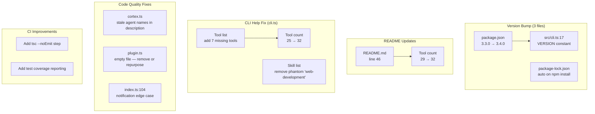
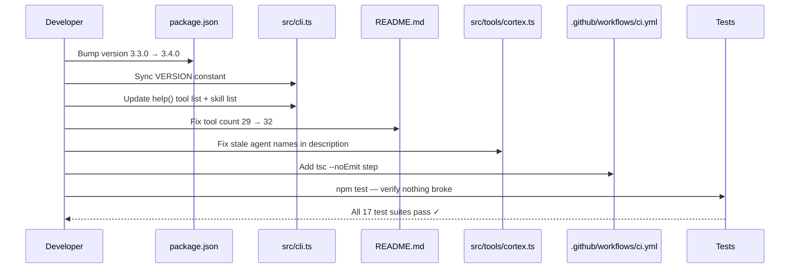

# v3.4.0 Release — README Update, Version Bump, and Code Quality Fixes

# Plan: v3.4.0 Release — README Update, Version Bump, and Code Quality Fixes

## Summary

Two major features were just merged to main — **GitHub Work Items Integration** (3 tools) and **REPL Loop** (4 tools) — bringing the total tool count from 25 to **32**. The README, CLI help text, and version numbers are now stale and need updating. Additionally, the codebase analysis revealed several code quality issues, CI gaps, and test coverage holes that should be addressed in this release.

This plan covers three scopes: **(1)** Version bump to 3.4.0, **(2)** README and CLI help text refresh, **(3)** Code quality fixes identified during analysis.

## Architecture Diagram



## Tasks

- [ ] Task 1: Bump version to 3.4.0 in `package.json` (line 3) and `src/cli.ts` (line 17, `VERSION` constant)
- [ ] Task 2: Update README.md tool count — line 46 says "29 tools" → change to "32 tools"
- [ ] Task 3: Update CLI help function (cli.ts lines 805-828) — add 7 missing tools to the tool list (github_status, github_issues, github_projects, repl_init, repl_status, repl_report, repl_summary) and the get_environment_info tool. Update count from 25 to 32
- [ ] Task 4: Fix CLI help skill list (cli.ts lines 823-828) — remove phantom "web-development" entry. Actual skills are 14 (not 15). Ensure count matches
- [ ] Task 5: Fix stale agent names in cortex.ts tool description (lines 188-206) — `configure` tool references old names "build, plan, debug" and "fullstack, testing, security, devops" instead of current "implement, architect, fix, audit" and "crosslayer, qa, guard, ship"
- [ ] Task 6: Remove or repurpose empty `src/plugin.ts` (3 lines of comments, no logic, nothing imports it)
- [ ] Task 7: Add `tsc --noEmit` type-check step to CI workflow (`.github/workflows/ci.yml`)
- [ ] Task 8: Run `npm test` to verify all existing tests pass after changes

## Technical Approach

### Phase 1: Version Bump (Task 1)

Two locations to update:
- `package.json` line 3: `"version": "3.3.0"` → `"version": "3.4.0"`
- `src/cli.ts` line 17: `const VERSION = "3.3.0"` → `const VERSION = "3.4.0"`

**Note**: The version is duplicated between package.json and cli.ts. This is a known tech debt item — the CLI reads a hardcoded constant instead of importing from package.json. Fixing this is out of scope for this release but flagged for future work.

### Phase 2: README Update (Task 2)

Line 46 currently reads:
```
That's it. Your OpenCode session now has 8 specialized agents, 29 tools, and 14 domain skills.
```
Change to:
```
That's it. Your OpenCode session now has 8 specialized agents, 32 tools, and 14 domain skills.
```

The rest of the README is already up-to-date — the Tools table (lines 161-221) already includes GitHub and REPL sections, and the "How It Works" section (lines 396-432) already documents the REPL Loop. Only the count number is stale.

### Phase 3: CLI Help Text (Tasks 3-4)

**Task 3 — Tool list**: The help function (cli.ts:805-822) lists 25 tools. Need to add:

```
  github_status, github_issues    GitHub issue and project browsing
  github_projects
  repl_init, repl_status          Iterative task-by-task implementation loop
  repl_report, repl_summary
```

And update the header from `TOOLS (25):` to `TOOLS (32):`.

**Task 4 — Skill list**: The help function (cli.ts:823-828) lists a skill called "web-development" that does **not exist**. The actual 14 skills are:
```
frontend-development, backend-development, mobile-development,
desktop-development, database-design, api-design,
architecture-patterns, design-patterns, testing-strategies,
security-hardening, deployment-automation, performance-optimization,
code-quality, git-workflow
```

Remove "web-development" and update the count to `SKILLS (14):` (it already says 14 but lists 15).

### Phase 4: Code Quality Fixes (Tasks 5-6)

**Task 5 — Stale cortex.ts description**: In `src/tools/cortex.ts` (around lines 188-206), the `configure` tool's description string says:
> "Sets the model for primary agents (build, plan, debug) and subagents (fullstack, testing, security, devops)"

Should read:
> "Sets the model for primary agents (implement, architect, fix, audit) and subagents (crosslayer, qa, guard, ship)"

**Task 6 — Empty plugin.ts**: `src/plugin.ts` is a 3-line file with only comments. Nothing imports it. Options:
- **Remove it** (preferred — dead code)
- Or repurpose it if there's a future plan for plugin config

### Phase 5: CI Improvement (Task 7)

Add a `tsc --noEmit` step to `.github/workflows/ci.yml` after the build step:

```yaml
      - name: Type check
        run: npx tsc --noEmit
```

This catches type errors that `npm run build` might miss in emitted files vs full project checking.

## Data Flow



## Risks & Mitigations

| Risk | Impact | Likelihood | Mitigation |
|------|--------|------------|------------|
| Missing a stale reference | Low | Medium | Grep for "29 tools", "25 tools", "web-development", old agent names |
| Breaking tests when removing plugin.ts | Low | Low | Verify no imports reference it (confirmed: none do) |
| npm publish fails with wrong version | High | Low | CI runs tests before publish; manual verification |
| CLI help text formatting breaks | Low | Low | Run `npx cortex-agents help` manually after changes |

## Estimated Effort

- **Complexity**: Low
- **Time Estimate**: 1-2 hours
- **Dependencies**: None — all changes are internal, no API changes

## Additional Issues Identified (Future Work)

These were found during analysis but are **out of scope** for this release:

| Issue | Severity | Location | Description |
|-------|----------|----------|-------------|
| Version duplication | Low | cli.ts:17 + package.json | VERSION constant should read from package.json at build time |
| Notification edge case | Low | index.ts:104 | `args.primaryModel?.split("/").pop() \|\| "set"` — `.pop()` on empty string returns `""` which is falsy, but edge case is non-critical |
| tmux shell injection risk | Medium | utils/terminal.ts:326 | `buildTabCommand` output passed to tmux exec — should use `shellEscape` |
| Test coverage gaps | Medium | Multiple files | branch.ts, session.ts, docs.ts, task.ts, environment.ts, worktree.ts, cortex.ts — no tool-level tests |
| No ESLint config | Low | Project root | No linter configured — consider adding for consistency |
| Notifications test duplicates logic | Low | notifications.test.ts | Duplicates `extractErrorMessage` and `TOOL_NOTIFICATIONS` instead of importing (they're not exported) |

## Key Decisions

1. **Decision**: Bump to 3.4.0 (minor), not 4.0.0
   **Rationale**: Two feature additions with no breaking changes. Semver minor is appropriate.

2. **Decision**: Remove empty plugin.ts rather than keep it
   **Rationale**: Dead code. Nothing imports it. Can always recreate if needed. YAGNI.

3. **Decision**: Add `tsc --noEmit` to CI but defer ESLint
   **Rationale**: Type checking catches real bugs. Linting is valuable but requires config setup — save for a dedicated chore PR.

4. **Decision**: Defer test coverage improvements to a separate PR
   **Rationale**: Test gaps are real but not blocking. Mixing test writing with version bump creates a large PR.

## Suggested Branch Name

`chore/v3.4.0-release-prep`

## Tasks

- [ ] Bump version to 3.4.0 in package.json and src/cli.ts VERSION constant
- [ ] Update README.md tool count from 29 to 32 (line 46)
- [ ] Update CLI help function — add 7 missing tools, update count from 25 to 32
- [ ] Fix CLI help skill list — remove phantom 'web-development', verify count is 14
- [ ] Fix stale agent names in cortex.ts configure tool description
- [ ] Remove empty src/plugin.ts (dead code, nothing imports it)
- [ ] Add tsc --noEmit type-check step to CI workflow
- [ ] Run npm test to verify all existing tests pass
