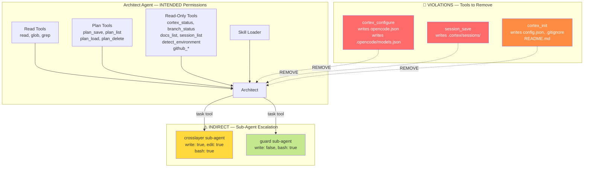
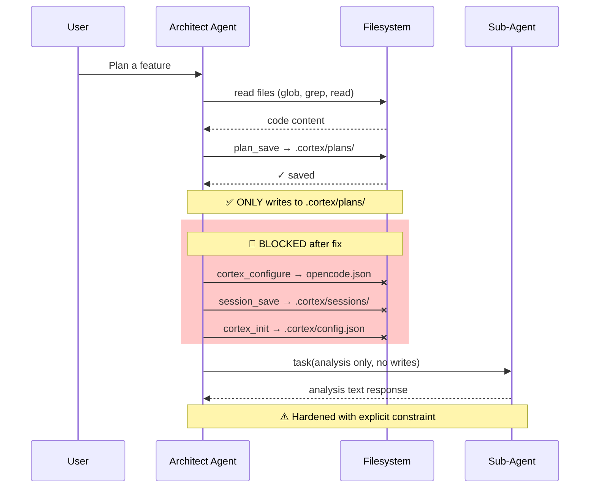

# Architect Agent Permissions Lockdown — Least Privilege Enforcement

## Summary

The architect agent's stated role is **read-only analysis + planning document creation**. However, an audit of its tool allowlist in `.opencode/agents/architect.md` reveals **three tools that perform writes beyond planning documents**, violating the Principle of Least Privilege. Additionally, the architect can launch sub-agents (`crosslayer`) that have full write/edit/bash access, creating an indirect escalation path.

This plan fixes the direct tool permission violations and hardens the sub-agent boundary.

## Architecture Diagram



## Audit Results

### Full Tool Permission Matrix

| Tool | Category | Writes To | Current | Verdict |
|------|----------|-----------|---------|---------|
| `read` | built-in | — | ✅ allowed | **Keep** |
| `glob` | built-in | — | ✅ allowed | **Keep** |
| `grep` | built-in | — | ✅ allowed | **Keep** |
| `skill` | built-in | — | ✅ allowed | **Keep** |
| `task` | built-in | Delegates to sub-agents | ✅ allowed | **Keep + harden** |
| `cortex_init` | cortex | `.cortex/config.json`, `.gitignore`, `README.md`, directories | ✅ allowed | 🔴 **Remove** |
| `cortex_status` | cortex | — | ✅ allowed | **Keep** |
| `cortex_configure` | cortex | `opencode.json`, `.opencode/models.json` | ✅ allowed | 🔴 **Remove** |
| `plan_save` | plan | `.cortex/plans/*.md` | ✅ allowed | **Keep** (core purpose) |
| `plan_list` | plan | — | ✅ allowed | **Keep** |
| `plan_load` | plan | — | ✅ allowed | **Keep** |
| `plan_delete` | plan | Deletes `.cortex/plans/*.md` | ✅ allowed | **Keep** (plan management) |
| `session_save` | session | `.cortex/sessions/*.md` | ✅ allowed | 🔴 **Remove** |
| `session_list` | session | — | ✅ allowed | **Keep** (read context) |
| `branch_status` | branch | — | ✅ allowed | **Keep** |
| `docs_list` | docs | — | ✅ allowed | **Keep** |
| `detect_environment` | environment | — | ✅ allowed | **Keep** |
| `github_status` | github | — | ✅ allowed | **Keep** |
| `github_issues` | github | — | ✅ allowed | **Keep** |
| `github_projects` | github | — | ✅ allowed | **Keep** |

### Violation Details

#### 🔴 V1: `cortex_configure` — Writes project configuration files

**Severity**: High  
**What it writes**: `opencode.json` (project root), `.opencode/models.json`  
**Why it's wrong**: These are project configuration files, not planning documents. The architect should *recommend* model configs in its plan, not write them directly. The implement agent or the user should apply configuration changes.  
**Fix**: Remove from architect's tool allowlist. Update system prompt to recommend configs in plan output instead.

#### 🔴 V2: `session_save` — Writes session summaries

**Severity**: Medium  
**What it writes**: `.cortex/sessions/*.md`  
**Why it's wrong**: Session summaries record what was *accomplished* during implementation/debugging. The architect's output IS the plan — it doesn't "accomplish" work that needs a session record. Session saving belongs to implement/fix agents.  
**Fix**: Remove from architect's tool allowlist. The architect's session prompt (Step 5 handoff) already references `session_save` in the context of implementation agents.

#### 🔴 V3: `cortex_init` — Creates directory structure and config files

**Severity**: Medium  
**What it writes**: `.cortex/config.json`, `.cortex/.gitignore`, `.cortex/README.md`, creates `plans/` and `sessions/` directories  
**Why it's wrong**: While the architect needs `.cortex/plans/` to exist, `plan_save` already auto-creates it via the `ensureCortexDir()` helper in `plan.ts` (line 22-31). The extra files (`config.json`, `.gitignore`, `README.md`) are project scaffolding — not the architect's concern.  
**Fix**: Remove from architect's tool allowlist. Plan saving works without it.

#### ⚠️ V4: `task` sub-agent escalation (indirect)

**Severity**: Low-Medium  
**What happens**: Architect can launch `crosslayer` sub-agent which has `write: true, edit: true, bash: true`  
**Why it matters**: The architect can indirectly write files by delegating to a fully-empowered sub-agent  
**Current mitigation**: The architect's system prompt instructs analysis-only use of sub-agents  
**Fix**: Add explicit instruction to sub-agent prompts when launched from architect context. The `guard` sub-agent is already safe (`write: false, edit: false`).

## Technical Approach

### Phase 1: Fix Direct Permissions (architect.md)

**File**: `.opencode/agents/architect.md`

Remove three tools from the `tools:` frontmatter:
```yaml
tools:
  write: false
  edit: false
  bash: false
  skill: true
  task: true
  read: true
  glob: true
  grep: true
  # cortex_init: true        ← REMOVE
  cortex_status: true
  # cortex_configure: true   ← REMOVE
  plan_save: true
  plan_list: true
  plan_load: true
  plan_delete: true
  # session_save: true       ← REMOVE
  session_list: true
  branch_status: true
  docs_list: true
  detect_environment: true
  github_status: true
  github_issues: true
  github_projects: true
```

### Phase 2: Update System Prompt (architect.md body)

Update the architect agent's system prompt to reflect the corrected permissions:

1. **Remove Step 1 `cortex_init` reference**: Replace the "If not, run `cortex_init`" instruction with a note that `plan_save` auto-creates the directory.

2. **Remove `cortex_configure` reference**: Replace the "offer to configure models via `cortex_configure`" instruction with a recommendation to include model config suggestions in the plan output.

3. **Remove `session_save` from Tool Usage list**: Remove the session_save entry from the documented tool list.

4. **Update Constraints section** to explicitly enumerate the write surface:
```markdown
## Constraints
- You cannot write, edit, or delete code files
- You cannot execute bash commands  
- You can only read, search, and analyze
- You CAN save/delete plans in .cortex/plans/ (your ONLY write surface)
- You CANNOT write session summaries, project configs, or documentation files
- When launching sub-agents, instruct them to perform ANALYSIS ONLY — no file writes
- Always ask clarifying questions when requirements are unclear
```

5. **Harden sub-agent launch instructions**: Update the sub-agent section to explicitly include "DO NOT write any files" in the prompts sent to sub-agents.

### Phase 3: Update Handoff Workflow

The current Step 1 and Step 5 reference tools being removed:

- **Step 1**: Replace `cortex_init` with: "Run `cortex_status` to check if .cortex exists. If it doesn't, inform the user that the implement agent will initialize it. Plan saving auto-creates the necessary directory."

- **Step 5**: Remove the model configuration offer. Instead, if the architect notices no model config, add a recommendation to the plan: "Recommended: Run `cortex_configure` to set up model preferences before implementation."

### Phase 4: Harden Sub-Agent Boundary

Update the sub-agent launch template in the architect's prompt to include read-only constraints:

```markdown
### How to Launch Sub-Agents

When launching sub-agents from the architect, ALWAYS include this constraint:
"This is an ANALYSIS-ONLY task. Do NOT write, edit, or create any files. 
Return your analysis as text in your response."

Example:
Task(subagent_type="crosslayer", prompt="ANALYSIS ONLY — do not write files. Feature: [requirements]. Stack: [tech stack]. Analyze feasibility and estimate effort. Return findings as structured text.")
```

## Data Flow



## Risks & Mitigations

| Risk | Impact | Likelihood | Mitigation |
|------|--------|------------|------------|
| Removing `cortex_init` breaks plan saving | High | **None** — `plan_save` has `ensureCortexDir()` | Verified in code: `plan.ts` lines 22-31 auto-create `.cortex/plans/` |
| Users expect architect to configure models | Medium | Low | Plan output includes config recommendation; implement agent has `cortex_configure` |
| Sub-agents ignore analysis-only instruction | Low | Low | Prompt engineering + `guard` already read-only; `crosslayer` runs in sub-agent context with its own session |
| Architect can't save session for handoff context | Low | Low | Plan itself contains all handoff context; session_list still available for reading |

## Estimated Effort

- **Complexity**: Low
- **Time Estimate**: 30 minutes
- **Dependencies**: None — changes are confined to `.opencode/agents/architect.md`

## Key Decisions

1. **Decision**: Remove `cortex_configure` from architect  
   **Rationale**: Project config files are not planning documents. The architect should recommend configuration in its plan output, letting the implementation agent apply it.

2. **Decision**: Remove `session_save` from architect  
   **Rationale**: Session summaries record implementation outcomes. The architect produces plans, not session records. `session_list` (read) is retained for context.

3. **Decision**: Remove `cortex_init` from architect  
   **Rationale**: `plan_save` auto-creates `.cortex/plans/` via `ensureCortexDir()`. The additional files written by `cortex_init` (config, gitignore, readme) are scaffolding beyond the architect's scope.

4. **Decision**: Keep `plan_delete` on architect  
   **Rationale**: Plan lifecycle management (create, read, delete) is a legitimate architect function. Deleting outdated plans is part of planning.

5. **Decision**: Harden sub-agent prompts rather than removing `task` tool  
   **Rationale**: Sub-agent analysis is valuable for complex plans. Removing `task` would degrade plan quality. Explicit "analysis only" constraints in prompts provide defense-in-depth.

## Suggested Branch Name
`bugfix/architect-permissions-lockdown`
## Tasks

- [ ] Remove `cortex_init` from architect.md tools allowlist
- [ ] Remove `cortex_configure` from architect.md tools allowlist
- [ ] Remove `session_save` from architect.md tools allowlist
- [ ] Update Step 1 in architect.md to remove cortex_init/configure references
- [ ] Update Constraints section to explicitly define the write surface as .cortex/plans/ ONLY
- [ ] Update Tool Usage section to remove references to removed tools
- [ ] Harden sub-agent launch templates with explicit 'analysis only, no file writes' constraint
- [ ] Update Step 5 handoff to remove model configuration offer (move to plan recommendation)
- [ ] Verify plan_save still works without cortex_init (ensureCortexDir auto-creates directory)
