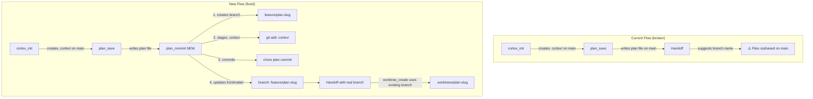
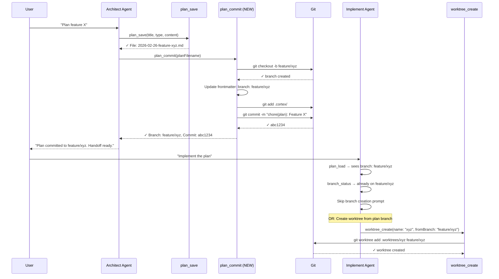

# Architect Branch-and-Commit — Plan Artifacts Off Main

## Summary

When the architect agent creates a plan, the `.cortex/` directory and plan files are written to disk but never committed — leaving untracked artifacts on the protected `main` branch. This creates a mess visible in VS Code's Source Control panel (5 orphaned files on `main*`) and breaks the plan → branch → worktree → PR traceability chain.

This feature introduces a new `plan_commit` tool that the architect calls **after `plan_save`** to:
1. Create a properly-named feature/bugfix branch from the plan metadata
2. Stage and commit all `.cortex/` artifacts to that branch
3. Write the branch name back into the plan frontmatter (`branch: feature/xyz`)

This keeps `main` clean and establishes the branch that later becomes the worktree target or direct implementation branch.

## Architecture Diagram



## Tasks

- [ ] Task 1: Create `plan_commit` tool in `src/tools/plan.ts`
  - AC: Tool accepts `planFilename` (required), optional `branchType` and `branchName` overrides
  - AC: Reads plan frontmatter to extract title and type
  - AC: Maps plan type to branch prefix (`feature`→`feature`, `bugfix`→`bugfix`, `refactor`→`refactor`, `architecture`→`refactor`, `spike`→`feature`, `docs`→`docs`)
  - AC: Creates git branch `{prefix}/{slug}` via `git checkout -b`
  - AC: If branch already exists, switches to it instead of failing
  - AC: Updates plan frontmatter to add `branch: {branchName}` field
  - AC: Stages `.cortex/` directory via `git add .cortex/`
  - AC: Commits with message `chore(plan): {title}`
  - AC: Returns branch name and commit hash on success
  - AC: Skips branch creation if already on a non-protected branch
  - AC: Uses `git()` shell utility (same pattern as `branch.ts`)
  - AC: Needs client access for toast notifications (factory pattern like `branch_create`)

- [ ] Task 2: Register `plan_commit` tool in `src/index.ts`
  - AC: Import and register as `plan_commit` in the tool map
  - AC: Uses factory pattern (`plan.createCommit(ctx.client)`) for toast access
  - AC: Add toast notification config in `TOOL_NOTIFICATIONS` map

- [ ] Task 3: Add `branch` field support to `plan_save` frontmatter
  - AC: Add optional `branch` arg to `plan_save` tool schema
  - AC: When provided, include `branch: {value}` in YAML frontmatter
  - AC: This allows plan_save to pre-set the branch if known (e.g., re-saving after plan_commit)

- [ ] Task 4: Add `extractBranch()` utility to `src/utils/plan-extract.ts`
  - AC: Parses `branch: feature/xyz` from plan frontmatter
  - AC: Returns `string | null`
  - AC: Used by `findPlanContent` result, `repl_init`, and `task_finalize`

- [ ] Task 5: Update architect agent workflow in `.opencode/agents/architect.md`
  - AC: Add `plan_commit: true` to tools list
  - AC: Add new **Step 4.5: Commit Plan to Branch** between Step 4 (Save) and Step 5 (Handoff)
  - AC: Step 4.5 instructions: "After saving the plan, call `plan_commit` with the plan filename. This creates a branch, commits `.cortex/` artifacts, and writes the branch name into the plan."
  - AC: Update Step 5 (Handoff) to remove "Create a worktree first" as a separate option — instead: "Create a worktree from the plan branch"
  - AC: Update Step 6 (Handoff Context) to include actual branch name from plan_commit result, not a suggestion
  - AC: Update the plan output format to include `branch` in frontmatter section
  - AC: Remove `branch_create` from the tools list (plan_commit encapsulates it)

- [ ] Task 6: Update implement agent awareness in `.opencode/agents/implement.md`
  - AC: Step 3 (Check for Existing Plan): When loading a plan with `branch` frontmatter, inform user they're on the plan's branch
  - AC: Step 4 (Branch Strategy): If plan has `branch` field and user is already on that branch, skip branch creation prompt
  - AC: Step 4 (Worktree): If plan has `branch` field, suggest creating worktree using that branch name

- [ ] Task 7: Enhance `worktree_create` to accept optional `fromBranch` parameter
  - AC: New optional arg `fromBranch: string` — if provided, creates worktree from that existing branch
  - AC: If `fromBranch` is set, skip `-b` flag entirely and use `git worktree add {path} {fromBranch}`
  - AC: If branch doesn't exist, fall back to creating it
  - AC: This allows: `worktree_create(name: "xyz", type: "feature", fromBranch: "feature/xyz")`

- [ ] Task 8: Write tests for `plan_commit` tool
  - AC: Test branch creation from plan metadata
  - AC: Test frontmatter update with branch field
  - AC: Test skip-branch-creation when already on non-protected branch
  - AC: Test error handling (not in git repo, plan not found)
  - AC: Test type-to-prefix mapping

- [ ] Task 9: Write tests for `extractBranch()` utility
  - AC: Test extraction from valid frontmatter
  - AC: Test null return when no branch field
  - AC: Test with various frontmatter formats

## Technical Approach

### Phase 1: Core Tool — `plan_commit`

The new tool lives in `src/tools/plan.ts` alongside `save`, `list`, `load`, `delete`. It follows the factory pattern used by `branch_create` for toast notification access.

**Key implementation detail:** The tool must update the plan's YAML frontmatter in-place. This means:
1. Read the plan file
2. Parse frontmatter boundaries (`---\n...\n---`)
3. Insert `branch: {branchName}` before the closing `---`
4. Write the file back
5. Then stage and commit

**Type-to-prefix mapping:**
```typescript
const TYPE_TO_PREFIX: Record<string, string> = {
  feature: "feature",
  bugfix: "bugfix",
  refactor: "refactor",
  architecture: "refactor",
  spike: "feature",
  docs: "docs",
};
```

**Git operations sequence:**
```
git checkout -b {prefix}/{slug}   // create branch
// update plan frontmatter
git add .cortex/                   // stage all cortex artifacts
git commit -m "chore(plan): {title}"  // commit
```

### Phase 2: Integration — Agent Workflows

**Architect (`architect.md`)** gets `plan_commit` added to its tool list and a new mandatory step:

```
### Step 4.5: Commit Plan to Branch (NEW — MANDATORY)
After saving the plan, commit it to a dedicated branch:
1. Call `plan_commit` with the plan filename from Step 4
2. This creates a branch, commits .cortex/ artifacts, and returns the branch name
3. The plan frontmatter is updated with `branch: feature/xyz`
4. Main branch is now clean — all plan artifacts live on the feature branch
```

**Implement (`implement.md`)** gains awareness of the `branch` frontmatter field so it can skip redundant branch-creation prompts when the architect already created one.

### Phase 3: Worktree Enhancement

`worktree_create` gains an optional `fromBranch` parameter. When set, it skips creating a new branch and instead creates the worktree directly from the existing branch. This completes the chain: architect → plan_commit (creates branch) → worktree_create (uses that branch) → implementation.

## Data Flow



## Edge Cases

### Already on a non-protected branch
If the architect is already on a feature branch (e.g., from a previous `plan_commit`), skip branch creation and just commit the new/updated plan.

### Branch name collision
If the branch `feature/xyz` already exists (e.g., from a previous planning session), switch to it rather than failing. This supports plan iteration — save, refine, commit again.

### No git repository
Return a clear error: "Not in a git repository. Initialize git first."

### Plan file not found
Return a clear error with suggestion to run `plan_list`.

### Worktree from existing branch
When `worktree_create` receives `fromBranch`, and the branch has commits ahead of main, the worktree will include those commits. This is correct behavior — the plan artifacts should be visible in the worktree.

## Risks & Mitigations

| Risk | Impact | Likelihood | Mitigation |
|------|--------|------------|------------|
| Architect left on feature branch after plan_commit | Medium | High | Document clearly; implement agent already handles being on feature branch |
| Branch naming inconsistency between plan_commit and manual worktree_create | Low | Medium | Both use same `{type}/{slug}` convention; plan frontmatter is source of truth |
| Git uncommitted changes in working dir when plan_commit runs | Medium | Medium | plan_commit should only stage `.cortex/` (not `git add -A`), minimizing risk |
| User iterates plan multiple times before committing | Low | Medium | plan_commit handles existing branch by switching to it |
| Plan frontmatter parsing breaks with unusual content | Low | Low | Use regex matching (already proven in plan-extract.ts) |

## Estimated Effort

- **Complexity**: Medium
- **Time Estimate**: 3-4 hours
- **Dependencies**: None — all changes are within the cortex-agents codebase

## Key Decisions

1. **Decision**: Separate `plan_commit` tool rather than enhancing `plan_save`
   **Rationale**: Separation of concerns — `plan_save` remains a pure file-write operation. Architects may save multiple draft iterations before committing. The explicit `plan_commit` call gives control over when the branch is created.

2. **Decision**: Stage only `.cortex/` directory, not `git add -A`
   **Rationale**: The architect agent is read-only for code. Staging only `.cortex/` ensures no accidental code changes get committed. This is a safety boundary.

3. **Decision**: Write branch name into plan frontmatter
   **Rationale**: Creates a traceable link from plan → branch. Downstream tools (implement agent, task_finalize, repl_init) can read the branch from the plan rather than guessing from naming conventions.

4. **Decision**: Factory pattern for `plan_commit` (like `branch_create`)
   **Rationale**: Needs client access for toast notifications. Follows established pattern in the codebase.

5. **Decision**: Add `fromBranch` to `worktree_create` rather than auto-detecting
   **Rationale**: Explicit is better than implicit. The implement agent reads the plan's `branch` field and passes it explicitly, keeping worktree_create simple and predictable.

## Suggested Branch Name

`feature/architect-plan-commit`
## Tasks

- [ ] Task 1: Create plan_commit tool in src/tools/plan.ts (factory pattern, git ops, frontmatter update)
- [ ] Task 2: Register plan_commit in src/index.ts with toast notifications
- [ ] Task 3: Add optional branch field to plan_save frontmatter
- [ ] Task 4: Add extractBranch() utility to src/utils/plan-extract.ts
- [ ] Task 5: Update architect agent workflow in .opencode/agents/architect.md (new Step 4.5)
- [ ] Task 6: Update implement agent awareness in .opencode/agents/implement.md (branch field handling)
- [ ] Task 7: Enhance worktree_create to accept optional fromBranch parameter
- [ ] Task 8: Write tests for plan_commit tool
- [ ] Task 9: Write tests for extractBranch() utility
