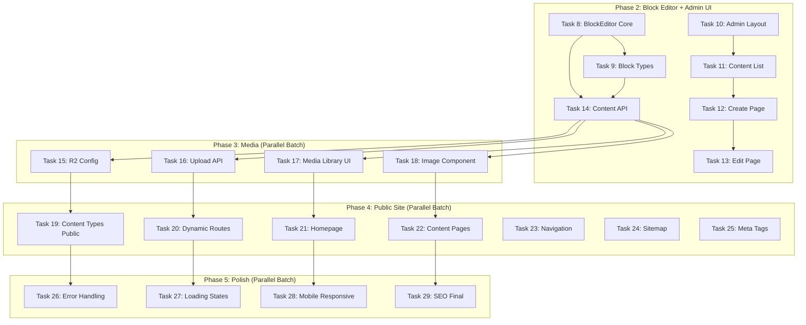
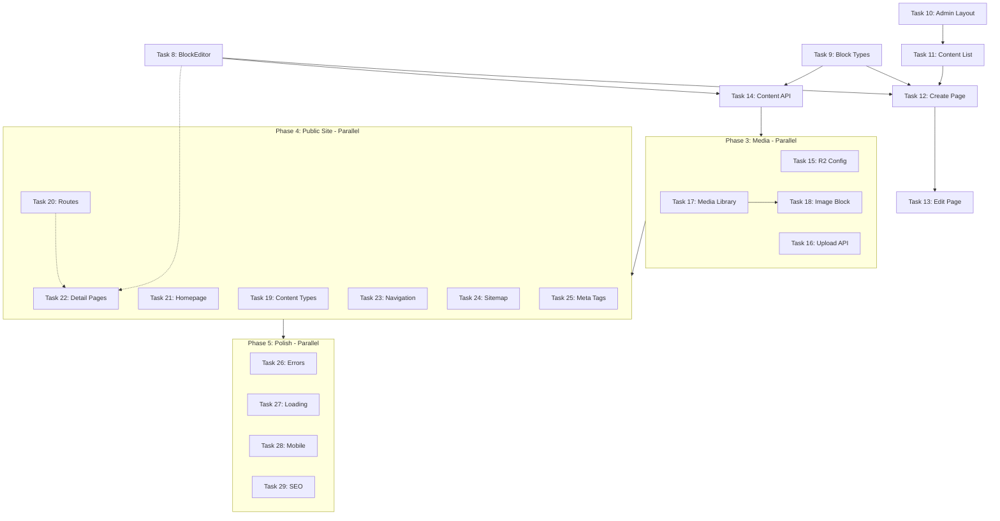
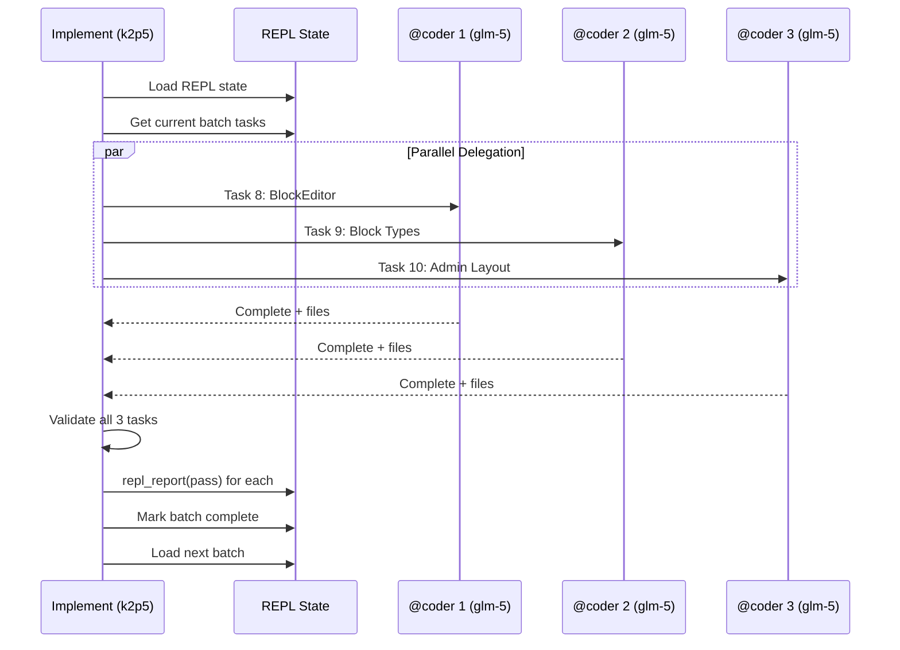

# CMS Implementation - Parallel Optimized for Subagent Delegation

# CMS Implementation - Parallel Optimized for Subagent Delegation

## Summary

This plan restructures the CMS implementation to maximize parallel execution using `@coder` (glm-5) subagents. Tasks are designed to be **independent, file-focused, and delegable** to achieve 3-5x speedup through parallelization.

**Delegation Strategy**: Always delegate to @coder when possible
**Max Parallel Subagents**: 5
**Research**: Architect agent handles (no subagent research)

## Architecture Diagram

## Phase 2: Block Editor + Admin UI

**Execution Strategy**: Parallel batches with minimal dependencies

### Batch 2A - Parallel (Independent Components)
These can all run simultaneously - no shared files

- [ ] **Task 8**: BlockEditor Core Component
  - AC: Create `app/components/BlockEditor/BlockEditor.vue` - Main container
  - AC: Create `app/components/BlockEditor/BlockToolbar.vue` - Add/remove blocks
  - AC: Create `app/composables/useBlockEditor.ts` - State management
  - AC: Define TypeScript interfaces in `app/types/blocks.ts`
  - Files: 4 files, no dependencies on other tasks
  - **Delegate to**: @coder

- [ ] **Task 9**: Block Type Components (Independent)
  - AC: Create `app/components/blocks/TextBlock.vue` - Rich text editor
  - AC: Create `app/components/blocks/ImageBlock.vue` - Image with caption
  - AC: Create `app/components/blocks/HeadingBlock.vue` - H1-H6 selector
  - AC: Create `app/components/blocks/DividerBlock.vue` - Horizontal rule
  - Files: 4 files, self-contained
  - **Delegate to**: @coder

- [ ] **Task 10**: Admin Layout Shell
  - AC: Create `app/layouts/admin.vue` - Admin layout with sidebar slot
  - AC: Create `app/components/admin/AdminSidebar.vue` - Navigation menu
  - AC: Create `app/components/admin/AdminHeader.vue` - Top bar with user
  - AC: Create `app/middleware/admin-auth.ts` - Admin route protection
  - Files: 4 files, uses existing auth from Phase 1
  - **Delegate to**: @coder

### Batch 2B - Sequential (Depends on 2A)

- [ ] **Task 11**: Content List Page
  - AC: Create `app/pages/admin/content/index.vue` - List all content
  - AC: Create `app/components/admin/ContentTable.vue` - Reusable table
  - AC: Create `app/components/admin/ContentFilters.vue` - Search/filter UI
  - Depends on: Task 10 (admin layout)
  - **Delegate to**: @coder

- [ ] **Task 12**: Content Create Page
  - AC: Create `app/pages/admin/content/create.vue` - New content form
  - AC: Create `app/components/admin/ContentForm.vue` - Reusable form
  - AC: Integrate BlockEditor from Task 8
  - Depends on: Task 8, Task 10, Task 11
  - **Delegate to**: @coder

- [ ] **Task 13**: Content Edit Page
  - AC: Create `app/pages/admin/content/[id].vue` - Edit existing content
  - AC: Reuse ContentForm from Task 12
  - AC: Add delete confirmation modal
  - Depends on: Task 12
  - **Delegate to**: @coder

### Batch 2C - API Layer (Depends on 2A)

- [ ] **Task 14**: Content Management API
  - AC: Create `server/api/content/index.post.ts` - Create content
  - AC: Create `server/api/content/[id].get.ts` - Get single content
  - AC: Create `server/api/content/[id].put.ts` - Update content
  - AC: Create `server/api/content/[id].delete.ts` - Delete content
  - AC: Create `server/api/content/index.get.ts` - List with pagination
  - Depends on: Task 8 (block data structure), Task 9 (block types)
  - **Delegate to**: @coder

## Phase 3: Media Integration - Cloudflare R2

**Execution Strategy**: All 4 tasks can run in parallel - independent APIs and UI

- [ ] **Task 15**: R2 Configuration & SDK
  - AC: Create `server/utils/r2.ts` - R2 client initialization
  - AC: Create `server/utils/media.ts` - Media helper functions
  - AC: Add R2 env vars to `.env.example`
  - AC: Create `server/types/media.ts` - Media type definitions
  - Files: 4 files, independent
  - **Delegate to**: @coder

- [ ] **Task 16**: Media Upload API
  - AC: Create `server/api/media/upload.post.ts` - Upload to R2
  - AC: Create `server/api/media/index.get.ts` - List media
  - AC: Create `server/api/media/[id].delete.ts` - Delete from R2
  - AC: Add file validation (size, type)
  - Files: 3 files, independent
  - **Delegate to**: @coder

- [ ] **Task 17**: Media Library UI
  - AC: Create `app/components/media/MediaLibrary.vue` - Modal/grid
  - AC: Create `app/components/media/MediaUploader.vue` - Drag & drop
  - AC: Create `app/components/media/MediaCard.vue` - Individual item
  - AC: Create `app/composables/useMediaLibrary.ts` - State management
  - Files: 4 files, independent of Task 16 (uses API contract)
  - **Delegate to**: @coder

- [ ] **Task 18**: Image Block Enhancement
  - AC: Update `app/components/blocks/ImageBlock.vue` - Add media picker
  - AC: Create `app/components/media/MediaPicker.vue` - Select from library
  - AC: Add image optimization/compression
  - Depends on: Task 9, Task 17 (uses MediaPicker)
  - **Delegate to**: @coder

## Phase 4: Content Types + Public Site

**Execution Strategy**: Parallel batches by concern

### Batch 4A - Content Type System (Parallel)

- [ ] **Task 19**: Dynamic Content Type System
  - AC: Create `server/api/content-types/index.post.ts` - Create type
  - AC: Create `server/api/content-types/index.get.ts` - List types
  - AC: Create `server/api/content-types/[id].put.ts` - Update type
  - AC: Create `app/components/admin/ContentTypeBuilder.vue` - Type builder UI
  - Files: 4 files, independent
  - **Delegate to**: @coder

- [ ] **Task 20**: Dynamic Route Generation
  - AC: Create `server/api/routes/index.get.ts` - Get all routes
  - AC: Create `server/utils/routes.ts` - Route resolution logic
  - AC: Update `app/pages/[...slug].vue` - Catch-all dynamic page
  - AC: Add route caching in Nitro
  - Files: 3-4 files, independent
  - **Delegate to**: @coder

### Batch 4B - Public Pages (Parallel)

- [ ] **Task 21**: Homepage Template
  - AC: Create `app/pages/index.vue` - Homepage with hero section
  - AC: Create `app/components/sections/HeroSection.vue` - Reusable hero
  - AC: Create `app/components/sections/FeaturesSection.vue` - Feature grid
  - AC: Create `app/layouts/public.vue` - Public site layout
  - Files: 4 files, independent
  - **Delegate to**: @coder

- [ ] **Task 22**: Content Detail Pages
  - AC: Update `app/pages/[...slug].vue` - Render content with blocks
  - AC: Create `app/components/content/ContentRenderer.vue` - Block renderer
  - AC: Create `app/components/content/ContentMeta.vue` - Author, date, etc.
  - Depends on: Task 8 (BlockEditor data format)
  - **Delegate to**: @coder

- [ ] **Task 23**: Navigation System
  - AC: Create `server/api/navigation/index.get.ts` - Navigation tree API
  - AC: Create `app/components/layout/MainNav.vue` - Main navigation
  - AC: Create `app/components/layout/MobileNav.vue` - Mobile menu
  - AC: Create `app/composables/useNavigation.ts` - Navigation state
  - Files: 4 files, independent
  - **Delegate to**: @coder

### Batch 4C - SEO (Parallel)

- [ ] **Task 24**: XML Sitemap Generation
  - AC: Create `server/routes/sitemap.xml.ts` - Dynamic sitemap
  - AC: Create `server/utils/sitemap.ts` - Sitemap builder
  - AC: Include all content types and pages
  - Files: 2 files, independent
  - **Delegate to**: @coder

- [ ] **Task 25**: Meta Tags & OpenGraph
  - AC: Create `app/composables/useSeo.ts` - SEO composable
  - AC: Update `app/pages/[...slug].vue` - Add meta tags
  - AC: Create `app/components/seo/SeoPreview.vue` - Admin preview
  - AC: Add Twitter Cards, Facebook OG tags
  - Files: 3 files, depends on Task 22
  - **Delegate to**: @coder

## Phase 5: Polish & Optimization

**Execution Strategy**: All parallel - independent improvements

- [ ] **Task 26**: Error Handling & Notifications
  - AC: Create `app/composables/useToast.ts` - Toast notification system
  - AC: Create `app/components/ui/Toast.vue` - Toast component
  - AC: Create `app/components/ui/ErrorBoundary.vue` - Error handling
  - AC: Add error handling to all API calls
  - Files: 3-4 files, independent
  - **Delegate to**: @coder

- [ ] **Task 27**: Loading States & Skeletons
  - AC: Create `app/components/ui/Skeleton.vue` - Reusable skeleton
  - AC: Create `app/components/ui/LoadingSpinner.vue` - Spinner
  - AC: Add skeleton loaders to all async components
  - AC: Add page transition loading state
  - Files: 3-4 files, independent
  - **Delegate to**: @coder

- [ ] **Task 28**: Mobile Responsive Design
  - AC: Audit and update all admin components for mobile
  - AC: Update BlockEditor for touch devices
  - AC: Add responsive breakpoints to Tailwind config
  - AC: Test and fix mobile navigation
  - Files: Updates across components, independent
  - **Delegate to**: @coder

- [ ] **Task 29**: SEO Final & Performance
  - AC: Add Nitro prerender configuration
  - AC: Optimize images with Nuxt Image
  - AC: Add lazy loading to images
  - AC: Final SEO audit and fixes
  - Files: 2-3 files, independent
  - **Delegate to**: @coder

## Task Dependency Graph

## Parallel Execution Batches

| Batch | Tasks | Max Parallel | Est. Time |
|-------|-------|--------------|-----------|
| **2A** | 8, 9, 10 | 3 | 1x |
| **2B** | 11, 12, 13 | Sequential | 3x |
| **2C** | 14 | 1 | 1x |
| **3** | 15, 16, 17, 18 | 4 | 1x |
| **4A** | 19, 20 | 2 | 1x |
| **4B** | 21, 22, 23 | 3 | 1x |
| **4C** | 24, 25 | 2 | 1x |
| **5** | 26, 27, 28, 29 | 4 | 1x |

**Total Sequential Time**: ~16 task-units  
**With Parallelization**: ~5-6 task-units (**~3x faster**)

## Data Flow

## Risks & Mitigations

| Risk | Impact | Likelihood | Mitigation |
|------|--------|------------|------------|
| File conflicts | High | Low | Tasks designed with isolated file sets |
| API contract mismatch | Medium | Medium | Define clear interfaces before delegation |
| Build failures in parallel | Medium | Medium | Each @coder runs isolated build |
| Token limit in @coder | Low | Medium | Each task is 1-5 files (fits in context) |
| Dependency misalignment | High | Low | Clear batch boundaries with explicit deps |

## Key Decisions

1. **Decision**: Tasks grouped by batch, not by phase
   **Rationale**: Maximizes parallelization across phases

2. **Decision**: No subagent research for Architect
   **Rationale**: Architect handles knowledge gathering directly

3. **Decision**: Always delegate to @coder
   **Rationale**: Maximizes parallel throughput

4. **Decision**: Max 5 parallel subagents
   **Rationale**: Balances speed with coordination overhead

5. **Decision**: Tasks limited to 1-5 files each
   **Rationale**: Fits in glm-5 context, isolated work units

## Estimates

- **Complexity**: High (parallel coordination)
- **Time with @coder delegation**: ~8-10 hours wall-clock
- **Time single-agent**: ~24-30 hours
- **Dependencies**: Phase 1 complete (auth, DB)
- **Model config**: k2p5 (primary), glm-5 (subagent)

## Suggested Branch Name
`feature/cms-parallel-subagent-implementation`
## Tasks

- [ ] Task 8: BlockEditor Core Component
- [ ] Task 9: Block Type Components
- [ ] Task 10: Admin Layout Shell
- [ ] Task 11: Content List Page
- [ ] Task 12: Content Create Page
- [ ] Task 13: Content Edit Page
- [ ] Task 14: Content Management API
- [ ] Task 15: R2 Configuration & SDK
- [ ] Task 16: Media Upload API
- [ ] Task 17: Media Library UI
- [ ] Task 18: Image Block Enhancement
- [ ] Task 19: Dynamic Content Type System
- [ ] Task 20: Dynamic Route Generation
- [ ] Task 21: Homepage Template
- [ ] Task 22: Content Detail Pages
- [ ] Task 23: Navigation System
- [ ] Task 24: XML Sitemap Generation
- [ ] Task 25: Meta Tags & OpenGraph
- [ ] Task 26: Error Handling & Notifications
- [ ] Task 27: Loading States & Skeletons
- [ ] Task 28: Mobile Responsive Design
- [ ] Task 29: SEO Final & Performance
