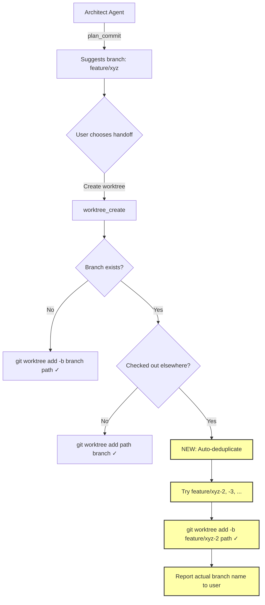
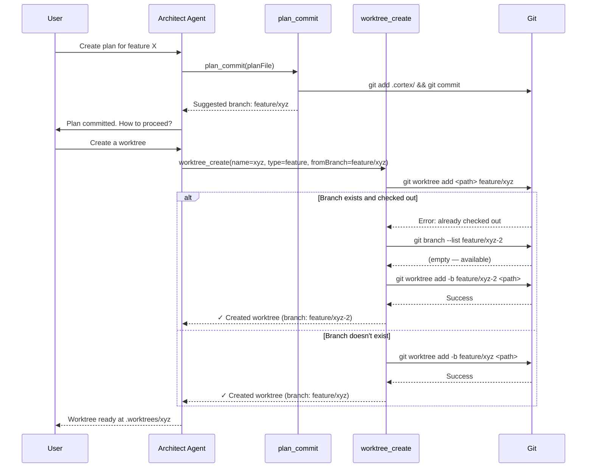

# Fix Architect Worktree Branch Conflict Error

## Summary

When the architect agent completes a plan and the user chooses "Create a worktree" at the handoff step, worktree creation fails with a branch-already-exists error. This happens because:

1. **Missing tool**: `worktree_create` is not listed in `architect.md`'s frontmatter tools — the agent literally cannot call it, though the prompt instructs it to.
2. **Branch collision**: If the user has previously created a branch with the same name (from a prior plan cycle, or by choosing "Create a branch" first), `worktree_create` tries `git worktree add -b feature/xyz` (fails: branch exists) then falls back to `git worktree add <path> feature/xyz` (fails: branch already checked out). Both paths fail and the user gets an unhelpful git error.

The fix addresses both layers: enable the tool in the architect agent, and make `worktree_create` resilient to branch name collisions by auto-deduplicating with a numeric suffix.

## Architecture Diagram



## Root Cause Analysis

### Bug 1: Missing tool in architect.md

File: `.opencode/agents/architect.md` (frontmatter, lines 5-29)

The tools section lists `branch_create: true` but NOT `worktree_create`. The prompt body (line 144) instructs: "Use `worktree_create` with `name` derived from the suggested branch slug". This is a prompt/config mismatch — the agent is told to call a tool it cannot access.

### Bug 2: No branch deduplication in worktree.ts

File: `src/tools/worktree.ts` (lines 87-110)

The no-`fromBranch` path:
1. Tries `git worktree add -b ${type}/${name} <path>` — fails if branch exists
2. Falls back to `git worktree add <path> ${type}/${name}` — fails if branch is checked out
3. Returns an opaque error to the user

Neither path attempts to create a unique branch name.

### Bug 3: Architect prompt doesn't pass `fromBranch`

File: `.opencode/agents/architect.md` (line 144)

The prompt says to call `worktree_create` with `name` and `type` but never mentions the `fromBranch` parameter. Since `plan_commit` already wrote the suggested branch into frontmatter, the architect should pass it as `fromBranch` so `worktree_create` can try to reuse it.

## Technical Approach

### Phase 1: Fix `worktree.ts` — Branch deduplication

In `src/tools/worktree.ts`, update the `createCreate` function to handle branch collisions:

**For the `fromBranch` path (lines 63-86):**
- First try: `git worktree add <path> fromBranch` (use existing branch)
- If fails (branch doesn't exist): try `git worktree add -b fromBranch <path>` (create new)
- If THAT fails (branch name conflict — exists but checked out): auto-deduplicate → append `-2`, `-3`, etc.

**For the no-`fromBranch` path (lines 87-110):**
- First try: `git worktree add -b branchName <path>` (create new branch)
- If fails: check if branch exists with `git branch --list branchName`
  - If exists and not checked out: `git worktree add <path> branchName` 
  - If exists and checked out: auto-deduplicate → append `-2`, `-3`, etc.
  - If doesn't exist: surface the real error

**Deduplication helper function:**
```typescript
async function deduplicateBranch(cwd: string, baseName: string): Promise<string> {
  for (let i = 2; i <= 10; i++) {
    const candidate = `${baseName}-${i}`;
    const { stdout } = await git(cwd, "branch", "--list", candidate);
    if (!stdout.trim()) return candidate;
  }
  throw new Error(`Could not find unique branch name after 10 attempts (base: ${baseName})`);
}
```

**When a deduplicated name is used**, the success message must clearly report the **actual** branch name (not the original suggestion) so the user isn't confused.

### Phase 2: Fix `architect.md` — Enable tools and update prompt

1. **Add tools** to frontmatter:
   ```yaml
   worktree_create: true
   worktree_list: true
   ```

2. **Update Step 5** worktree instructions to pass `fromBranch`:
   ```
   - **User chose "Create a worktree"**:
     - Use `worktree_create` with `name` derived from the suggested branch slug, 
       `type` from the plan type, and `fromBranch` set to the suggested branch name 
       from plan_commit
     - Report the worktree path so the user can navigate to it
   ```

3. **Add `worktree_create` and `worktree_list`** to the Tool Usage section at the bottom.

### Phase 3: Add tests

Add test cases in `src/tools/__tests__/` for the deduplication logic:
- Branch doesn't exist → creates normally
- Branch exists but not checked out → reuses it
- Branch exists and checked out → auto-deduplicates
- Deduplication exhaustion (10 attempts) → clear error

## Data Flow



## Risks & Mitigations

| Risk | Impact | Likelihood | Mitigation |
|------|--------|------------|------------|
| Auto-deduplication creates confusing branch names (feature/xyz-2) | Low | Medium | Success message clearly reports actual branch name; user can rename |
| Deduplication loop doesn't terminate | Low | Very Low | Hard cap at 10 attempts, then surface error |
| Existing worktree tests break | Medium | Low | Changes are additive — new logic only triggers on error paths |
| `fromBranch` param not passed by architect | Low | Medium | Prompt update + fallback logic still works without fromBranch |

## Estimated Effort

- **Complexity**: Low-Medium
- **Time Estimate**: 1-2 hours
- **Dependencies**: None — self-contained changes to worktree.ts and architect.md

## Key Decisions

1. **Decision**: Auto-deduplicate with numeric suffix (`-2`, `-3`, ...) rather than failing
   **Rationale**: A failed worktree creation is a dead end for the user. A branch named `feature/xyz-2` is slightly ugly but functional. The user is clearly told the actual branch name.

2. **Decision**: Cap deduplication at 10 attempts
   **Rationale**: Prevents infinite loops. If 10 branches with the same base name exist, something is wrong and the user should intervene.

3. **Decision**: Add `worktree_create` AND `worktree_list` to architect tools
   **Rationale**: The architect needs `worktree_create` for handoff. `worktree_list` is useful for the architect to check existing worktrees before creating a new one (avoids path conflicts too).

4. **Decision**: Architect should pass `fromBranch` to `worktree_create`
   **Rationale**: `plan_commit` already computed the suggested branch name and wrote it to frontmatter. Passing `fromBranch` allows `worktree_create` to try using the existing branch first, which is more predictable than constructing a new name from `type/name`.

## Suggested Branch Name

`bugfix/architect-worktree-branch-conflict`
## Tasks

- [ ] Fix worktree.ts: Add deduplicateBranch() helper function that appends -2, -3 ... -10 suffix to find unique branch name
- [ ] Fix worktree.ts: Update fromBranch path (lines 63-86) to auto-deduplicate when branch exists and is checked out
- [ ] Fix worktree.ts: Update no-fromBranch path (lines 87-110) to auto-deduplicate when branch exists and is checked out
- [ ] Fix worktree.ts: Ensure success message reports the ACTUAL branch name used (may differ from requested)
- [ ] Fix architect.md: Add worktree_create and worktree_list to frontmatter tools section
- [ ] Fix architect.md: Update Step 5 worktree instructions to pass fromBranch parameter
- [ ] Fix architect.md: Add worktree_create and worktree_list to Tool Usage section
- [ ] Add tests for branch deduplication logic (normal, reuse, deduplicate, exhaustion cases)
