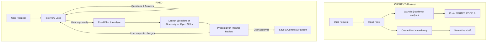
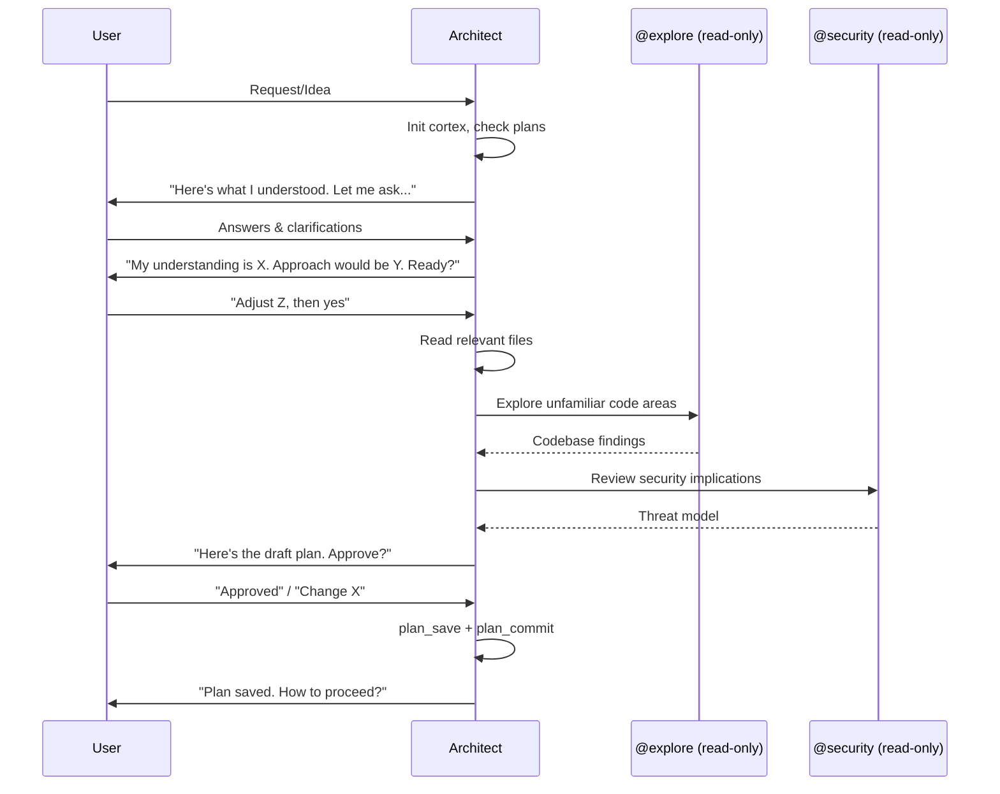

# Harden Architect Agent — Remove Coder Sub-Agent and Add Interview Workflow

# Plan: Harden Architect Agent — Remove Coder Sub-Agent and Add Interview Workflow

## Summary

The architect agent has two critical behavioral issues that must be fixed:

1. **Sub-agent permissions gap**: The architect can launch `@coder` for "feasibility analysis" but the coder agent has full write/edit/bash permissions. There is no mechanism to make it read-only at runtime — the constraint is purely prompt-level and demonstrably fails. The coder's own system prompt says "You implement tasks" and it proceeds to do exactly that.

2. **Missing interview phase**: The architect jumps straight from reading the user's initial message to producing a full plan. There is no structured conversation to clarify requirements, probe for unstated constraints, present trade-offs, or get user buy-in before committing to an approach.

Both issues are in a single file: `.opencode/agents/architect.md`.

## Architecture Diagram



## Tasks

- [ ] Task 1: Remove `@coder` from architect's allowed sub-agents
  - AC: The `@coder` entry is completely removed from the "Allowed Sub-Agents" table
  - AC: The `@coder` example in "How to Launch Read-Only Sub-Agents" is removed
  - AC: `@coder` is added to the "NOT Allowed" list with explicit rationale
  - AC: `@explore` replaces `@coder` for codebase analysis needs (read-only agent type)

- [ ] Task 2: Add hardened sub-agent safety rules
  - AC: New rule: "NEVER launch any sub-agent that has write, edit, or bash capabilities"
  - AC: Explicit allowlist: only `@explore`, `@security`, `@perf` — nothing else
  - AC: All Task tool prompts MUST include "ANALYSIS ONLY — no code changes" prefix
  - AC: Add a "Sub-Agent Safety" section near the top of the prompt (before workflow)

- [ ] Task 3: Restructure workflow to add Requirements Discovery Interview (new Step 3)
  - AC: New Step 3 inserted between current Step 2 and Step 3
  - AC: Interview phase requires minimum 1 round of questions before plan creation
  - AC: Architect must present understanding summary and get user confirmation
  - AC: Architect must propose approach options with trade-offs
  - AC: User must explicitly say "ready" or approve before plan creation begins
  - AC: Current Steps 3-6 are renumbered to Steps 4-7

- [ ] Task 4: Add "Plan Review" gate before save (new Step 5)
  - AC: After creating the plan, architect presents it to the user BEFORE saving
  - AC: User can request changes, which loops back to the interview
  - AC: User must explicitly approve the plan before `plan_save` is called
  - AC: This prevents premature plan commits

- [ ] Task 5: Update Constraints section
  - AC: Add "You CANNOT launch any sub-agent with write/edit/bash permissions"
  - AC: Add "You MUST conduct a requirements interview before creating any plan"
  - AC: Add "You MUST get user approval before saving any plan"

## Technical Approach

### Phase 1: Sub-Agent Lockdown (Tasks 1-2)

**File**: `.opencode/agents/architect.md`

**Changes to "Allowed Sub-Agents" table (lines 43-49):**

Replace the current table with:

```markdown
### Allowed Sub-Agents (read-only analysis only)

| Sub-Agent | Mode | Purpose | When to Use |
|-----------|------|---------|-------------|
| `@explore` | Read-only codebase exploration | Find files, search code, understand structure | Need to explore unfamiliar parts of the codebase |
| `@security` | Audit-only (no code changes) | Threat modeling, security review of proposed design | Plan involves auth, sensitive data, or security-critical features |
| `@perf` | Complexity analysis (no code changes) | Analyze existing code performance, assess proposed approach | Plan involves performance-sensitive changes |
```

**Remove the `@coder` example (lines 56-58)** and replace with `@explore`:

```markdown
# Codebase exploration:
Task(subagent_type="explore", prompt="ANALYSIS ONLY. Explore the codebase to understand: [what you need to know]. Search for: [patterns/files]. Report structure, patterns, and relevant findings.")
```

**Strengthen the "NOT Allowed" section (lines 64-67):**

```markdown
### NOT Allowed
- **Never launch `@coder`** — has write/edit/bash permissions, WILL implement code regardless of prompt instructions
- **Never launch `@testing`, `@audit`, or `@devops`** — these are implementation-phase agents
- **Never launch `@refactor` or `@docs-writer`** — these modify files
- **Never launch `@debug`** — this is a troubleshooting agent for the fix/implement agents
- **Never launch `@general`** — uncontrolled agent with no permission restrictions

### Sub-Agent Safety Rule (ABSOLUTE)
You may ONLY launch sub-agents from this exact allowlist: `explore`, `security`, `perf`. 
Any other sub-agent type is FORBIDDEN. There are NO exceptions.
If you are unsure whether a sub-agent is safe, DO NOT launch it.
```

### Phase 2: Interview Workflow (Tasks 3-4)

**File**: `.opencode/agents/architect.md`

**Insert new Step 3: Requirements Discovery Interview** between current Step 2 and Step 3:

```markdown
### Step 3: Requirements Discovery Interview (MANDATORY)

**You MUST conduct an interview before creating any plan. NEVER skip this step.**

This is a conversation, not a monologue. Your job is to understand what the user actually needs — not assume it.

#### Round 1: Acknowledge & Clarify
1. **Summarize** what you understood from the user's request (1-3 sentences)
2. **Ask 3-5 targeted questions** about:
   - Scope boundaries (what's in, what's out)
   - Existing constraints (tech stack, timeline, dependencies)
   - Success criteria (how will we know this is done?)
   - Edge cases or error scenarios
   - Non-functional requirements (performance, security, scale)
3. **Wait for answers** — do NOT proceed until the user responds

#### Round 2+: Deepen Understanding
Based on answers, you may:
- Ask follow-up questions on unclear areas
- Present your understanding of the problem for validation
- Identify risks or trade-offs the user may not have considered
- Suggest alternative approaches with pros/cons

#### Readiness Check
When you believe you have enough information, present:
1. **Problem Statement** — 2-3 sentence summary of what needs to be solved
2. **Proposed Approach** — High-level direction (not the full plan yet)
3. **Key Assumptions** — What you're assuming that hasn't been explicitly stated
4. **Ask**: "Does this capture what you need? Should I proceed to create the detailed plan, or do you want to adjust anything?"

**Only proceed to Step 4 when the user explicitly confirms readiness.**

#### Exceptions (when you can shorten the interview)
- User provides a highly detailed specification with clear acceptance criteria
- User explicitly says "just plan it, I'll review" 
- User references a GitHub issue with full requirements (loaded in Step 0)

Even in these cases, present at minimum a **Readiness Check** summary before proceeding.
```

**Renumber remaining steps** (current 3→4, 4→5, 4.5→5.5, 5→6, 6→7).

**Insert new Step 6: Plan Review Gate** after plan creation:

```markdown
### Step 6: Plan Review (MANDATORY)

**Present the plan to the user BEFORE saving it.**

1. Output the full plan in the conversation
2. Ask: "Here's the plan I've drafted. Would you like to:
   - **Approve** — I'll save and commit it
   - **Revise** — Tell me what to change
   - **Start over** — Let's rethink the approach"
3. If the user requests revisions, make the changes and present again
4. Only call `plan_save` after explicit approval

This prevents premature plan commits and ensures the user owns the plan.
```

### Phase 3: Update Constraints and Core Principles (Task 5)

**Update Constraints section (lines 314-322):**

Add these new constraints:
```markdown
- You CANNOT launch any sub-agent with write, edit, or bash capabilities (@coder, @testing, @refactor, @devops, @debug, @docs-writer, @audit, @general)
- You may ONLY launch: @explore, @security, @perf — no exceptions
- You MUST conduct a requirements interview before creating any plan
- You MUST present the plan to the user and get approval before saving it
- You MUST NOT produce a plan in your first response to the user — interview first
```

**Update Core Principles (lines 169-178):**

Add:
```markdown
- Interview before planning — understand before you prescribe
- Plans require user approval — never save without explicit buy-in
- Sub-agent safety — only launch proven read-only agents
```

## Data Flow



## Risks & Mitigations

| Risk | Impact | Likelihood | Mitigation |
|------|--------|------------|------------|
| Interview feels slow for simple tasks | Medium | Medium | Add "Exceptions" clause for detailed specs or explicit user opt-out |
| Removing @coder reduces plan quality | Low | Low | @explore + architect's own file reading covers all analysis needs |
| User frustrated by extra approval steps | Medium | Low | Make interview natural/conversational, not bureaucratic |
| Prompt-level restrictions still bypassable | Medium | Low | The allowed agents (@explore, @security, @perf) genuinely lack write permissions at the tool level |

## Estimated Effort

- **Complexity**: Low — single file edit, no code changes, purely prompt engineering
- **Time Estimate**: 30-45 minutes
- **Dependencies**: None — self-contained change to `.opencode/agents/architect.md`

## Key Decisions

1. **Decision**: Remove `@coder` entirely rather than trying to add a "read-only mode"
   **Rationale**: The coder agent has `write: true`, `edit: allow`, `bash: ask` in its frontmatter. There is no runtime mechanism to override these permissions when launched by the architect. Prompt-level instructions ("analysis only") are unreliable — the coder's own system prompt says "You implement tasks" and it will do so. The only safe fix is removal.

2. **Decision**: Replace `@coder` with `@explore` for codebase analysis
   **Rationale**: `@explore` is a built-in read-only agent type in the Task system, purpose-built for "fast exploration of codebases." It can find files, search code, and answer questions about structure — which is exactly what the architect needs for feasibility analysis. Unlike `@coder`, it cannot write files.

3. **Decision**: Mandatory interview before plan creation (not optional)
   **Rationale**: The whole point of the architect is to produce high-quality plans. Jumping to plan creation without understanding the problem leads to wrong plans, wasted implementation time, and user frustration. An interview-first approach ensures the plan solves the right problem.

4. **Decision**: Plan review gate before save (present plan, get approval)
   **Rationale**: Once a plan is saved and committed, it becomes the implementation contract. The user should see and approve it before it's finalized. This also naturally supports iterative refinement.

## Suggested Branch Name
`bugfix/harden-architect-agent`
## Tasks

- [ ] Remove @coder from architect's allowed sub-agents, replace with @explore
- [ ] Add hardened sub-agent safety rules with explicit allowlist
- [ ] Restructure workflow to add Requirements Discovery Interview (new Step 3)
- [ ] Add Plan Review gate before save — user must approve before plan_save
- [ ] Update Constraints and Core Principles sections
