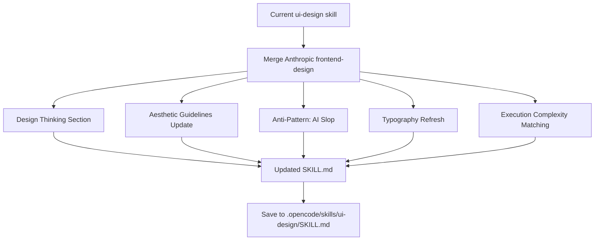

# Update UI-Design skill with Anthropic's frontend-design principles

# Plan: Update UI-Design Skill with Anthropic's Frontend-Design Principles

## Summary

Update the `ui-design` skill to incorporate the bold, distinctive aesthetic guidelines from Anthropic's `frontend-design` skill. The Anthropic skill emphasizes avoiding "AI slop" aesthetics through intentional creative choices, distinctive typography, and unique visual direction. This update will merge our systematic design spec approach with Anthropic's creative philosophy.

## Key Changes

### 1. Add "Design Thinking" Section
New section focused on creative direction before coding:
- Purpose analysis (problem & audience)
- Tone selection (extreme aesthetic choices: maximalist, minimalist, retro-futuristic, etc.)
- Constraint consideration
- Differentiation focus (what makes it UNFORGETTABLE)
- Mandate for bold conceptual direction with precision execution

### 2. Expand "Aesthetic Guidelines"
Add Anthropic's specific guidance on:
- Typography: Avoid generic fonts (Inter, Roboto, Arial); choose distinctive, characterful fonts
- Color & Theme: Commit to cohesive aesthetic with CSS variables; dominant colors with sharp accents
- Motion: CSS-only for HTML, Motion library for React; prioritize orchestrated reveals over scattered interactions
- Spatial Composition: Unexpected layouts, asymmetry, overlap, diagonal flow, grid-breaking
- Backgrounds & Visual Details: Atmospheric effects, textures, gradient meshes, noise, patterns, layered transparencies

### 3. Add "Anti-Pattern: AI Slop"
Explicitly warn against:
- Overused fonts (Inter, Space Grotesk, system fonts)
- Cliched color schemes (purple gradients on white)
- Predictable layouts and component patterns
- Cookie-cutter design lacking context-specific character
- Convergence on common choices across generations

### 4. Update Typography Section
- Keep current systematic approach
- Add guidance on distinctive font choices
- Emphasize pairing display fonts with refined body fonts
- Add warning about avoiding default choices

### 5. Add "Execution Complexity Matching"
Guideline to match implementation complexity to aesthetic vision:
- Maximalist designs need elaborate code with extensive animations
- Minimalist designs need restraint, precision, and careful spacing/typography

## Architecture Diagram

## Tasks
- [x] Task 1: Fetch Anthropic frontend-design skill content
- [x] Task 2: Analyze current ui-design skill structure
- [ ] Task 3: Merge skills maintaining structure and adding creative guidelines
- [ ] Task 4: Update frontmatter with merged description
- [ ] Task 5: Add new Design Thinking section
- [ ] Task 6: Update Aesthetic Guidelines with anti-AI-slop principles
- [ ] Task 7: Refresh Typography section with distinctive font guidance
- [ ] Task 8: Add Execution Complexity Matching section
- [ ] Task 9: Save updated skill to repository
- [ ] Task 10: Commit changes

## Technical Approach

### Phase 1: Content Integration
1. Preserve existing structure (Design Spec, Visual Hierarchy, Spacing, etc.)
2. Insert new "Design Thinking" section at the top after When to Use
3. Update "Typography" section with distinctive font guidance
4. Add "Aesthetic Philosophy" section covering anti-AI-slop principles
5. Add "Execution Matching" section at the end

### Phase 2: Refinement
1. Ensure consistent tone throughout
2. Verify all sections flow logically
3. Check that practical guidelines remain intact
4. Validate that creative guidance is clear and actionable

## Risks & Mitigations

| Risk | Impact | Likelihood | Mitigation |
|------|--------|------------|------------|
| Losing practical value | High | Low | Preserve all existing systematic guidelines |
| Conflicting guidance | Medium | Low | Ensure creative and practical sections complement each other |
| Skill becomes too long | Medium | Medium | Condense where possible, use clear headings |

## Key Decisions

1. **Decision**: Merge rather than replace
   **Rationale**: The systematic design spec approach is valuable for teams; the creative guidance fills a gap without removing existing value

2. **Decision**: Place Design Thinking before When to Use
   **Rationale**: Creative direction should come first, before any implementation decisions

3. **Decision**: Keep "Design Spec" as mandatory
   **Rationale**: Even with creative guidance, consistency requires documented specs

## Estimated Effort
- **Complexity**: Low
- **Time Estimate**: 1-2 hours
- **Dependencies**: None

## Suggested Branch Name
`refactor/update-ui-design-skill-with-anthropic-principles`
## Tasks

- [ ] Fetch Anthropic frontend-design skill content
- [ ] Analyze current ui-design skill structure
- [ ] Merge skills maintaining structure and adding creative guidelines
- [ ] Update frontmatter with merged description
- [ ] Add new Design Thinking section
- [ ] Update Aesthetic Guidelines with anti-AI-slop principles
- [ ] Refresh Typography section with distinctive font guidance
- [ ] Add Execution Complexity Matching section
- [ ] Save updated skill to repository
- [ ] Commit changes
