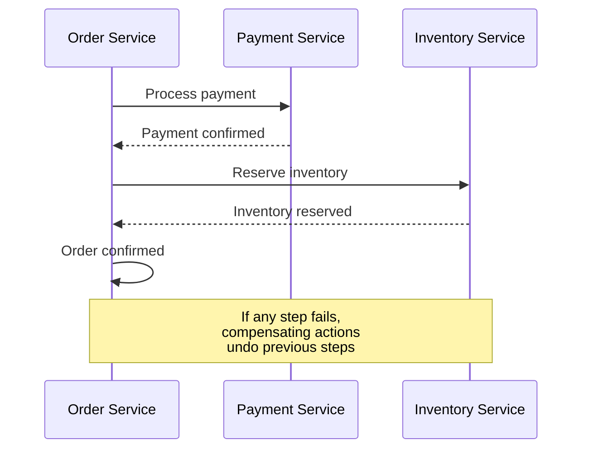

# Architecture Patterns Skill

This skill provides guidance on choosing and implementing software architecture patterns for scalable systems.

## When to Use

Use this skill when:
- Designing new systems or services from scratch
- Evaluating architecture for scaling or refactoring
- Choosing between monolith, microservices, or serverless
- Implementing event-driven, CQRS, or clean architecture
- Making technology and infrastructure decisions

## Architecture Decision Framework

### Key Questions
1. **Scale** — How many users/requests? Expected growth?
2. **Team** — How large? How autonomous? How distributed?
3. **Complexity** — How complex is the domain logic?
4. **Velocity** — How fast do you need to ship?
5. **Constraints** — Budget, compliance, existing infrastructure?

### Quick Decision Matrix
| Situation | Recommended Architecture |
|-----------|--------------------------|
| Small team, new product, uncertain requirements | Modular Monolith |
| Large team, well-defined domains, independent deploy | Microservices |
| High throughput, loose coupling, eventual consistency OK | Event-Driven |
| Read-heavy with complex queries, different read/write models | CQRS |
| Spiky workloads, pay-per-use, rapid prototyping | Serverless |
| Complex domain logic, long-lived system | Clean/Hexagonal + DDD |

## Monolithic Architecture

### When to Use
- Early-stage products — ship fast, iterate quickly
- Small teams (< 10 developers)
- Simple domain with clear boundaries
- Shared database is acceptable

### Modular Monolith (Recommended Starting Point)
```
src/
  modules/
    users/         # Self-contained user module
      routes.ts
      service.ts
      repository.ts
      models.ts
    orders/        # Self-contained order module
      routes.ts
      service.ts
      repository.ts
      models.ts
    shared/        # Shared kernel
      auth/
      database/
      events/
  app.ts
```

### Laravel Modular Monolith
```
app/
  Modules/
    Users/          # Self-contained user module
      Controllers/
      Models/
      Services/
      Repositories/
      Routes/
      Providers/UserServiceProvider.php
    Orders/         # Self-contained order module
      Controllers/
      Models/
      Services/
      Events/
      Providers/OrderServiceProvider.php
  Providers/        # Core service providers
```
- Use Laravel service providers to register each module
- Communicate between modules via events or defined interfaces
- Laravel's service container makes modular DI natural
- Can also use packages like `nwidart/laravel-modules`

### Key Principles
- Module boundaries enforced by convention or linting
- Modules communicate through defined interfaces, not direct DB access
- Each module owns its database tables
- Can extract to microservices later with minimal refactoring

### Strangler Fig Migration
- Incrementally replace monolith functionality with new services
- Route traffic through a facade that delegates to old or new
- Never big-bang rewrite — decompose gradually

## Microservices Architecture

### Service Design
- One service per business capability (bounded context)
- Services own their data — no shared databases
- API contracts between services (REST, gRPC, events)
- Independent deployment and scaling

### Communication Patterns
| Pattern | Type | Use When |
|---------|------|----------|
| REST/gRPC | Synchronous | Request needs immediate response |
| Message Queue | Asynchronous | Fire-and-forget, decoupled processing |
| Event Bus | Asynchronous | Multiple consumers need to react |
| Saga | Orchestrated | Distributed transactions across services |

### Saga Pattern for Distributed Transactions


### Service Mesh & Discovery
- Service discovery — Consul, Kubernetes DNS, AWS Cloud Map
- Load balancing — round-robin, least connections, weighted
- Circuit breaker — prevent cascade failures (Hystrix pattern)
- Service mesh — Istio, Linkerd for observability and traffic management

### Anti-Patterns to Avoid
- Distributed monolith — services tightly coupled, must deploy together
- Nano-services — too granular, excessive network overhead
- Shared database — defeats data ownership principle
- Synchronous chains — fragile, high latency

## Event-Driven Architecture

### Core Concepts
- **Event** — Immutable fact that something happened
- **Producer** — Service that emits events
- **Consumer** — Service that reacts to events
- **Event Bus** — Infrastructure for routing events (Kafka, RabbitMQ, NATS)

### Event Types
| Type | Description | Example |
|------|-------------|---------|
| Domain Event | Business-meaningful occurrence | `OrderPlaced`, `UserRegistered` |
| Integration Event | Cross-boundary notification | `PaymentProcessed` |
| Command Event | Request to perform action | `ProcessPayment` |

### Event Sourcing
- Store state as a sequence of events, not current snapshot
- Rebuild state by replaying events from the beginning
- Enables audit trail, temporal queries, debugging
- **Trade-off**: Complex to implement, eventual consistency

```
Event Store:
  1. OrderCreated { items: [...], userId: "123" }
  2. ItemAdded { itemId: "abc", quantity: 2 }
  3. PaymentProcessed { amount: 99.99 }
  4. OrderShipped { trackingId: "XYZ" }

Current State = replay(events) → Order { status: "shipped", ... }
```

### Best Practices
- Events are immutable — never modify published events
- Include correlation ID for tracing across services
- Use schema registry for event versioning (Avro, Protobuf)
- Dead letter queue for failed event processing
- Idempotent consumers — safe to process the same event twice

## CQRS (Command Query Responsibility Segregation)

### Core Idea
- Separate read model (queries) from write model (commands)
- Read side optimized for queries — denormalized, cached
- Write side optimized for business rules — normalized, validated

```
┌─────────────┐     ┌─────────────┐
│   Command    │     │   Query     │
│   (Write)    │     │   (Read)    │
├─────────────┤     ├─────────────┤
│ Validate     │     │ Optimized   │
│ Business     │     │ Read Models │
│ Rules        │     │ (Views)     │
├─────────────┤     ├─────────────┤
│ Write DB     │────>│ Read DB     │
│ (Normalized) │event│ (Denorm.)   │
└─────────────┘     └─────────────┘
```

### When to Use
- Read and write workloads have very different characteristics
- Complex domain logic on write side, simple queries on read side
- Need to scale reads and writes independently
- Combined with event sourcing for full audit trail

### When NOT to Use
- Simple CRUD applications — adds unnecessary complexity
- Strong consistency required — read model has eventual consistency lag
- Small team — operational overhead not justified

## Clean / Hexagonal Architecture

### Hexagonal Architecture (Ports & Adapters)
```
         ┌─────────────────────────────────┐
         │          Adapters (Outer)        │
         │  ┌─────────────────────────┐    │
         │  │     Application Core     │    │
         │  │  ┌───────────────────┐  │    │
Driving  │  │  │                   │  │    │  Driven
Adapters │  │  │   Domain Model    │  │    │  Adapters
(API,    │──│──│  (Entities, Value │──│────│──(DB, Email,
 CLI,    │  │  │   Objects, Rules) │  │    │   Queue,
 Tests)  │  │  │                   │  │    │   External)
         │  │  └───────────────────┘  │    │
         │  │     Use Cases / Ports    │    │
         │  └─────────────────────────┘    │
         └─────────────────────────────────┘
```

### Key Rules
- Domain has ZERO external dependencies — no frameworks, no DB
- Ports (interfaces) define what the domain needs
- Adapters implement ports — pluggable infrastructure
- Dependencies point inward — outer layers depend on inner
- Test domain logic without infrastructure

### Clean Architecture Layers
| Layer | Contains | Depends On |
|-------|----------|------------|
| Entities | Business objects, rules | Nothing |
| Use Cases | Application logic, orchestration | Entities |
| Interface Adapters | Controllers, presenters, gateways | Use Cases |
| Frameworks | Web framework, DB, external services | Interface Adapters |

## Serverless Architecture

### Patterns
- **API + Functions** — API Gateway + Lambda/Cloud Functions
- **Event Processing** — Functions triggered by events (S3, Queue, DB)
- **Scheduled Jobs** — CRON-triggered functions
- **Step Functions** — Orchestrated workflows

### Benefits
- Zero idle cost — pay only for execution
- Auto-scaling — from 0 to thousands of instances
- No server management — focus on business logic

### Limitations
- Cold starts — latency spike on first invocation (mitigated with provisioned concurrency)
- Execution duration limits (15 min Lambda, 60 min Cloud Run)
- Stateless — no local state between invocations
- Vendor lock-in — tight coupling to cloud provider APIs
- Debugging complexity — distributed tracing required

### Best Practices
- Keep functions small and focused — one function, one purpose
- Use environment variables for configuration
- Implement structured logging with correlation IDs
- Use layers/extensions for shared code
- Test locally with emulators (SAM, serverless-offline, Functions Framework)

## The Twelve-Factor App

| # | Factor | Summary |
|---|--------|---------|
| 1 | Codebase | One codebase tracked in version control, many deploys |
| 2 | Dependencies | Explicitly declare and isolate dependencies |
| 3 | Config | Store config in environment variables |
| 4 | Backing Services | Treat databases, queues, caches as attached resources |
| 5 | Build, Release, Run | Strictly separate build, release, and run stages |
| 6 | Processes | Execute app as stateless processes |
| 7 | Port Binding | Export services via port binding |
| 8 | Concurrency | Scale out via the process model |
| 9 | Disposability | Fast startup, graceful shutdown |
| 10 | Dev/Prod Parity | Keep development and production as similar as possible |
| 11 | Logs | Treat logs as event streams |
| 12 | Admin Processes | Run admin tasks as one-off processes |

### Modern Additions
- **API First** — Design APIs before implementation
- **Telemetry** — Built-in observability (metrics, traces, logs)
- **Security** — Security as a first-class concern, not an afterthought
- **Authentication** — Externalize auth (OAuth, OIDC)

## Data Architecture Patterns

### Data Mesh
- Domain-oriented data ownership — each team owns their data products
- Data as a product — treat datasets with the same care as user-facing features
- Self-serve data platform — infrastructure that enables domain teams
- Federated governance — global policies, local implementation

### Event Streaming Platform
- Central event bus (Kafka, Pulumi) as source of truth
- Services produce and consume events
- Enables real-time analytics and derived views
- Replay capability for rebuilding state

### OLTP vs OLAP
| Characteristic | OLTP | OLAP |
|---------------|------|------|
| Operations | INSERT, UPDATE, DELETE | SELECT, aggregate |
| Queries | Simple, row-level | Complex, analytical |
| Schema | Normalized (3NF) | Denormalized (star/snowflake) |
| Examples | PostgreSQL, MySQL | BigQuery, Snowflake, ClickHouse |
