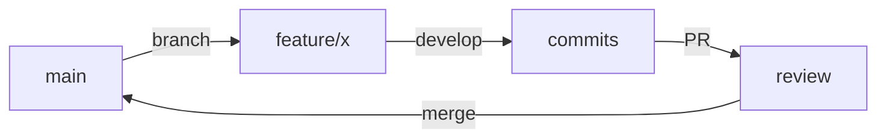
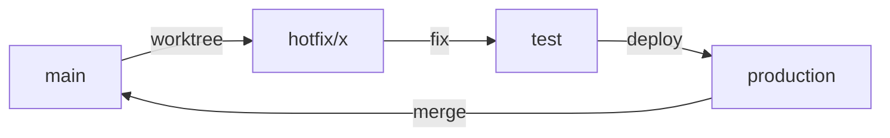
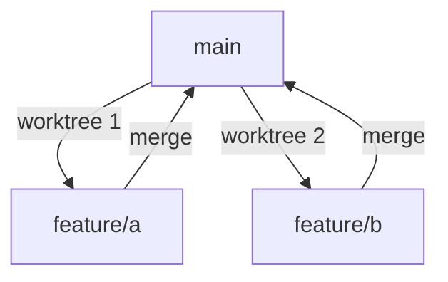

# Git Workflow Skill

This skill provides patterns for git branching, worktree management, and collaborative workflows.

## When to Use

Use this skill when:
- Setting up branch strategy for new work
- Managing parallel development with worktrees
- Handling production hotfixes
- Coordinating team workflows
- Understanding git best practices

## Branch Naming Conventions

| Type | Prefix | Example | Use Case |
|------|--------|---------|----------|
| Feature | `feature/` | `feature/user-authentication` | New functionality |
| Bugfix | `bugfix/` | `bugfix/login-validation` | Non-critical bug fixes |
| Hotfix | `hotfix/` | `hotfix/security-patch` | Critical production fixes |
| Refactor | `refactor/` | `refactor/api-cleanup` | Code restructuring |
| Docs | `docs/` | `docs/api-reference` | Documentation only |
| Test | `test/` | `test/e2e-coverage` | Test additions |
| Spike | `spike/` | `spike/graphql-poc` | Research/proof of concept |
| Chore | `chore/` | `chore/update-deps` | Maintenance tasks |

## Protected Branches

These branches should never be committed to directly:
- `main` / `master` - Production code
- `develop` - Integration branch
- `staging` - Pre-production testing
- `production` - Live deployment

Always create a feature/bugfix branch and merge via Pull Request.

## Worktree Workflow

### When to Use Worktrees

Worktrees are ideal for:
- Parallel feature development
- Urgent hotfix while mid-feature
- Testing different approaches simultaneously
- Code review while continuing work
- Running different versions side-by-side

### Worktree Structure

```
project/                    # Main worktree (main branch)
../.worktrees/
├── feature-auth/           # feature/auth worktree
├── hotfix-security/        # hotfix/security worktree
└── spike-graphql/          # spike/graphql worktree
```

### Worktree Commands

```bash
# Create worktree with new branch
git worktree add -b feature/auth ../.worktrees/feature-auth

# List all worktrees
git worktree list

# Remove worktree (after merge)
git worktree remove ../.worktrees/feature-auth

# Prune stale worktree references
git worktree prune
```

### Worktree Best Practices

1. **Keep worktrees short-lived** - Merge and clean up promptly
2. **Name descriptively** - Match branch name for clarity
3. **Share dependencies** - Use same node_modules when possible
4. **Clean up after merge** - Remove worktree and optionally delete branch
5. **Don't nest worktrees** - Keep them as siblings

## Workflow Patterns

### Feature Development Flow



Steps:
1. Create feature branch from main
2. Develop and commit regularly
3. Push and create Pull Request
4. Address review feedback
5. Merge after approval
6. Delete feature branch

### Hotfix Flow (with Worktree)



Steps:
1. Create worktree from main: `worktree_create hotfix critical-bug`
2. Open new terminal: `worktree_open critical-bug`
3. Fix issue in new terminal
4. Test and deploy
5. Merge back to main
6. Remove worktree

### Parallel Development



Use when:
- Multiple features needed simultaneously
- Don't want to stash/switch constantly
- Need to compare implementations

## Commit Message Convention

### Format

```
<type>(<scope>): <subject>

<body>

<footer>
```

### Types

| Type | Description |
|------|-------------|
| `feat` | New feature |
| `fix` | Bug fix |
| `docs` | Documentation only |
| `style` | Formatting, no code change |
| `refactor` | Code change, no feature/fix |
| `test` | Adding tests |
| `chore` | Maintenance |
| `perf` | Performance improvement |
| `ci` | CI/CD changes |

### Examples

```
feat(auth): add OAuth2 login flow

Implement Google and GitHub OAuth providers.
Includes token refresh and session management.

Closes #123
```

```
fix(api): handle null response in user endpoint

The /users/:id endpoint was crashing when user
not found. Now returns proper 404 response.

Fixes #456
```

## Pull Request Best Practices

### PR Title
- Use same format as commits: `type(scope): description`
- Keep under 72 characters
- Be specific about the change

### PR Description Template

```markdown
## Summary
Brief description of changes

## Changes
- Change 1
- Change 2

## Testing
How was this tested?

## Screenshots (if applicable)

## Checklist
- [ ] Tests added/updated
- [ ] Documentation updated
- [ ] No breaking changes
```

### Review Guidelines

1. **Keep PRs small** - Under 400 lines ideally
2. **One concern per PR** - Don't mix features
3. **Self-review first** - Check your own diff
4. **Respond to feedback** - Address or discuss all comments
5. **Squash if needed** - Clean up messy history before merge

## Git Configuration

### Recommended Global Config

```bash
# Use rebase by default when pulling
git config --global pull.rebase true

# Prune deleted remote branches
git config --global fetch.prune true

# Sign commits (optional)
git config --global commit.gpgsign true

# Default branch name
git config --global init.defaultBranch main
```

### Useful Aliases

```bash
git config --global alias.co checkout
git config --global alias.br branch
git config --global alias.st status
git config --global alias.last 'log -1 HEAD'
git config --global alias.unstage 'reset HEAD --'
git config --global alias.visual '!gitk'
```

## Troubleshooting

### Undo Last Commit (keep changes)
```bash
git reset --soft HEAD~1
```

### Discard Local Changes
```bash
git checkout -- <file>      # Single file
git checkout -- .           # All files
```

### Fix Commit Message
```bash
git commit --amend -m "New message"
```

### Recover Deleted Branch
```bash
git reflog                  # Find commit hash
git checkout -b branch-name <hash>
```

### Clean Untracked Files
```bash
git clean -n                # Dry run
git clean -f                # Actually delete
```
