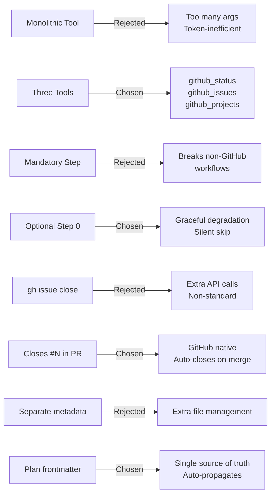

# ADR: GitHub Integration Architecture

## Context

We need to integrate GitHub work items (issues, project boards) into the cortex-agents workflow so users can browse their backlog and seed plans from real issues. Key questions:

1. **Monolithic vs granular tools**: One `github` tool or multiple specialized tools?
2. **Mandatory vs optional**: Should GitHub integration be required in every planning session?
3. **Issue linking strategy**: How to connect PRs to source issues?
4. **Data storage**: Where to persist issue references between planning and implementation?

## Decision

### Decision 1: Three Separate Tools
**Chose**: `github_status`, `github_issues`, `github_projects` as independent tools.
**Over**: Single monolithic `github` tool with a sub-command argument.

### Decision 2: Optional Step 0
**Chose**: GitHub browsing as an optional pre-step in the architect agent.
**Over**: Mandatory GitHub check in every planning session.

### Decision 3: PR Linking via "Closes #N"
**Chose**: Append `Closes #N` to PR body via `task_finalize` issueRefs parameter.
**Over**: Using `gh issue close` after PR creation.

### Decision 4: Issue Refs in Plan Frontmatter
**Chose**: Store `issues: [42, 51]` in plan YAML frontmatter.
**Over**: Separate metadata file or environment variable.

## Rationale

1. **Three tools** follows the established codebase pattern (`branch_status`, `branch_create`, `branch_switch`). Each tool has focused responsibility. Agents call only what they need. Token-efficient — don't fetch project data if user only wants issues.

2. **Optional Step 0** because not all projects use GitHub, and not all planning sessions start from backlog items. The feature enhances without disrupting existing workflows. `github_status` failing just skips the step silently.

3. **"Closes #N"** is GitHub's native issue-linking mechanism. It auto-closes issues when the PR merges. No extra API calls needed. Works within existing `task_finalize` PR body generation.

4. **Plan frontmatter** is already the single source of truth for implementation context (title, type, status). Adding `issues` is natural and auto-propagates to worktrees via `propagatePlan()`.

## Consequences

### Positive
- Users can browse backlog without leaving the AI session
- PRs automatically link to and close source issues
- Zero new dependencies (leverages existing gh CLI)
- Graceful degradation when gh is unavailable
- Plans become richer with real issue context

### Negative
- Requires gh CLI to be installed and authenticated (optional dependency)
- GitHub Projects v2 API may evolve (mitigated by gh CLI abstraction)
- 3 new tools increase the tool surface area for agents

## Related Files

- `src/tools/github.ts`
- `src/utils/github.ts`
- `src/tools/task.ts`
