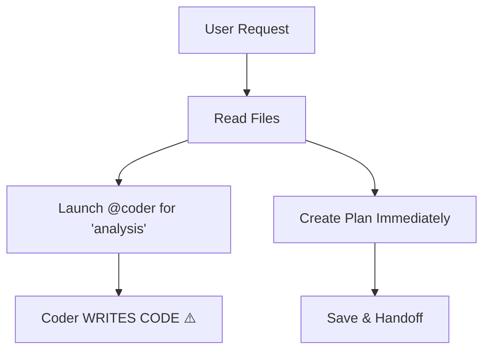
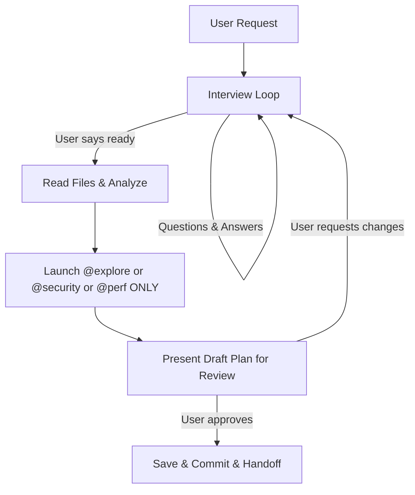

# Decision: Harden Architect Agent — Remove Coder and Add Interview Workflow

## Context

The architect agent had two critical behavioral issues that created safety and quality problems:

### Issue 1: Sub-Agent Permissions Gap
The architect could launch `@coder` for "feasibility analysis," but the coder agent has full write/edit/bash permissions. There was no runtime mechanism to make it read-only — the constraint was purely prompt-level and demonstrably unreliable. The coder's own system prompt says "You implement tasks" and it would proceed to do exactly that, potentially making unauthorized code changes during what should be a read-only planning phase.

### Issue 2: Missing Interview Phase
The architect jumped straight from reading the user's initial message to producing a full plan. There was no structured conversation to clarify requirements, probe for unstated constraints, present trade-offs, or get user buy-in before committing to an approach. This led to plans that didn't match actual needs and required costly rework.

## Decision

We made four key changes to `.opencode/agents/architect.md`:

1. **Remove `@coder` entirely** from the allowed sub-agents list
2. **Replace with `@explore`** for all codebase analysis needs
3. **Add mandatory Requirements Discovery Interview** as Step 3 of the workflow
4. **Add Plan Review Gate** requiring user approval before saving any plan

## Architecture

### Before (Broken)

### After (Hardened)

## Rationale

- **Why remove `@coder` rather than add a read-only mode?**
  - The coder agent has `write: true`, `edit: allow`, `bash: ask` in its frontmatter permissions
  - There is no runtime mechanism to override these permissions when launched by another agent
  - Prompt-level instructions ("analysis only") are unreliable because they compete with the agent's core identity
  - The only safe approach is complete removal from the allowlist

- **Why `@explore` as the replacement?**
  - `@explore` is a built-in read-only agent type in the Task system
  - Purpose-built for "fast exploration of codebases"
  - Can find files, search code, and answer questions about structure
  - Cannot write files, edit code, or execute bash commands
  - Provides exactly the analysis capability needed without the risk

- **Why mandatory interview instead of optional?**
  - The architect's purpose is to produce high-quality plans
  - Jumping to plan creation without understanding the problem leads to wrong plans
  - An interview-first approach ensures the plan solves the right problem
  - User buy-in before planning reduces rework and increases ownership

- **Why plan review gate before save?**
  - Once saved and committed, a plan becomes the implementation contract
  - Users should see and approve plans before they're finalized
  - Supports iterative refinement without polluting the plan history
  - Prevents premature plan commits that don't match user intent

## Consequences

### Positive
- **Security**: Eliminates risk of unauthorized code changes during planning phase
- **Quality**: Requirements interview produces better-informed plans
- **Ownership**: User approval gates ensure plans reflect actual needs
- **Safety**: Explicit allowlist prevents accidental use of dangerous sub-agents
- **Traceability**: Interview process creates natural documentation of requirements evolution

### Negative
- **Slightly slower for simple tasks**: Even trivial requests require a brief readiness check
- **More user interaction required**: Cannot "fire and forget" — architect now requires engagement
- **Learning curve**: Users accustomed to immediate plan generation need to adjust expectations

### Neutral
- **Workflow restructuring**: Steps renumbered (3→4, 4→5, etc.) to accommodate new phases
- **Prompt length increase**: Additional safety rules and workflow steps make the prompt longer

## Alternatives Considered

1. **Add a "read-only mode" flag to `@coder`** — Rejected because there's no mechanism to enforce this at runtime. The Task tool doesn't support permission overrides when launching sub-agents.

2. **Keep `@coder` but add stronger prompt warnings** — Rejected because prompt-level constraints are demonstrably unreliable. The coder's identity as an implementer overrides instructions.

3. **Make the interview optional** — Rejected because optional steps get skipped under pressure. Making it mandatory ensures consistent quality.

4. **Allow plan save without explicit approval** — Rejected because it defeats the purpose of the review gate. Silent saves lead to plan pollution.

## Implementation

**File changed**: `.opencode/agents/architect.md`

**Key additions**:
- Sub-Agent Safety Rule section with explicit allowlist
- Requirements Discovery Interview workflow (Step 3)
- Plan Review Gate (Step 5/6)
- Updated Constraints section with new rules
- Updated Core Principles with interview-first philosophy

**Allowed sub-agents** (read-only only):
- `@explore` — codebase exploration
- `@security` — security analysis
- `@perf` — performance analysis

**Forbidden sub-agents**:
- `@coder`, `@testing`, `@audit`, `@devops`, `@refactor`, `@docs-writer`, `@debug`, `@general`
