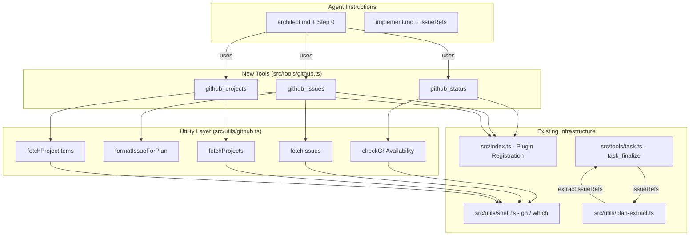

# GitHub Work Items Integration

## Overview

This feature adds GitHub work item integration to the cortex-agents workflow, allowing users to list issues and project items directly from their repo, select one or more for implementation, create a plan from the selected items, and delegate to the implement agent.

This bridges the gap between **project management** (GitHub Issues/Projects) and the **plan-implement pipeline** that cortex-agents already provides. Users can now pick from their backlog instead of manually describing requirements.

## Architecture

## Key Components

### Tools

| Tool | Purpose | Arguments |
|------|---------|-----------|
| `github_status` | Check gh CLI availability, auth, and detect projects | None |
| `github_issues` | List/filter repo issues for selection | state, labels, milestone, assignee, limit, detailed |
| `github_projects` | List project boards and items | projectNumber, status, limit |

### Utilities (`src/utils/github.ts`)

- `checkGhAvailability()` - Full gh CLI status check (installed, authenticated, remote configured)
- `fetchIssues()` / `fetchProjects()` / `fetchProjectItems()` - Data fetching via gh CLI JSON output
- `formatIssueForPlan()` - Formats issue into planning-friendly markdown
- `formatIssueList()` / `formatProjectItemList()` - Compact list formatting for selection
- `parseRepoUrl()` - Extracts owner/repo from HTTPS and SSH remote URLs
- `truncate()` - Safe string truncation for issue bodies

### Enhanced Existing Components

- **`task_finalize`** - New `issueRefs` parameter auto-appends "Closes #N" to PR body
- **`extractIssueRefs()`** in `plan-extract.ts` - Extracts `issues: [42, 51]` from plan frontmatter
- **Path traversal guard** in `findPlanContent()` - Prevents directory traversal via `planFilename`

## Usage

### Architect Agent Workflow

The architect agent now has an optional Step 0:

1. User asks to "pick from backlog" or mentions issues
2. Agent runs `github_status` to verify connectivity
3. Presents browse options (Issues / Projects / Skip)
4. User selects items from the list
5. Selected issue details seed the plan
6. Issue numbers stored in plan frontmatter (`issues: [42, 51]`)

### Issue Linking in PRs

When `task_finalize` creates a PR:
1. Checks for `issueRefs` parameter (explicit)
2. Falls back to extracting from plan frontmatter
3. Appends "Closes #N" for each referenced issue
4. GitHub auto-closes issues when PR merges

### gh CLI Commands Used

| Command | Purpose |
|---------|---------|
| `gh auth status` | Check authentication |
| `gh issue list --json ...` | List issues with structured output |
| `gh project list --format json` | List projects |
| `gh project item-list --format json` | List project items |
| `gh pr create --body "Closes #N"` | Link PR to issue |

## Related Files

- `src/utils/github.ts`
- `src/tools/github.ts`
- `src/index.ts`
- `src/tools/task.ts`
- `src/utils/plan-extract.ts`
- `.opencode/agents/architect.md`
- `.opencode/agents/implement.md`
