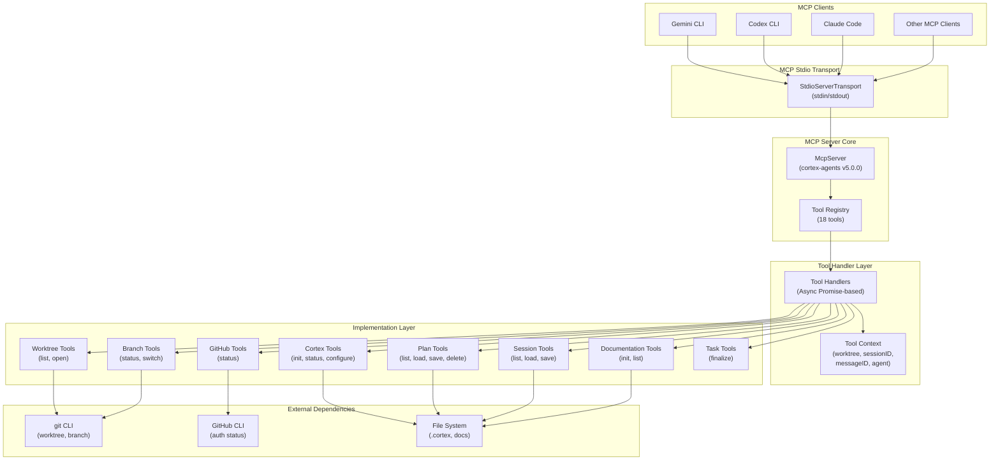

# MCP Server Implementation

## Overview

This feature implements a Model Context Protocol (MCP) stdio server that exposes cortex-agents tools to external CLI clients including Gemini CLI, Codex CLI, and Claude Code. The MCP server acts as a bridge between these clients and the cortex-agents tooling ecosystem, enabling remote tool invocation over stdio.

The MCP server is started with `npx cortex-agents mcp` and registers 18 tools organized into 6 functional categories: cortex management, worktree operations, branch operations, plan management, session management, documentation, GitHub integration, and task finalization.

## Architecture



## Key Components

### MCP Server Core (`src/mcp-server.ts`)

| Component | Purpose |
|-----------|---------|
| `McpServer` | Core MCP protocol implementation from @modelcontextprotocol/sdk |
| `StdioServerTransport` | Bidirectional stdio transport for MCP communication |
| `TOOL_REGISTRY` | Map of all 18 tools with specs and handlers |
| `ToolContext` | Request context (worktree, sessionID, messageID, agent) |
| `ToolHandler` | Async function type for tool execution |
| `ToolSpec` | Tool definition (description, inputSchema, handler) |

### Tool Categories

#### Cortex Management (3 tools)

| Tool | Description | Arguments |
|------|-------------|-----------|
| `cortex_init` | Initialize .cortex directory (plans, sessions) | None |
| `cortex_status` | Check .cortex directory status | None |
| `cortex_configure` | Configure AI models (primary/subagent) | scope, primaryModel, subagentModel |

#### Worktree Operations (2 tools)

| Tool | Description | Arguments |
|------|-------------|-----------|
| `worktree_list` | List all git worktrees | None |
| `worktree_open` | Open worktree path | name |

#### Branch Operations (2 tools)

| Tool | Description | Arguments |
|------|-------------|-----------|
| `branch_status` | Get current git branch | None |
| `branch_switch` | Switch to branch | branch |

#### Plan Management (4 tools)

| Tool | Description | Arguments |
|------|-------------|-----------|
| `plan_list` | List plans in .cortex/plans/ | limit |
| `plan_load` | Load full plan by filename | filename |
| `plan_save` | Save plan with mermaid support | title, type (feature/bugfix/refactor/architecture/spike/docs), content |
| `plan_delete` | Delete plan file | filename |

#### Session Management (3 tools)

| Tool | Description | Arguments |
|------|-------------|-----------|
| `session_list` | List session summaries | limit |
| `session_load` | Load session by filename | filename |
| `session_save` | Save session with decisions | summary, decisions (array) |

#### Documentation Tools (2 tools)

| Tool | Description | Arguments |
|------|-------------|-----------|
| `docs_init` | Initialize docs directory structure | None |
| `docs_list` | List all documentation files | None |

#### GitHub Integration (1 tool)

| Tool | Description | Arguments |
|------|-------------|-----------|
| `github_status` | Check GitHub CLI availability | None |

#### Task Finalization (1 tool)

| Tool | Description | Arguments |
|------|-------------|-----------|
| `task_finalize` | Commit, push, create pull request | commitMessage |

## Tool Schema Structure

### Input Schema Pattern

All tools follow JSON Schema Draft 2020-12 specification:

```typescript
{
  type: "object",
  properties: {
    // Tool-specific properties
    paramName: {
      type: "string" | "number" | "array" | "object",
      description: "Human-readable parameter description",
      enum?: ["value1", "value2"],  // Optional: constraint values
      items?: { type: "..." },      // Array element type
    }
  },
  required: ["param1", "param2"],  // Required parameters
}
```

### Response Format

All tool handlers return:

```typescript
{
  content: [
    {
      type: "text",
      text: "Tool output as plain text"
    }
  ],
  isError?: boolean  // Optional: true if tool failed
}
```

### Success Response Example

```json
{
  "content": [
    {
      "type": "text",
      "text": "✓ Initialized .cortex directory at /project/.cortex"
    }
  ]
}
```

### Error Response Example

```json
{
  "content": [
    {
      "type": "text",
      "text": "Error: Plan not found: 2026-03-12-feature-example.md"
    }
  ],
  "isError": true
}
```

## Tool Context

Each tool receives a `ToolContext` object with:

```typescript
{
  worktree: string;           // Current working directory (project root)
  sessionID?: string;         // Session identifier ("mcp-session")
  messageID?: string;         // Message identifier ("mcp-message")
  agent?: string;             // Calling agent identifier ("mcp")
  directory?: string;         // Same as worktree
}
```

## Usage

### Starting the MCP Server

```bash
npx cortex-agents mcp
```

This starts the server on stdio. The server:
- Reads MCP protocol messages from stdin
- Writes MCP responses to stdout
- Stays running until killed (Ctrl+C)
- Uses current working directory as project root

### Client Integration Example (Pseudo-code)

```javascript
// MCP Client connects via stdio
const server = spawn('npx', ['cortex-agents', 'mcp']);

// Register tool handlers
const tools = await server.listTools();

// Call a tool
const result = await server.callTool('plan_list', {
  limit: 10
});

// Response structure
{
  content: [
    { type: 'text', text: '✓ Plans (showing 3):\n\n  • 2026-03-12-feature-mcp.md\n  • 2026-03-11-bugfix-stdio.md\n  • 2026-03-10-refactor-tools.md\n' }
  ]
}
```

### Common Workflows

#### List and Load a Plan

```bash
# List available plans
curl -X POST http://localhost:3000/rpc \
  -d '{"jsonrpc":"2.0","method":"tools/call","params":{"name":"plan_list","arguments":{"limit":5}}}'

# Load specific plan
curl -X POST http://localhost:3000/rpc \
  -d '{"jsonrpc":"2.0","method":"tools/call","params":{"name":"plan_load","arguments":{"filename":"2026-03-12-feature-mcp.md"}}}'
```

#### Create a Session

```bash
# Save session with accomplishments
curl -X POST http://localhost:3000/rpc \
  -d '{"jsonrpc":"2.0","method":"tools/call","params":{"name":"session_save","arguments":{"summary":"Implemented MCP server for stdio communication","decisions":["Use MCP SDK","Expose 18 tools","Support Gemini/Codex/Claude CLIs"]}}}'
```

#### Finalize Task

```bash
# Commit, push, and create PR
curl -X POST http://localhost:3000/rpc \
  -d '{"jsonrpc":"2.0","method":"tools/call","params":{"name":"task_finalize","arguments":{"commitMessage":"feat: add MCP stdio server implementation"}}}'
```

## Implementation Details

### Tool Handler Architecture

Each tool handler follows this pattern:

```typescript
handler: async (args: Record<string, unknown>, context: ToolContext): Promise<string> => {
  try {
    // Tool-specific logic
    // File system operations
    // Shell execution (git, gh)
    // Directory structure management
    return "✓ Success message" | "✗ Error message";
  } catch (error) {
    return `✗ Error: ${error.message}`;
  }
}
```

### File System Operations

- Plans stored in: `.cortex/plans/YYYY-MM-DD-{type}-{slug}.md`
- Sessions stored in: `.cortex/sessions/YYYY-MM-DD-{sessionId}.md`
- Docs structure: `docs/decisions/`, `docs/features/`, `docs/flows/`

### Shell Execution

Tools using git or GitHub CLI:
- `git worktree list` - List worktrees
- `git checkout <branch>` - Switch branches
- `git branch --show-current` - Get current branch
- `gh auth status` - Check GitHub authentication

## Dependencies

### New Dependency

- `@modelcontextprotocol/sdk` (v1.0.0) - MCP protocol implementation

### Existing Dependencies Used

- `@modelcontextprotocol/sdk/server/mcp.js` - McpServer class
- `@modelcontextprotocol/sdk/server/stdio.js` - StdioServerTransport
- `src/utils/shell.ts` - exec() function for git/gh CLI
- Node.js built-ins: fs, path

## Configuration

### Server Identification

```typescript
{
  name: "cortex-agents",
  version: "5.0.0"  // From package.json
}
```

### Tool Registration

All 18 tools auto-registered from `TOOL_REGISTRY` on startup:
- Tool name
- Description
- Input JSON schema
- Handler function

## Error Handling

### Tool Execution Errors

All tool errors are caught and returned with `isError: true`:

```typescript
try {
  const result = await spec.handler(args, context);
  return { content: [{ type: 'text', text: result }] };
} catch (error) {
  return {
    content: [{ type: 'text', text: `Error: ${error.message}` }],
    isError: true
  };
}
```

### Common Error Cases

| Error | Handling |
|-------|----------|
| .cortex not initialized | Returns "Run cortex_init to initialize" |
| Git not available | Returns "Not a git repository" |
| GitHub CLI not auth'd | Returns "Run: gh auth login" |
| File not found | Returns "✗ [file] not found" |
| Shell command failed | Captures stderr and returns error message |

## Limitations

- **Stdio only** - No HTTP/TCP server mode
- **Single process** - One server per invocation
- **Read-mostly** - Some write operations (plan save, session save)
- **Local filesystem** - Cannot browse remote repositories
- **No persistence** - Context lost between server restarts
- **Synchronous tool list** - Tool registry is static

## Related Files

- `/Users/paulo/Code/CortexTools/cortex-agents/src/mcp-server.ts`
- `/Users/paulo/Code/CortexTools/cortex-agents/src/cli.ts` (lines 927-934: mcp command)
- `/Users/paulo/Code/CortexTools/cortex-agents/package.json` (dependencies)
- `/Users/paulo/Code/CortexTools/cortex-agents/src/utils/shell.ts` (exec utility)
