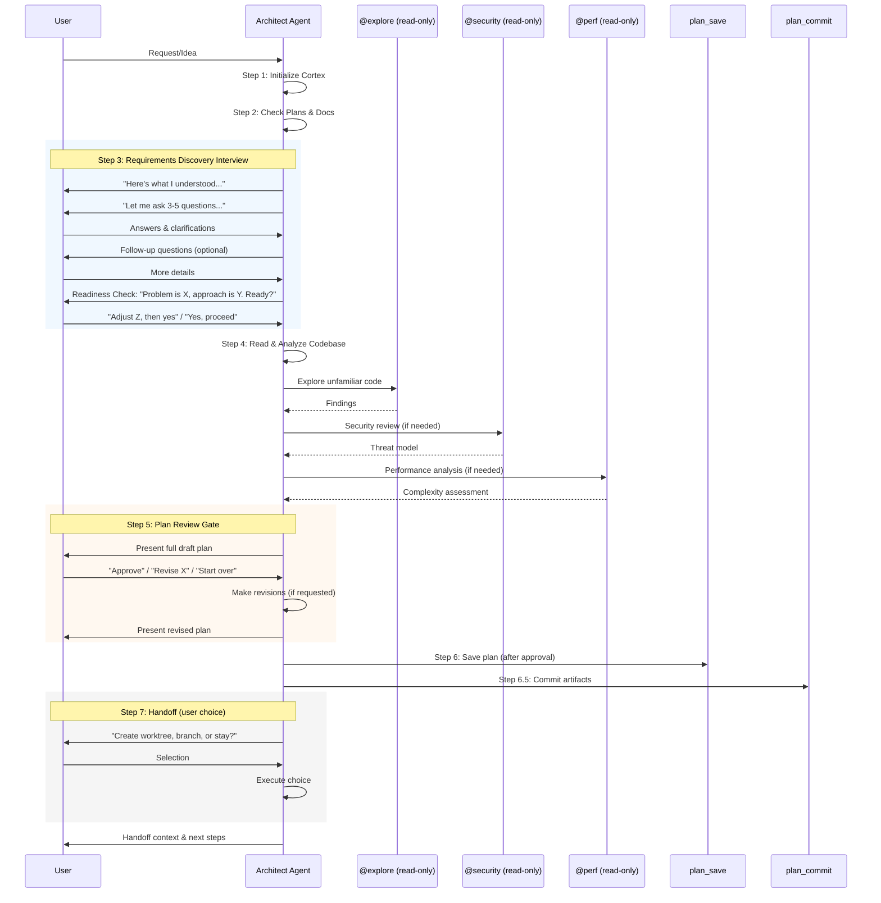

# Flow: Architect Agent Requirements Interview and Review Workflow

## Overview

This document describes the mandatory workflow phases added to the architect agent to ensure proper requirements gathering and plan validation. The workflow now includes a structured interview phase before planning and a review gate before saving.

## Flow Diagram

### Complete Workflow

## Steps

### Step 3: Requirements Discovery Interview (MANDATORY)

**Purpose**: Understand what the user actually needs before prescribing solutions.

#### Round 1: Acknowledge & Clarify
1. **Summarize** what you understood from the user's request (1-3 sentences)
2. **Ask 3-5 targeted questions** about:
   - Scope boundaries (what's in, what's out)
   - Existing constraints (tech stack, timeline, dependencies)
   - Success criteria (how will we know this is done?)
   - Edge cases or error scenarios
   - Non-functional requirements (performance, security, scale)
3. **Wait for answers** — do NOT proceed until the user responds

#### Round 2+: Deepen Understanding
Based on answers, you may:
- Ask follow-up questions on unclear areas
- Present your understanding of the problem for validation
- Identify risks or trade-offs the user may not have considered
- Suggest alternative approaches with pros/cons

#### Readiness Check
When you believe you have enough information, present:
1. **Problem Statement** — 2-3 sentence summary of what needs to be solved
2. **Proposed Approach** — High-level direction (not the full plan yet)
3. **Key Assumptions** — What you're assuming that hasn't been explicitly stated
4. **Ask**: "Does this capture what you need? Should I proceed to create the detailed plan, or do you want to adjust anything?"

**Only proceed to Step 4 when the user explicitly confirms readiness.**

#### Exceptions
The interview can be shortened when:
- User provides a highly detailed specification with clear acceptance criteria
- User explicitly says "just plan it, I'll review"
- User references a GitHub issue with full requirements (loaded in Step 0)

Even in these cases, present at minimum a **Readiness Check** summary before proceeding.

### Step 5: Plan Review Gate (MANDATORY)

**Purpose**: Ensure user approval before committing the plan.

1. **Output the full plan** in the conversation
2. **Ask**: "Here's the plan I've drafted. Would you like to:
   - **Approve** — I'll save and commit it
   - **Revise** — Tell me what to change
   - **Start over** — Let's rethink the approach"
3. **If user requests revisions**: Make the changes and present again
4. **Only call `plan_save` after explicit approval**

This prevents premature plan commits and ensures the user owns the plan.

## Error Handling

### User Doesn't Respond to Interview Questions
- The architect waits indefinitely — workflow cannot proceed without user input
- This is intentional: the interview is mandatory

### User Rejects Readiness Check
- Loop back to Round 1 or 2 with revised questions
- Do NOT proceed to Step 4 until readiness is confirmed

### User Requests Revisions During Plan Review
- Make requested changes to the draft plan
- Present the revised plan for another review cycle
- Repeat until user approves or chooses "start over"

### User Chooses "Start Over" During Plan Review
- Return to Step 3 (Requirements Discovery Interview)
- The problem understanding or approach may need fundamental revision

## Edge Cases

### Highly Detailed User Input
If the user provides a comprehensive specification upfront:
- Still conduct at minimum a Readiness Check
- Confirm your understanding matches their specification
- Ask if there are any implicit requirements not stated

### Simple/Trivial Tasks
Even for simple tasks:
- Acknowledge the request
- Confirm scope ("just this one file?")
- Present Readiness Check before proceeding

### Iterative Planning
If the user wants to iterate on the plan:
- Loop through Plan Review Gate multiple times
- Each revision gets presented for approval
- Only save once explicitly approved

### Handoff Without Approval
**This is prevented by the workflow design**:
- `plan_save` is only called after Step 5 approval
- `plan_commit` (Step 6.5) can only run after `plan_save`
- Branch/worktree creation (Step 7) only happens after commit

## Sub-Agent Safety During Analysis

During Step 4 (Read & Analyze), the architect may launch read-only sub-agents:

**Allowed** (read-only only):
- `@explore` — codebase exploration
- `@security` — security analysis
- `@perf` — performance analysis

**All prompts MUST include**: "ANALYSIS ONLY — no code changes"

**Forbidden** (will not be launched):
- Any agent with write/edit/bash permissions
- Implementation-phase agents (`@coder`, `@testing`, `@audit`, etc.)
