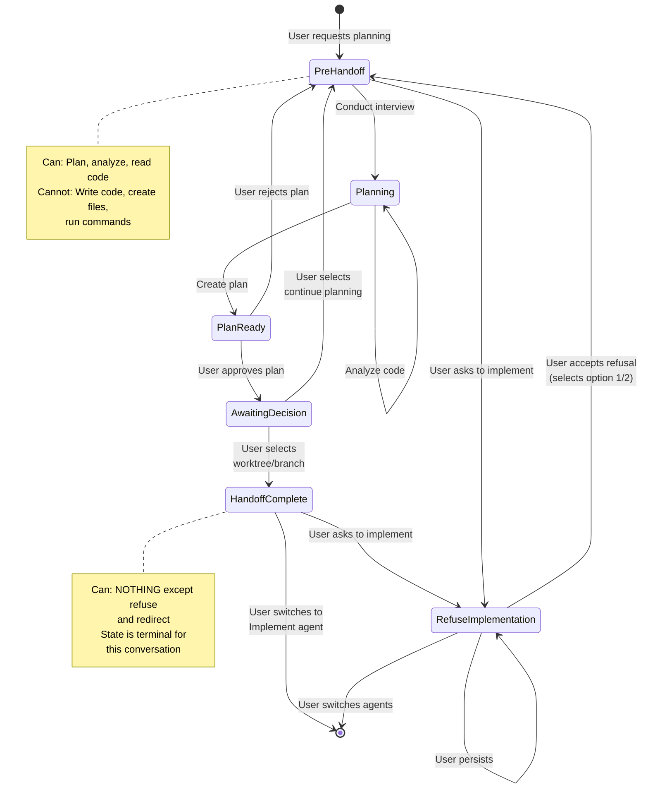
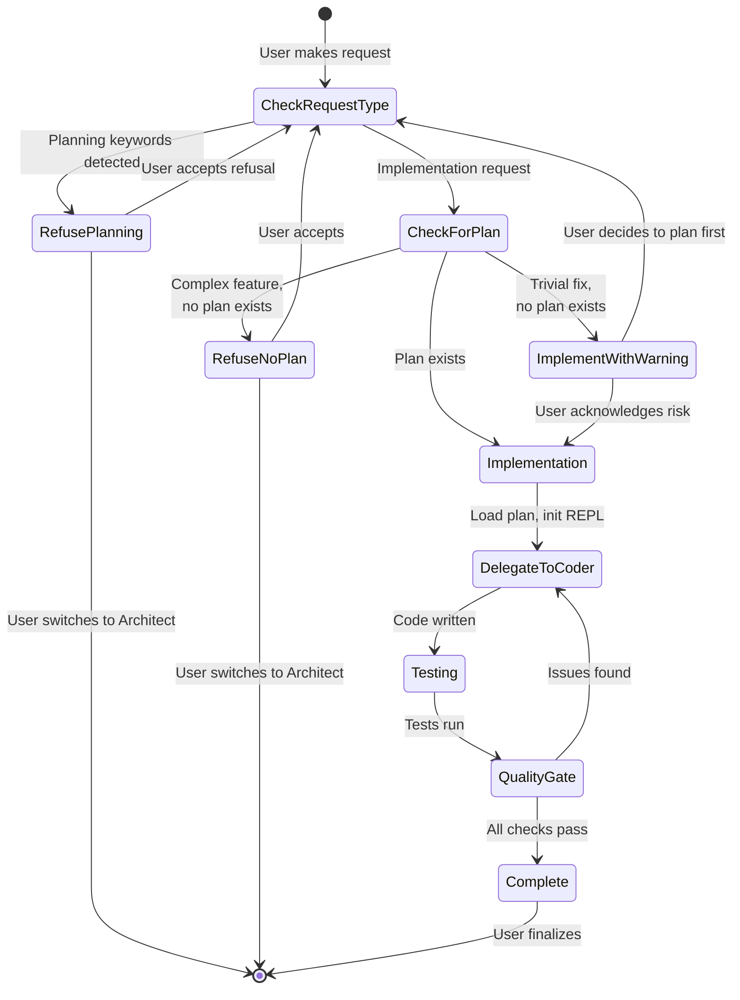

# Hardened Agent Handoff Flow

## Overview

This document shows the secure handoff flow between Architect and Implement agents with **boundary violation detection** and **refusal protocols**.

## Sequence Diagram: Secure Handoff

```mermaid
sequenceDiagram
    participant U as User
    participant A as Architect Agent
    participant W as Worktree/Branch
    participant I as Implement Agent

    rect rgb(230, 245, 255)
    Note over U,A: PHASE 1: Planning (Architect Only)
    U->>A: Request: "Build auth service"
    A->>A: Check: Is this planning? ✓
    A->>A: Refuse if implementation keywords detected
    A->>U: Conduct requirements interview
    U->>A: Provide requirements
    A->>A: Analyze codebase (read-only)
    A->>A: Create implementation plan
    A->>U: Present plan for approval
    U->>A: Approve plan
    A->>A: Save plan via plan_save
    A->>A: Commit plan via plan_commit
    end

    rect rgb(255, 245, 230)
    Note over U,A: PHASE 2: Handoff Decision
    A->>U: "How to proceed?"
    Note right of A: Options:<br/>1. Create worktree<br/>2. Create branch<br/>3. Continue planning ONLY
    
    alt User selects Worktree or Branch
        U->>A: Select option 1 or 2
        A->>W: Create worktree/branch
        A->>U: "Handoff complete. Switch to Implement agent."
        Note over A: State: POST-HANDOFF<br/>ANY implementation request = REFUSE
    else User selects Continue Planning
        U->>A: Select option 3
        A->>U: "Additional planning only. I cannot implement."
        Note over A: State: PRE-HANDOFF<br/>Still cannot implement
    end
    end

    rect rgb(255, 230, 230)
    Note over U,A: PHASE 3: Boundary Enforcement (CRITICAL)
    
    alt Violation Attempt 1: Post-Handoff Implementation Request
        U->>A: "Actually, help me write the auth code"
        A->>A: Detect: Implementation keywords
        A->>A: Check state: POST-HANDOFF ✓
        A->>U: 🚫 STOP — I cannot write code.
        A->>U: "You must switch to Implement agent."
        Note over A: REFUSAL PROTOCOL ACTIVATED
    end
    
    alt Violation Attempt 2: Stay-Then-Request
        U->>A: "Continue planning"
        Note over U,A: [Some time passes...]
        U->>A: "Can you just implement this one function?"
        A->>A: Detect: Implementation keywords
        A->>U: 🚫 STOP — I cannot write code.
        A->>U: "Select worktree/branch option first."
        Note over A: REFUSAL PROTOCOL ACTIVATED
    end
    end

    rect rgb(230, 255, 230)
    Note over U,I: PHASE 4: Implementation (Implement Only)
    U->>I: Switch to Implement agent
    I->>I: Check: Am I Implement? ✓
    I->>I: Check: Is this planning? ✗
    I->>U: "Ready to implement. Check git status first."
    U->>I: Proceed
    I->>I: Load plan via plan_load
    I->>I: Initialize REPL loop
    I->>I: Delegate to @coder sub-agent
    I->>I: Run tests via bash
    I->>I: Quality gate checks
    I->>U: "Implementation complete. Ready to finalize?"
    end

    rect rgb(255, 230, 255)
    Note over U,I: PHASE 5: Reciprocal Boundary Check
    
    alt Violation Attempt 3: Implement Asked to Plan
        U->>I: "Should we use JWT or sessions?"
        I->>I: Detect: Planning keywords
        I->>U: 🚫 STOP — I cannot plan.
        I->>U: "You must switch to Architect agent."
        Note over I: RECIPROCAL REFUSAL ACTIVATED
    end
    
    alt Violation Attempt 4: No Plan Exists
        U->>I: "Implement auth service" (no plan)
        I->>I: Check: Plan exists? ✗
        I->>U: ⚠️ No plan detected.
        I->>U: "Recommended: Switch to Architect first."
        Note over I: NO-PLAN WARNING ACTIVATED
    end
    end
```



## State Machine: Architect Agent



## State Machine: Implement Agent



## Boundary Violation Matrix

### Architect Agent Violations

| Violation | Detection | Response | Escalation |
|-----------|-----------|----------|------------|
| Post-handoff implementation | State=POST-HANDOFF + implementation keywords | Immediate refusal + redirect | If persists: Remind state is terminal |
| Stay-then-request | State=PRE-HANDOFF + implementation keywords | Refuse + require option 1/2 | If persists: Repeat refusal |
| File creation | write/edit tool triggered | Tool-level denial | N/A (system enforced) |
| Launch @coder | task launch with subagent_type=coder | Prompt-level denial | N/A (system enforced) |

### Implement Agent Violations

| Violation | Detection | Response | Escalation |
|-----------|-----------|----------|------------|
| Planning request | Planning keywords detected | Immediate refusal + redirect | If persists: Remind role |
| Architecture question | "Should we use...", "Design..." | Refuse + explain limitation | Offer to switch agents |
| No plan for complex work | Complexity assessment + plan check | Warning + recommendation | Allow with risk acknowledgment |
| Creating plan documents | docs_save with plan content | Refuse + redirect | N/A |

## Refusal Response Templates

### Architect Refusing Implementation

```
🚫 **STOP — I cannot write code.**

I am the **Architect agent**, and I NEVER write, edit, or generate code.

**My role:**
✅ Analyze existing code (read-only)
✅ Create implementation plans
✅ Provide architectural guidance

**I cannot:**
❌ Write functions, classes, or modules
❌ Fix bugs or update code
❌ Generate code examples beyond pseudocode

**Next steps:**
To implement this, you need the **Implement agent**.

[Options presented...]
```

### Implement Refusing Planning

```
🚫 **STOP — I cannot create plans.**

I am the **Implement agent**, and I NEVER design systems or create plans.

**My role:**
✅ Implement code based on existing plans
✅ Run tests and verify implementations
✅ Manage development workflow

**I cannot:**
❌ Create implementation plans
❌ Make architectural decisions
❌ Analyze technology choices

**Next steps:**
To plan this, you need the **Architect agent**.

[Options presented...]
```

## Implementation Checklist

### Architect Agent Changes
- [ ] Layer 1: Absolute opening statement
- [ ] Layer 2: Post-handoff state guard
- [ ] Layer 3: Strengthened constraints
- [ ] Layer 4: Explicit refusal protocol
- [ ] Layer 5: Loophole closure (rename "Stay" option)

### Implement Agent Changes
- [ ] Reciprocal opening statement
- [ ] Pre-planning boundary check
- [ ] Planning request detection
- [ ] Refusal protocol
- [ ] No-plan warning system

### System Changes
- [ ] Keyword detection lists
- [ ] State tracking mechanism
- [ ] Tool-level permission enforcement
- [ ] Cross-agent handoff protocol

## Testing Scenarios

### Architect Agent Tests
1. ✅ Normal planning flow → Success
2. ✅ Post-handoff implementation request → Refuse
3. ✅ Stay-then-request → Refuse + require option 1/2
4. ✅ Launch @coder attempt → Refuse
5. ✅ Complex request without keywords → Clarify first

### Implement Agent Tests
1. ✅ Normal implementation with plan → Success
2. ✅ Planning question → Refuse + redirect
3. ✅ No plan for complex feature → Warning + recommendation
4. ✅ No plan for trivial bug → Proceed with warning
5. ✅ Architecture decision request → Refuse

## Success Metrics

- **Zero tolerance**: Any code written by Architect = failure
- **Clear refusals**: User understands why request was refused
- **Easy switching**: User can quickly switch to correct agent
- **Minimal friction**: Refusals only for actual violations

